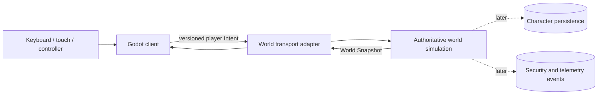

# System architecture

## Runtime shape



The current repository is a modular monolith, not a fleet of premature
microservices. Deployment seams can be extracted only after scale or ownership
creates a real need.

## Modules and interfaces

| Module | Interface callers learn | Hidden implementation |
| --- | --- | --- |
| `game-domain` | Join/leave, submit validated Intent, advance a Simulation Tick, observe snapshot | Ordering, fixed-point physics, bounds, stale-input rejection |
| `game-protocol` | Versioned client and server message types | JSON shape and domain-to-wire translation rules |
| `world-server` | WebSocket session endpoint | Connection lifecycle, limits, tick scheduling, broadcast |
| Godot `NetworkClient` | Connect, submit intent, receive snapshot | Socket polling, JSON encoding, reconnect state |
| Godot `Main` | Local input and presentation | Entity view lifecycle and debug drawing |

The authoritative simulation is the deepest module: tests and servers exercise
world behavior through its small interface. Transport is an adapter; it does
not contain game rules.

## Data flow and ownership

1. **Negotiate.** The client sends `Hello` (protocol version, build); the
   server replies `HelloAccepted` (tick rate) once the version matches. No
   identity is exchanged yet.
2. **Admit.** The client sends `JoinWorld` (account id, hero name). An in-memory
   Account registry assigns the Hero a stable identity, enforces that a Hero is
   controlled by one live Session at a time, and replies `WorldJoined` or a
   recoverable `JoinRejected`. This is the seam a real identity/gateway tier
   later replaces with authenticated, token-based admission.
3. The client samples local controls and sends an Intent with a monotonically
   increasing sequence number. It never sends a position or damage result.
4. The world-server validates message shape, protocol version, session state,
   size, and rate.
5. `game-domain` rejects invalid or stale Intent, advances fixed-point rules on
   a fixed Simulation Tick, and owns the resulting state.
6. The server broadcasts a World Snapshot. The client renders observations and
   will later reconcile local prediction against them.

## Cross-platform client

Godot was selected because one scene and gameplay layer can export to all four
targets while its RenderingDevice backend uses modern native GPU interfaces.
Platform-specific integrations—Steamworks, Apple sign-in, Google Play, touch,
store purchases—belong behind narrow adapters selected by Godot feature tags.
They must not enter world rules.

## Scaling path

- A **World Instance** owns one Zone simulation and has a strict single-writer
  rule for mutable Entity state.
- A gateway/identity tier can later issue short-lived Session admission tokens.
- Cross-zone movement becomes a handoff between World Instances, with one owner
  at every instant.
- Durable Character changes are committed through idempotent operations.
- Read-heavy social, discovery, and leaderboard views can be projected outside
  the simulation.

No extraction happens until measurements show the modular monolith is the
limiting factor.

Godot can also export a headless dedicated server, but this architecture does
not use it: keeping authoritative rules in a transport-free Rust module reduces
the server footprint and avoids coupling persistent world behavior to client
scene concerns. See the
[official dedicated-server export documentation](https://docs.godotengine.org/en/stable/tutorials/export/exporting_for_dedicated_servers.html)
for the considered alternative.

## Repository map

```text
client/                 Godot presentation and platform input
apps/world-server/      executable transport and tick host
crates/game-domain/     authoritative, transport-free world rules
crates/game-protocol/   versioned wire contract
docs/design/            living specifications and threat model
docs/adr/               durable architectural decisions
```

## Change log

- 2026-08-22: Initial runtime seams and ownership rules established.
