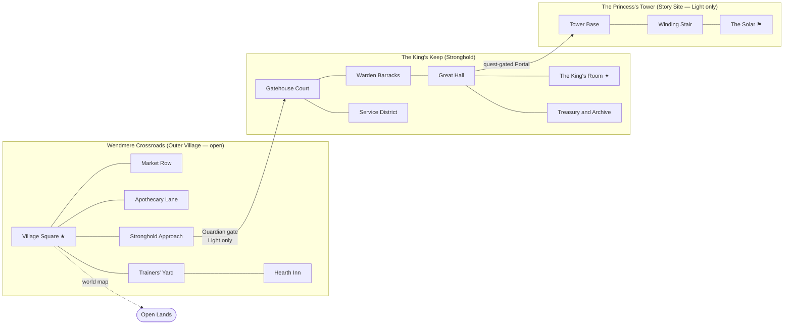
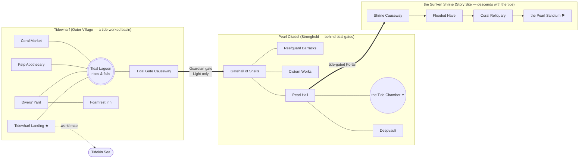
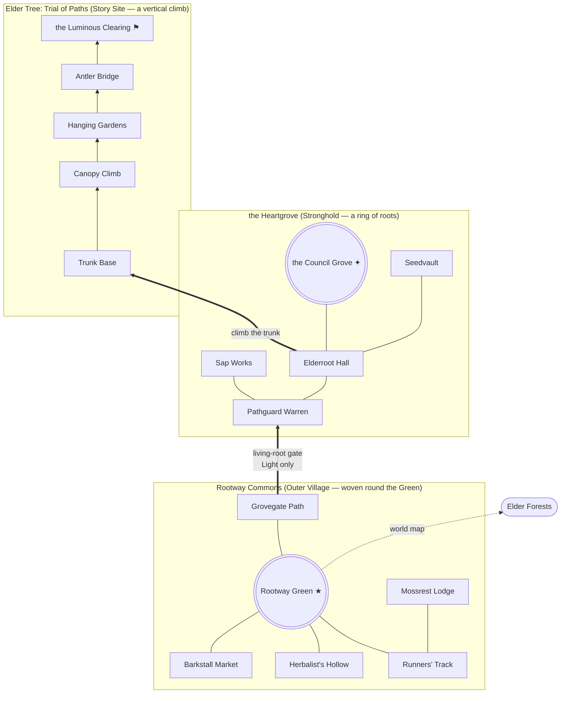
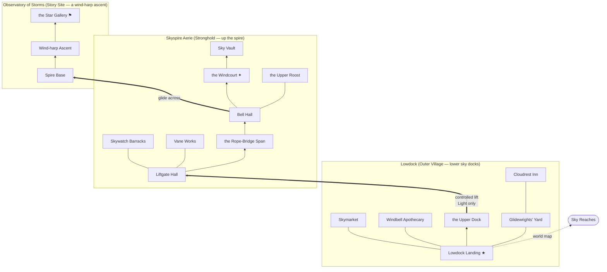
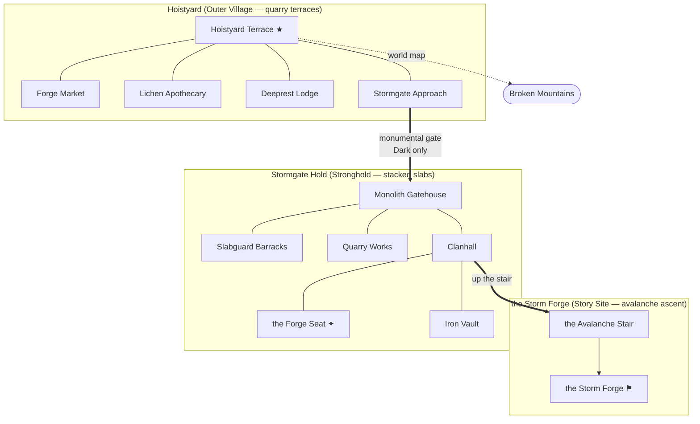
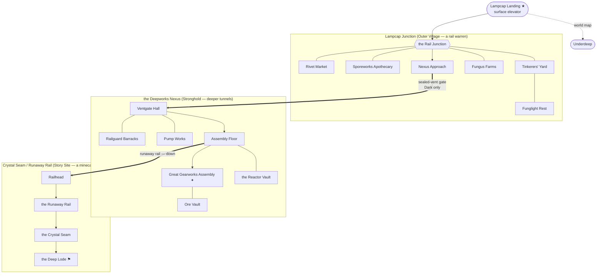
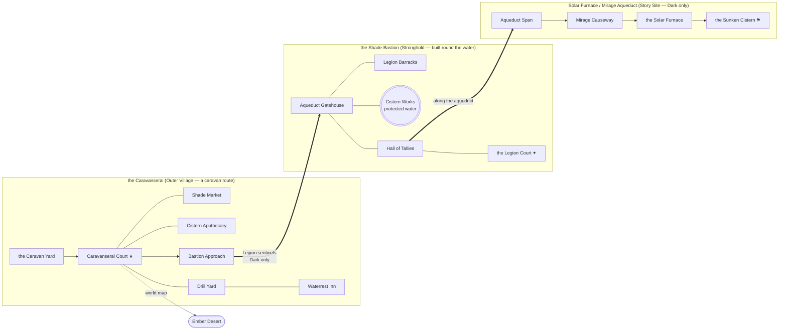
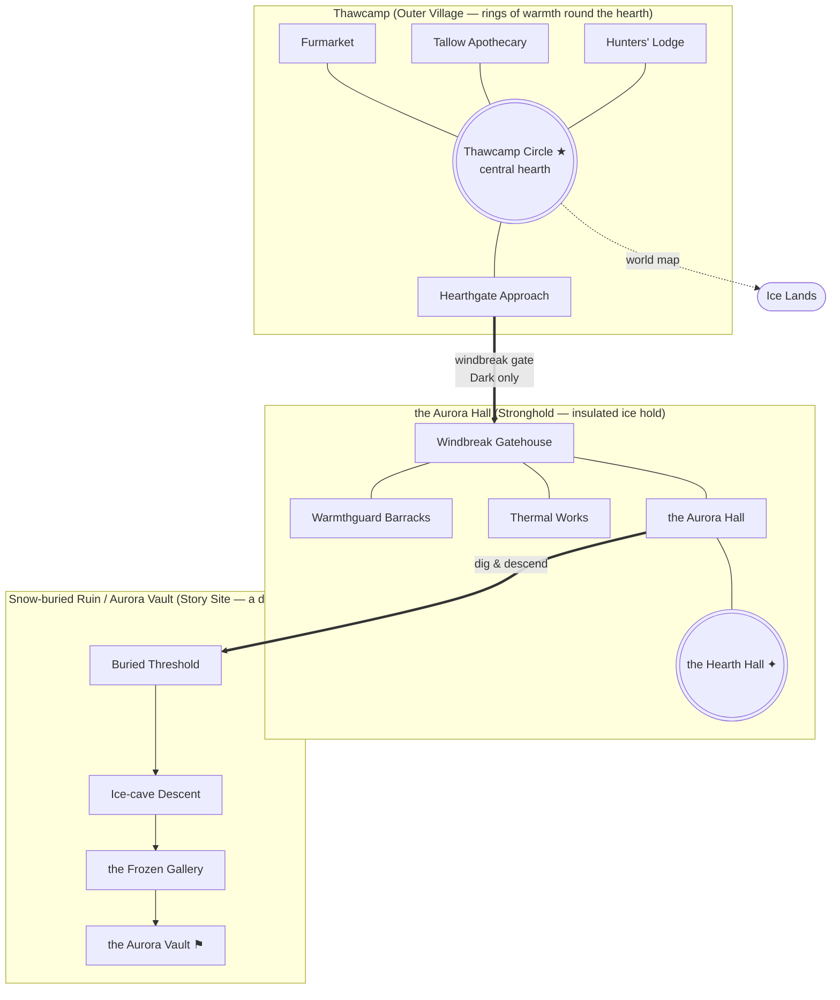

# Home-town maps

## Context

A new Hero should begin life somewhere that *belongs* to them. Onboarding
(DESIGN-0006) already binds every Hero to a lineage-derived **Homeland**, and
the world map (DESIGN-0010) gives each of the eight Homelands an **Outer
Village** and a **Stronghold** (DESIGN-0009). But three things are unresolved
and block a playable "start at home" loop:

1. **Where a Hero first spawns.** DESIGN-0006 drops the created Hero into the
   combat arena and explicitly asks whether a Homeland is "one Zone, a family of
   Zones, or a starting region."
2. **What services a town actually offers.** The only economy primitive today is
   the player-driven **Exchange** and its **Exchange Brokers** (DESIGN-0009). No
   weapon / armor / potion vendors, and no potions, exist yet.
3. **What the towns contain and look like** — sub-maps, NPCs, and art direction.

This record designs the **home town** for each Lineage: a hub of connected Zones
(Outer Village → Stronghold → a signature Story Site), the NPCs in them, how a
Hero moves between them, and art-generation prompts per map. It resolves the
spawn question (a Hero spawns in their Lineage's Outer Village) and proposes the
NPC service layer and a starter consumable set.

**Canon vs. new.** Established by existing records and reused verbatim:
Stronghold / Outer Village / Stronghold Guardian, Allegiance-gated access,
5–10 Stronghold Zones, the walk-through Portal graph, Exchange Brokers, the
culmination-hall examples, the six Combat Classes, the equipment tiers, and the
creature roster. **New proposals in this record** (flagged ⊕ throughout): the
first-spawn location, named towns and Story Sites, fixed-price NPC shops, the
starter **Provision** (consumable) set, class-trainer NPCs, and the Human
narrative (the King's Keep and the Princess's Tower).

## The home-town model

A **home town** is not one map. It is a small cluster of Zones inside a Homeland
Territory, in three concentric rings, connected only by Portals the Hero walks
through (DESIGN-0010 — no fast travel):

```
        OUTER VILLAGE (shared, both Allegiances)        STRONGHOLD (Allegiance-gated)      STORY SITE
        ┌───────────────────────────────────┐          ┌────────────────────────────┐     ┌──────────────┐
 spawn ▶│ Village Square ⇄ Market Row        │          │ Gatehouse Court ⇄ Guard Hall│     │ signature     │
        │      ⇕            ⇕                 │  Guardian│      ⇕           ⇕          │     │ multi-zone    │
        │ Trainers' Yard ⇄ Apothecary Lane   │──gate──▶ │ Service District ⇄ Great Hall│──▶ │ questline     │
        │      ⇕                              │  (⊕ deny │      ⇕                      │     │ (King's Keep, │
        │ Hearth Inn ─ Stronghold Approach ──┘  opposing)│ Culmination Hall ─ Treasury │     │  Tower, …)    │
        └───────────────────────────────────┘          └────────────────────────────┘     └──────────────┘
```

- **Ring 1 — Outer Village** (open to Light and Dark). The social hub and the
  spawn ring. Contains the market, apothecary, trainers, inn, and the Exchange
  Broker. Themed per Lineage (DESIGN-0009 "Stronghold and village themes").
- **Ring 2 — Stronghold** (Allegiance-gated). 5–10 Zones (DESIGN-0010) reached
  through the **Stronghold Approach → Guardian gate**. Same-Allegiance Heroes
  pass; Opposing-Allegiance Heroes are warned and repelled by the **Stronghold
  Guardian** (DESIGN-0009 escalation ladder). Culminates in a hall that fits the
  culture (King's Room, Council Grove, Tide Chamber, Forge Seat, Hearth Hall…).
- **Ring 3 — Story Site**. The named multi-Zone questline connected to each
  Stronghold shares its permanent Allegiance restriction. The eight graphs
  below do not provide an Opposing-Allegiance entrance. Every leaf has a return
  Portal; returning does not bypass the access policy (DESIGN-0010).

Zone budget per home town: **13–19 Zones**, with the culture-specific Village,
Stronghold and Story breakdowns in the summary below, inside each Homeland's 30–45-Zone allowance
(DESIGN-0010).

### Movement & interaction rules
- **First creation:** a new Hero receives their Lineage's Village-Square Map
  as their initial current Map and spawns at its safe starting point. This is
  the only automatic hometown placement.
- **Login/reconnect:** preserve the current Map and restore the last legal
  position. If that position is obstructed or hazardous, use a safe Recovery
  Anchor within that same Map. Relogging never grants travel or restores health,
  cooldowns, consumables, or an expired encounter benefit.
- **Traversal:** left/right through Portals only; the current networked build
  already models zones + positional Portals (see *Implementation*).
- **Allegiance gate (⊕ enforcement detail):** the Portal from *Stronghold
  Approach* into *Gatehouse Court* is a server-checked boundary. Opposing
  Allegiance is refused (Guardian warns → repels). Defeat stays in the approach
  Map at its safe anchor, never inside the Stronghold. Only Outer Villages are
  shared; Strongholds and their connected Story Sites use the same restriction.
- **Respawn:** preserve the current Map and place the Hero at that Map's safe
  Recovery Anchor, including within a Story Site or Dungeon Depth. Never send
  them to another Map's Inn, Village Square, or Dungeon entrance. Inns offer
  rest and services; they do not bind remote respawns.
- **Map lifetime and atomicity:** every playable Map needs a legal recovery
  point and outbound Portal. Persist Map ID and location together on a completed
  Portal transfer; after a crash, recover the last committed Map. Retain or
  reconstruct an instanced Map needed by a saved Hero rather than evicting them
  elsewhere. If the Map cannot be loaded, report temporary unavailability;
  do not silently teleport home. A dead Hero relogs into the same Map's respawn
  flow, not an alive pre-death snapshot.
- **Safety:** Outer Villages are proposed as **guarded peace zones** — no Open
  Conflict, Sentry NPCs present (DESIGN-0009 leaves this open; this record picks
  the peaceful reading for the starter experience).
- **Map:** `M` opens the world/region map (DESIGN-0010); the home town shows as
  one Outer-Village marker + one Stronghold marker that expands into this Zone
  graph.

## Standard NPC roster (the "town template")

NPCs are **Characters** (DESIGN glossary), server-owned, non-hostile inside the
peace zone. Every home town instantiates this template; flavor/skins vary by
Lineage. (Shops and the Provision set are ⊕ new; Exchange Broker is canon.)

| Role | Zone | Function |
| --- | --- | --- |
| **Stronghold Guardian** (canon) | Stronghold Approach | Enforces the Allegiance boundary; the gate's set-piece Character. |
| **Gate Sentries** (⊕) | Village Square, Approach | Flavor guards; give directions; signal the peace zone. |
| **Weaponsmith** (⊕) | Market Row | Sells Tier 1–2 weapons of every family (Roadworn Blade, Old Iron Greatblade, Ashwood Spear, Crankwood Crossbow, Moonwood Bow, Driftwood Buckler, Wayfarer's Dirk, Quarry Maul…). Buys back loot. |
| **Armorer** (⊕) | Market Row | Sells Tier 1–2 Class armor pieces (the six-slot sets, e.g. Roadwarden / Candlewick lines) and generic **Capes**. |
| **Wandwright / Arcane Stall** (⊕) | Market Row | Wands & Staves (Hazel Sparkwand, Lantern Staff) and reagents — the arcane focus vendor split out from the Weaponsmith. |
| **Apothecary** (⊕) | Apothecary Lane | Sells **Provisions** (see below): healing salves, vigor & focus draughts, antidotes. |
| **Provisioner / Grocer** (⊕) | Apothecary Lane | Food/utility: waybread (out-of-combat regen), torches, throwables, ropes. |
| **Exchange Broker** (canon) | Village Square | Access point to the server-wide player market (buy/sell orders, escrow). |
| **Class Trainers ×6** (⊕) | Trainers' Yard | One each for Vanguard, Ravager, Ranger, Duelist, Arcanist, Warden. Teach baseline Class actions and the three talent branches (DESIGN-0012/0013). |
| **Innkeeper** (⊕) | Hearth Inn | Rest and local services; opens Hero overview. Does not bind remote respawns. |
| **Quartermaster** (⊕) | Hearth Inn | Placeholder for future durable stash / bank. |
| **Lorekeeper / Herald** (⊕) | Village Square / Stronghold | Quest-giver that opens the Story Site line. |
| **Benevolent wildlife** (canon roster) | ambient | Homeland-specific creatures wandering as life/set-dressing (e.g. Meadow Puffkin, Lumen Mole). |

### ⊕ Provision set (new consumables — none exist in canon yet)
A deliberately small default starter line, stocked reliably at fixed prices
based on early earning rates (DESIGN-0009). NPCs do not stock special drops or
upgraded versions. Players may resell tradable surplus, but default NPC goods
are not priced dynamically below player offers:

| Provision | Effect | Sold by |
| --- | --- | --- |
| **Mending Salve** | Restore health over a few seconds, out of combat | Apothecary |
| **Draught of Vigor** | Restore stamina | Apothecary |
| **Focusing Tonic** | Restore mana | Apothecary |
| **Antidote / Warmth Tallow / Cooling Salt** | Cure a biome status (poison / cold / heat) | Apothecary (biome-flavored) |
| **Waybread** | Faster out-of-combat regen for a while | Provisioner |

### Shop interaction model (⊕)
NPC shops are a thin, server-authoritative convenience layer, **not** the
Exchange: walking into an NPC's interact radius shows a prompt; interacting opens
a client panel (reuse the existing `chronicle_character_panels` window style);
purchases are validated server-side against the Hero's currency and a fixed price
list. This depends on the same durable server-owned inventory/currency the
Exchange needs (DESIGN-0009) — until that lands, shops are display-only mockups.

## The eight home towns

Each entry: **Homeland (Allegiance)** · Outer Village · Stronghold → culmination
hall · signature Story Site · a distinctive sub-map · signature Guardian ·
local wildlife (from the DESIGN-0011 roster) · palette/materials (DESIGN-0008).
All proper names are ⊕ new unless a doc named them.

### 1. Humans — Open Lands (Light) — *worked example*
- **Outer Village — Wendmere Crossroads.** A road-linked market town: caravan
  yard, inn, workshops, farm terraces (DESIGN-0009 Human theme). Six Zones:
  Village Square (first spawn) · Market Row · Apothecary Lane · Trainers' Yard ·
  Hearth Inn · Stronghold Approach.
- **Stronghold — the King's Keep** (5–8 Zones): Gatehouse Court → Warden Barracks
  (guard hall) → Service District (kitchens/smithy) → the Great Hall → **the
  King's Room** (culmination, DESIGN-0009's own example) → Treasury & Archive.
  Layered walls, banners, a central hall; platforms are bridges, rooftops,
  ruined walls, terraced farmland.
- **Story Site — the Princess's Tower** (⊕, 3 Zones): a warden-tower on the keep's
  edge — Tower Base (locked Portal, quest-gated) → Winding Stair → the Solar
  (leaf, return Portal). Seed line: the heir-warden has sealed herself in to
  contain something in the Archive; the Lorekeeper sends the Hero up.
- **Distinctive sub-map:** the *Terraced Farmland* approach — a gentle side-scroll
  of orchard terraces and old roads that teaches movement before the town.
- **Guardian:** the **Waystone Guardian** / **Old Road Warden** constructs
  (canon benevolent Open-Lands constructs read perfectly as keep sentinels).
- **Wildlife:** Meadow Puffkin (healing grazer), Brookskip Otter; a **Hillkeep
  Gargoyle** (Corrupted) menaces the keep's outer wall as an early threat.
- **Palette/materials:** royal blue, warm ivory, field green, oxblood, muted
  gold; linen, wool, oak, hammered brass, weathered steel, glazed pottery.

### 2. Tidekin — The Sea (Light)
- **Outer Village — Tidewharf.** Amphibious docks and tidal-terrace market reached
  through tidal gates. Buildings change function as the water rises.
- **Stronghold — the Pearl Citadel** → **the Tide Chamber** (culmination,
  DESIGN-0009 example). Coral-and-shell citadel behind tidal gates; flooded halls,
  coral arches, wave-worn shrines.
- **Story Site — the Sunken Shrine** (⊕): a flooded cathedral whose rooms open and
  close with the tide; timing-based traversal.
- **Guardian:** a bonded **Reefsong Whalelet**-scaled guardian + tidal-gate
  mechanism (environmental defense).
- **Wildlife:** Ripplefin Sprout, Shellbell Nymph (bubble shield), Tidepool
  Crowncrab; Tidal Gate Eel lurks past the gate.
- **Palette/materials:** deep teal, sea green, foam cream, indigo, coral-orange
  accents; shell, polished coral, pearl, woven kelp, sea glass, verdigris bronze.
- **Maps — 17 (Village 7 · Stronghold 6 · Story 4), a tide-worked town:**
  *Village* — Tidewharf Landing (spawn) · Coral Market · Kelp Apothecary ·
  Divers' Yard · Foamrest Inn · the Tidal Lagoon (a shared hub that opens and
  closes with the tide) · Tidal Gate Causeway (Guardian gate); *Stronghold* —
  Gatehall of Shells · Reefguard Barracks · Cistern Works · Pearl Hall · **the
  Tide Chamber** · Deepvault; *Story* — Shrine Causeway · Flooded Nave · Coral
  Reliquary · the Pearl Sanctum.

### 3. Grove Centaurs — Elder Forests (Light)
- **Outer Village — Rootway Commons.** Broad living paths and canopy roads into
  the grove; settlements built *around* living trunks. Mind the longer body when
  spacing platforms (DESIGN-0008 note).
- **Stronghold — the Heartgrove** → **the Council Grove** (culmination,
  DESIGN-0009 example). Enclosed by ancient roots and guarded forest paths.
- **Story Site — the Elder Tree: Trial of Paths** (⊕): a vertical climb of root
  bridges and hollow trunks to a luminous clearing.
- **Guardian:** the **Elderbloom Dryad** (canon Elite) — heals allies while the
  Hero protects its roots; here it warands the grove boundary.
- **Wildlife:** Acornback Fawn, Lantern Antler (reveals herbs), Rootling Tender;
  Briarhorn Boar and Hollowroot Mimic off the paths.
- **Palette/materials:** moss, fern, bark brown, warm cream, amber & spring-green
  accents; living wood, bark lamellae, woven reeds, bronze, amber, seed pods.
- **Maps — 16 (Village 6 · Stronghold 5 · Story 5), a small hub under a tall
  climb:** *Village* — Rootway Green (spawn) · Barkstall Market · Herbalist's
  Hollow · Runners' Track · Mossrest Lodge · Grovegate Path (living-root Guardian
  gate); *Stronghold* — Pathguard Warren · Sap Works · Elderroot Hall · **the
  Council Grove** · Seedvault; *Story (the tallest Story Site)* — Trunk Base ·
  Canopy Climb · the Hanging Gardens · the Antler Bridge · the Luminous Clearing.

### 4. Aeralith — Sky Reaches (Light)
- **Outer Village — Lowdock.** Lower sky docks and controlled lifts; rope bridges
  between wind-carved spires. Platforms suggest updrafts and dangerous open air.
- **Stronghold — Skyspire Aerie** → **the Windcourt** (⊕ culmination). A high
  sky-spire reached by lifts, bridges, and wind passages.
- **Story Site — the Observatory of Storms** (⊕): astronomer's spire with hanging
  bells and wind-harp puzzles; gliding traversal between mesas.
- **Guardian:** a **Liftline Drake** bound to the lift mechanism + controlled-lift
  denial (you cannot ride up on the wrong Allegiance).
- **Wildlife:** Cloudlet Finch (boosts jumping), Zephyr Manta (ferries across a
  broken bridge), Windbridge Wisp; Thunderplume Condor as a threat.
- **Palette/materials:** cloud white, azure, blue-grey, soft lavender, sunrise-gold
  accents; layered silk, lacquered light wood, brass, pale stone, crystal,
  taut membrane. Motifs: spirals, kites, wind harps, open arches.
- **Maps — 17 (Village 6 · Stronghold 8 · Story 3), a vertical lift-spire (the
  largest Stronghold):** *Village* — Lowdock Landing (spawn) · Skymarket ·
  Windbell Apothecary · Glidewrights' Yard · Cloudrest Inn · the Upper Dock
  (controlled-lift approach); *Stronghold* — Liftgate Hall · Skywatch Barracks ·
  Vane Works · the Rope-Bridge Span · Bell Hall · **the Windcourt** · the Upper
  Roost · Sky Vault; *Story* — Spire Base · Wind-harp Ascent · the Star Gallery.

### 5. Crag Trolls — Broken Mountains (Dark)
- **Outer Village — Hoistyard.** Quarry terraces, rope-hoist yards, forge markets,
  cliffside lodgings below monumental gates.
- **Stronghold — Stormgate Hold** → **the Forge Seat** (culmination, DESIGN-0009
  example). Monumental mountain hold behind storm-battered gates; platforms look
  split, stacked, anchored, weight-bearing.
- **Story Site — the Storm Forge & Avalanche Stair** (⊕): ascend monumental stairs
  through avalanche chutes to a storm-fed forge.
- **Guardian:** a **Thunderquarry Golem** (canon Elite) standing the gate.
- **Wildlife:** Pebblehorn Kid (warns of rockfall), Quarryback Ram; Slatejaw Hound,
  Stormcap Golem as threats.
- **Palette/materials:** granite blue, charcoal, umber, storm grey, rust-orange &
  pale-lichen accents; basalt, slate, raw iron, horn, thick hide, rope,
  lichen-dyed cloth. Motifs: wedges, stacked slabs, fault lines, metal bands.
- **Maps — 13 (Village 5 · Stronghold 6 · Story 2), the smallest town — a stout
  village, a monumental hold, a brutal-short Story Site:** *Village* — Hoistyard
  Terrace (spawn) · Forge Market · Lichen Apothecary · Deeprest Lodge · Stormgate
  Approach (monumental Guardian gate); *Stronghold* — Monolith Gatehouse ·
  Slabguard Barracks · Quarry Works · Clanhall · **the Forge Seat** · Iron Vault;
  *Story* — the Avalanche Stair · the Storm Forge.

### 6. Deep Goblins — The Underdeep (Dark)
- **Outer Village — Lampcap Junction.** Trade tunnels and guarded surface
  elevators; dense stacked settlement of pumps, chain lifts, rails, ventilation
  towers. (The prototype's **Buttoncap Biter** is the local level-1 pest — a
  direct tie to the existing build.)
- **Stronghold — the Deepworks Nexus** → **the Great Gearworks Assembly**
  (⊕ culmination). A fortified nexus controlling tunnels, rails, and ventilation.
- **Story Site — the Crystal Seam / Runaway Rail** (⊕): a minecart descent through
  crystal seams and machine halls.
- **Guardian:** a **Ventshade** (canon Corrupted) + sealed ventilation doors as
  the boundary mechanism.
- **Wildlife:** Lumen Mole (lights mining nodes, benevolent); Rail Gnawer,
  Sporebelly Hopper, Gearspine Rat as pests.
- **Palette/materials:** soot black, copper, umber, fungus violet, chartreuse/cyan
  bioluminescence; sooted iron, copper, leather, fungal fiber, glass, ceramic
  pipe, crystal. Motifs: diamonds, tunnel ribs, rivets, rails, mycelial nets.
- **Maps — 19 (Village 8 · Stronghold 7 · Story 4), the largest town — a
  sprawling machine-warren threaded on a rail hub:** *Village* — Lampcap Landing
  (spawn, surface elevator) · the Rail Junction (rail hub linking the district) ·
  Rivet Market · Sporeworks Apothecary · Tinkerers' Yard · Funglight Rest ·
  Fungus Farms · Nexus Approach (sealed-vent Guardian gate); *Stronghold* —
  Ventgate Hall · Railguard Barracks · Pump Works · Assembly Floor · **the Great
  Gearworks Assembly** · the Reactor Vault · Ore Vault; *Story* — Railhead · the
  Runaway Rail · the Crystal Seam · the Deep Lode.

### 7. Sunscour — Ember Desert (Dark)
- **Outer Village — the Caravanserai.** Caravan village and cistern market before
  a shaded bastion; cloth shade, scaffolds, heat-distorted ruins.
- **Stronghold — the Shade Bastion** → **the Legion Court** (⊕ culmination — the
  **Sunscour Legion** is the one canon-named organization; its war-council fits a
  Dark, disciplined culture better than a "king"). Built around protected water
  and route control.
- **Story Site — the Solar Furnace & Mirage Aqueduct** (⊕): monumental aqueduct
  traverse to a solar furnace; heat-shimmer illusions hide platforms.
- **Guardian:** Legion sentinels + a **Cistern Devourer** (canon Elite) guarding
  the water the bastion is built around.
- **Wildlife:** Cistern Gecko (cleans tainted water, grants heat resistance —
  benevolent); Saltback Jackal (howls for its pack); Mirage Viper as a threat.
- **Palette/materials:** sand, indigo, ember red, charcoal, turquoise/brass
  accents; sun-bleached linen, dark cooling cloth, blackened bronze, glazed
  ceramic, salt crystal, colored glass. Motifs: split sun, horizon line, mirage
  wave, geometric shade screens, water tallies.
- **Maps — 16 (Village 7 · Stronghold 5 · Story 4), a route-and-water spine:**
  *Village* — Caravanserai Court (spawn) · the Caravan Yard (arriving caravans) ·
  Shade Market · Cistern Apothecary · Drill Yard · Waterrest Inn · Bastion
  Approach (Legion-sentinel gate); *Stronghold* — Aqueduct Gatehouse · Legion
  Barracks · Cistern Works (the protected water) · Hall of Tallies · **the Legion
  Court**; *Story* — Aqueduct Span · Mirage Causeway · the Solar Furnace · the
  Sunken Cistern.

### 8. Rimeborn — The Ice Lands (Dark)
- **Outer Village — Thawcamp.** A thermal village of mobile windbreak shelters
  outside insulated halls, clustered around geothermal warmth ("enclosed circles
  of warmth"). The hostile climate shapes the scenery, not a harder mandatory
  starter path: DESIGN-0011 supplies ordinary solo threats and aid objectives
  in every five-level band. Elites are optional off-route challenges.
- **Stronghold — the Aurora Hall** → **the Hearth Hall** (culmination, DESIGN-0009
  example). Insulated ice hold around geothermal warmth and aurora-lit halls.
- **Story Site — the Snow-buried Ruin / Aurora Vault** (⊕): dig-and-descend through
  a buried ruin toward an aurora-lit vault; heat management as a mechanic.
- **Guardian:** a **Steamhide Ursa** or **Aurora Hornbeast** (canon Elites) bonded
  to the hearth-gate.
- **Wildlife:** few benevolent — set-dress with distant Aurora Lynx and a tame
  hearth-beast; the **Nightglass Mammoth** (Corrupted Elite, cleansable) as a
  story threat rather than a farm target.
- **Palette/materials:** midnight navy, glacial blue, moon white, black rock,
  aurora-green/magenta & hearth-amber accents; layered fur, felt, bone, dark iron,
  sealable leather, ice glass, luminous mineral pigment. Motifs: hexagonal
  fracture, spear points, braided cord, constellations, circles of warmth.
- **Maps — 14 (Village 5 · Stronghold 5 · Story 4), a compact mobile camp around
  one hearth:** *Village* — Thawcamp Circle (spawn, central hearth) · Furmarket ·
  Tallow Apothecary · Hunters' Lodge (trainers + rest, combined for warmth) ·
  Hearthgate Approach (windbreak Guardian gate); *Stronghold* — Windbreak
  Gatehouse · Warmthguard Barracks · Thermal Works (geothermal) · the Aurora
  Hall · **the Hearth Hall**; *Story* — Buried Threshold · Ice-cave Descent · the
  Frozen Gallery · the Aurora Vault.

### Summary — all eight towns

Zone counts vary by culture; only the **Stronghold** ring is held to the canon
5–10 range (DESIGN-0010). Village and Story rings flex to fit each people — a
stout compact troll hold, a sprawling goblin rail-warren, a tall centaur climb.

| Lineage (Alleg.) | Home town | Stronghold → culmination | Story Site | Zones (V·S·T) |
| --- | --- | --- | --- | --- |
| Humans (L) | Wendmere Crossroads | the King's Keep → the King's Room | the Princess's Tower | **15** (6·6·3) |
| Tidekin (L) | Tidewharf | the Pearl Citadel → the Tide Chamber | the Sunken Shrine | **17** (7·6·4) |
| Grove Centaurs (L) | Rootway Commons | the Heartgrove → the Council Grove | Elder Tree: Trial of Paths | **16** (6·5·5) |
| Aeralith (L) | Lowdock | Skyspire Aerie → the Windcourt | the Observatory of Storms | **17** (6·8·3) |
| Crag Trolls (D) | Hoistyard | Stormgate Hold → the Forge Seat | the Storm Forge | **13** (5·6·2) |
| Deep Goblins (D) | Lampcap Junction | the Deepworks Nexus → the Great Gearworks Assembly | the Crystal Seam | **19** (8·7·4) |
| Sunscour (D) | the Caravanserai | the Shade Bastion → the Legion Court | the Solar Furnace | **16** (7·5·4) |
| Rimeborn (D) | Thawcamp | the Aurora Hall → the Hearth Hall | the Aurora Vault | **14** (5·5·4) |

Total: **127 Zones** across the eight home towns (within the 240–360-Zone
Homeland budget in DESIGN-0010).

## Home-town portal graphs

All eight share the three-ring *logic* — Outer Village (open, ★spawn) → Guardian
gate → Stronghold (Allegiance-gated, ✦culmination) → Story Site (⚑leaf) — but each
graph's **geometry is shaped to its terrain**, not a shared template: the goblin
warren bores *down* from a rail junction, the centaur town *rings* the Elder Tree
and then *climbs* it, the sky spire *ascends*, the troll quarry *terraces* up, the
rimeborn shelters *circle one hearth*, the tide town's shrine *sinks*. Read the
flow direction (`TB` down · `BT` up · `LR` along), the hub nodes (`(((…)))` a
tree/hearth/lagoon/water), and the `==>` gate/portal edges. Every Zone still keeps
≥1 outbound Portal and every leaf a return Portal (DESIGN-0010). Arrows show
narrative ordering; all playable links shown also have return Portals with the
same access checks. `★`=first-creation spawn only,
`✦`=culmination hall, `⚑`=leaf.

### Humans — Wendmere Crossroads (15)



### Tidekin — Tidewharf (17) · docks ring a tidal lagoon; the shrine sinks with the tide

Layout reads as a **lagoon basin**: the market ring hangs off a central Tidal
Lagoon hub, and the Sunken Shrine *descends* (`TB`) — you drop deeper through the
flooded nave as the water pulls back.



### Grove Centaurs — Rootway Commons (16) · the town rings the Green; the Elder Tree climbs the sky

Layout reads as a **grove around one great tree**: stalls and tracks circle the
Rootway Green, the Heartgrove closes in a ring of roots around the Council Grove,
and the whole Story Site *climbs* (`BT`) the Elder Tree trunk to the crown.



### Aeralith — Lowdock (17) · everything ascends the spire; the Star Gallery crowns it

Layout reads as a **climb into the sky** (`BT`): the lower docks sit at the
bottom, a controlled lift carries you up through the Aerie's spans and bells, and
the Observatory ascends past the clouds to the Star Gallery at the very top.



### Crag Trolls — Hoistyard (13) · quarry terraces stack up to a monumental hold and a storm forge

Layout reads as **stacked mountain terraces** (`TB` — the whole town climbs the
cliff): the quarry village at the base, a monumental slab-gate above it, and the
Story Site is a brutal-short *avalanche stair* hauling you up to the storm forge.



### Deep Goblins — Lampcap Junction (19) · a tunnel-warren boring down from a surface elevator

Layout reads as a **cave descent** (`TB`): you drop in by surface elevator to a
branching Rail Junction, tunnels fan off it to the market/spore/tinker dead-ends,
the sealed vents drop you deeper into the Nexus, and the Story Site is a runaway
minecart plunge down the crystal seam to the Deep Lode.



### Sunscour — the Caravanserai (16) · a caravan route strung along one aqueduct line

Layout reads as a **linear route-and-water spine** (`LR`): caravans arrive at one
end of the court, the whole town threads west along the road, everything hangs off
the protected water, and the Story Site runs the aqueduct out to a solar furnace.



### Rimeborn — Thawcamp (14) · shelters ring one hearth; the buried ruin digs down

Layout reads as **circles of warmth around a central hearth**: every shelter
clusters on the Thawcamp Circle, then the Story Site *digs down* (`TB`) — a
buried-ruin descent from the surface threshold to the aurora-lit vault.



## Art-generation prompts

**Shared style preamble** (prepend to every prompt; from DESIGN-0008 and
`art-source/style-references/cinematic-storybook-anime-v1.png`):

> *Child-friendly cinematic storybook-anime; clean dark contours, soft
> cel-painted shading, luminous oversized nature given more space than any
> characters; a 2D side-scrolling game keyframe, 16:9, with clearly traversable
> platforms, a vertical route, foreground cover, a distant landmark, and a
> readable safe-settlement silhouette; characters compact at 3.5–4 heads tall.*

### Human home town (full set)
- **Wendmere Crossroads (village keyframe):** "…a warm crossroads market town at
  golden hour: timber-and-plaster stalls, a caravan yard with oxcarts, terraced
  farmland behind, an old stone road leading up toward a distant hill keep with
  royal-blue and muted-gold banners. Palette royal blue, warm ivory, field green,
  oxblood; materials oak, linen, hammered brass, glazed pottery."
- **The King's Keep — Gatehouse Court:** "…layered curtain walls and a raised
  central hall, banners on brass poles, a portcullis flanked by two ivy-wrapped
  stone-construct sentinels (Waystone Guardians); side-scroll platforms of
  ramparts and ruined walls; oxblood-and-gold heraldry with an original knot/road
  motif, not real-world crests."
- **The Princess's Tower — the Solar (story keyframe):** "…the top chamber of a
  slender warden-tower at dusk, tall arched windows, an astronomer's table and a
  sealed archive door edged with faint protective light; a lone heir-warden in a
  royal-blue mantle; warm ivory stone, candle glow."
- **NPC — Weaponsmith:** "…a broad-shouldered human smith in a leather apron at an
  open forge stall, racks of Tier-1 arms (Roadworn blades, Ashwood spears, a
  Driftwood buckler); brass and weathered steel; friendly weathered face."

### Marquee keyframe prompt per other Lineage
- **Tidekin — Tidewharf & Pearl Citadel:** "…a coral-and-shell citadel on tidal
  terraces reached through great tidal gates, water level mid-rise revealing
  stepping platforms; deep teal, sea green, foam cream, coral-orange accents;
  pearl, woven kelp, verdigris bronze; ripple and scale-plate motifs."
- **Grove Centaurs — the Heartgrove:** "…a settlement woven around colossal living
  trunks, root-bridge platforms and canopy roads climbing to a luminous Council
  Grove; moss, fern, bark-brown, amber and spring-green glow; leaf-vein and
  growth-ring motifs; wide horizontal composition for long-bodied residents."
- **Aeralith — Skyspire Aerie:** "…a wind-carved spire above a sea of clouds, rope
  bridges and sail-lifts between floating mesas, hanging bells and open arches;
  cloud white, azure, blue-grey, lavender, sunrise-gold; silk, pale stone,
  crystal, taut membrane; spiral and wind-harp motifs; dangerous open air below."
- **Crag Trolls — Stormgate Hold:** "…monumental basalt gates under a storm sky,
  quarry terraces and rope-hoists, split-and-stacked weight-bearing platforms,
  a storm-fed forge glowing within; granite blue, charcoal, umber, rust-orange;
  slate, raw iron, hammered metal bands; wedge and fault-line motifs."
- **Deep Goblins — Lampcap Junction:** "…a dense stacked Underdeep settlement lit
  by chartreuse and cyan bioluminescence, chain-lifts and rails and ventilation
  towers, fungal fiber and ceramic pipe; soot black, copper, umber, fungus violet;
  diamond, rivet, tunnel-rib and mycelial-net motifs; braced excavated platforms."
- **Sunscour — the Shade Bastion:** "…a shaded desert bastion over a protected
  cistern, monumental aqueduct and geometric shade screens against a low ember
  sun, caravan tents before the gates; sand, indigo, ember red, charcoal,
  turquoise/brass; blackened bronze, colored glass; split-sun and mirage-wave
  motifs; heat-shimmer air."
- **Rimeborn — Thawcamp & Aurora Hall:** "…mobile fur-and-bone windbreak shelters
  around a glowing geothermal hearth outside an insulated ice hold, aurora ribbons
  overhead, ice-glass and dark iron; midnight navy, glacial blue, moon white,
  aurora-green and hearth-amber; hexagonal-fracture, braided-cord and
  circle-of-warmth motifs; snow-buried ruin on the horizon."

### Stronghold-gate + Story-Site prompts (per Lineage)
Each pairs with the marquee village keyframe above; prepend the style preamble.

- **Tidekin** — *Gate:* "…the Gatehall of Shells behind great tidal gates, a
  bonded whale-scaled guardian coiled at the threshold, water sluicing between
  coral-arch platforms; pearl, kelp, verdigris bronze." *Story (Pearl Sanctum):*
  "…a flooded shrine nave with tide-timed platforms rising from indigo water,
  shafts of green light, a pearl altar."
- **Grove Centaurs** — *Gate:* "…a living Root Arch Gate woven from colossal
  roots, an Elderbloom Dryad standing warden, canopy-road platforms; moss, amber
  glow, bark." *Story (Luminous Clearing):* "…a sacred moonlit clearing atop the
  elder tree, floating pollen light, a ring of standing seed-stones."
- **Aeralith** — *Gate:* "…the Liftgate Hall on a wind-carved spire, a sail-lift
  platform and a bound Liftline Drake, open air and hanging bells; cloud white,
  azure, sunrise-gold." *Story (Star Gallery):* "…a domed observatory of brass
  astrolabes and wind-harps open to a starfield above the clouds."
- **Crag Trolls** — *Gate:* "…the Monolith Gatehouse under storm-battered basalt,
  a Thunderquarry Golem at the gate, rope-hoist and stacked-slab platforms;
  granite blue, rust orange, hammered iron bands." *Story (Storm Forge):* "…a
  cliff-top forge fed by captured lightning at the head of a monumental stair,
  molten glow on wet slate."
- **Deep Goblins** — *Gate:* "…the Ventgate Hall of sealed ventilation doors and
  rails, a Ventshade lurking, chain-lift platforms; soot black, copper, fungus
  violet, cyan glow." *Story (Crystal Seam):* "…a vast cavern of glowing crystal
  veins with a minecart track winding down, chartreuse bioluminescence."
- **Sunscour** — *Gate:* "…the Aqueduct Gatehouse of a shaded desert bastion,
  Legion sentinels and geometric shade screens over a protected cistern, low
  ember sun; sand, indigo, blackened bronze." *Story (Solar Furnace):* "…a
  monumental aqueduct span leading to a mirror-lit solar furnace, heat-shimmer
  hiding platforms, turquoise and brass accents."
- **Rimeborn** — *Gate:* "…the Windbreak Gatehouse of an insulated ice hold, a
  Steamhide Ursa bonded to a glowing hearth-gate, fur-and-bone shelters, aurora
  overhead; midnight navy, glacial blue, hearth amber." *Story (Aurora Vault):*
  "…a snow-buried ruin descent opening into an aurora-lit ice vault, luminous
  mineral veins, breath fog and hearth-amber lanterns."

### NPC prompt template (reuse per role, swap Lineage palette/materials)
> *"…a [Lineage] [role] Character in the storybook-anime style, 3.5–4 heads tall,
> readable silhouette and a single clear role prop ([anvil / mortar & pestle /
> ledger / training weapon / lantern]); [Lineage palette] clothing in [Lineage
> materials]; warm approachable expression; neutral standing pose for a
> side-scroll town."*

Priority NPC art: the six **Class Trainers** (distinct weapon silhouettes:
Vanguard shield, Ravager two-hander, Ranger bow, Duelist paired blades, Arcanist
staff, Warden polarity focus), the **Stronghold Guardian** per Lineage, and the
three shop keepers.

## Implementation mapping (onto the current build)

The networked build already has the pieces this needs (see `crates/game-domain`):
zones with fixed-point collision, positional Portals, per-zone snapshots, and
per-hero zone routing.

1. **Zones as data.** Add each home-town Zone to `catalog.rs` as `ZoneGeometry`
   (ground, one-way ledges, climbs, Portals, spawns) with a `ZoneId`. Author the
   Human town first end-to-end, then the others.
2. **First spawn and same-Map recovery.** Use the lineage-to-starting-Map table
   only at creation. Persist each Hero's current Map and legal position, and
   recover within that Map on login or defeat. Define a Recovery Anchor per
   Map, including Dungeon Depths. Derive immutable `allegiance` from Lineage
   on `HeroDescriptor`; never accept a client-authored side switch.
3. **Allegiance gate.** Give the Approach→Gatehouse `PortalVolume` a required
   Allegiance; on cross, if the Hero's Allegiance differs, refuse the transfer and
   emit a "repelled" event instead of `ZoneTransfer` (Guardian escalation).
4. **NPC entities.** Add `EntityKind::Npc` (a non-hostile Character with a role id
   + interact radius, no AI) to the snapshot; the client draws it and shows an
   interact prompt. Trainers/shops open client panels (reuse the
   `chronicle_character_panels` window). Guards can reuse enemy visuals but with
   hostility off.
5. **Shops & Provisions (⊕).** Gate on durable server-owned inventory/currency
   (shared dependency with the Exchange, DESIGN-0009). Until then, ship shops as
   display-only panels with the price lists above.
6. **Client presentation.** Extend `world.gd`'s `MapView` drawing + backgrounds
   per new zone; reuse the Lineage palettes for placeholder art until keyframes
   from the prompts above are produced.

## Open questions
- Is there an inner **Lineage-only** sanctuary inside a Stronghold, distinct from
  the Allegiance gate? (DESIGN-0009 open question — inherited here.)
- How should guards communicate the accepted peace-zone rule? Open Conflict
  is prohibited in Outer Villages regardless of visible guard reactions?
- What earning rates and baseline prices make permanent NPC shops useful while
  leaving special drops and upgrades to the player economy (DESIGN-0009)?
- Confirm the culmination-hall names for Aeralith / Deep Goblins / Sunscour
  (Windcourt / Great Gearworks Assembly / Legion Court are ⊕ proposals).
- Naming pass: all ⊕ town and Story-Site names are placeholders pending review.

## Change log

- 2026-09-08: Reconciled the user-approved rules applicable to this record;
  see the decision summary in `../game-coherence-review.md`.
- 2026-08-24: Initial home-town model, per-Lineage towns, NPC template, Provision
  set, portal graph, and art prompts established.
- 2026-08-24: Expanded all seven non-Human towns to explicit map breakdowns;
  added stronghold-gate + Story-Site art prompts per Lineage and an eight-town
  summary table.
- 2026-08-24: Varied zone counts per culture (13–19 Zones; Stronghold held to
  5–10) instead of a uniform 15, and added a portal-graph mermaid for every town.
- 2026-08-25: Reshaped the seven non-Human portal graphs so each map's geometry
  reads as its terrain rather than a shared `flowchart LR` template — goblins bore
  *down* a tunnel-warren, centaurs *ring* the Elder Tree then *climb* it, the sky
  spire and troll quarry go *vertical*, rimeborn *circles one hearth*, the tide
  shrine *descends*. Varied flow direction, hub nodes, and gate edges. Human town
  left unchanged.
