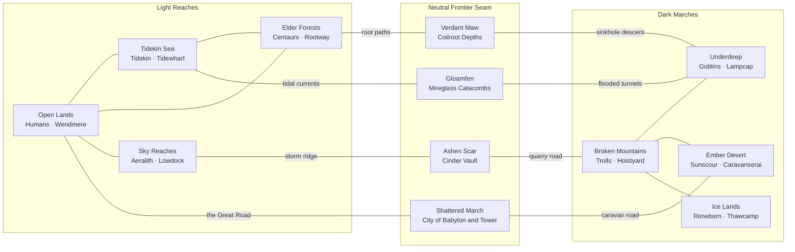
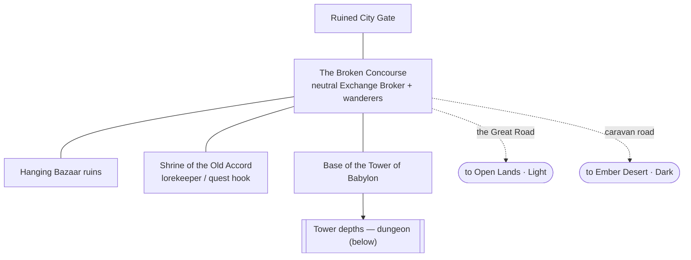
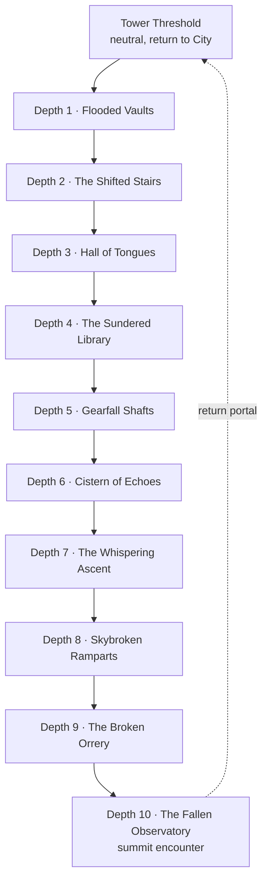

# World map layout — Light, Dark, and the neutral frontier

## Context

DESIGN-0010 defines the *interactive* world map (Territory → Region → Zone →
Portal, no fast travel) and lists eight Homeland Territories, four Frontier
Territories, and four Dungeon Sites — but it does not lay out *where things sit*
relative to one another. DESIGN-0008/0006 fix each Lineage's Allegiance (Light or
Dark). DESIGN-0014 fills each Homeland with a home town.

This record draws the **geographic layout**: a **Light** half and a **Dark** half
split by a **neutral Frontier seam**, with the eight Homelands arranged so
neighbours share terrain, and the neutral middle holding shared/abandoned sites —
foremost the **Abandoned City of Babylon and its Tower**, which crowns the
featured **dungeon**. It uses mermaid maps, matching DESIGN-0014's style.

**Canon reused:** the four Frontiers and their Dungeon Sites (Gloamfen →
Mireglass Catacombs; Ashen Scar → Cinder Vault; Shattered March → Fallen
Observatory; Verdant Maw → Coilroot Depths), the Light/Dark Allegiance split, the
walk-through Portal graph, Exchange Brokers in shared settlements, and the
"unclaimed is not safe" rule. **New here (⊕):** the relative layout, the
Light↔Dark seam pairing of Frontiers, and the **Abandoned City of Babylon / Tower
of Babylon** as the marquee neutral site atop the Shattered March's dungeon.

> Naming note: "Babylon" is a real-world name; DESIGN-0008 prefers original
> motifs. It is kept here as the requested working name; an original alternative
> (e.g. *Bab-Ilim, the Fallen Accord*) is offered for the review pass. All names
> are provisional.

## The two halves and the seam

- **Light Reaches** (Allegiance Light): **Sky Reaches** (Aeralith), **Tidekin
  Sea** (Tidekin), **Open Lands** (Humans), **Elder Forests** (Grove Centaurs).
  The **Open Lands** are the Light hub — roads radiate from it to the coast, the
  forest eaves, and the sky lifts.
- **Dark Marches** (Allegiance Dark): **Broken Mountains** (Crag Trolls),
  **Underdeep** (Deep Goblins), **Ember Desert** (Sunscour), **Ice Lands**
  (Rimeborn). The **Broken Mountains** are the Dark hub; the **Ice Lands** sit at
  the far dark edge, reached only through the mountains.
- **Neutral Frontier seam** (both Allegiances, "unclaimed" ≠ safe): four
  Frontiers form the border, each bridging one Light Homeland to one Dark one
  along a shared terrain gradient. Home-town Strongholds stay Allegiance-gated
  (DESIGN-0009); the Frontiers and their sites are open to all.

**Terrain-paired seam crossings (⊕):**

| Frontier (Dungeon) | Light side | Dark side | Terrain gradient / route |
| --- | --- | --- | --- |
| **Ashen Scar** (Cinder Vault) | Sky Reaches | Broken Mountains | scarred high peaks — storm ridge ↔ quarry road |
| **Shattered March** — *City of Babylon* (Fallen Observatory) | Open Lands | Ember Desert | ruined plains meeting desert — the Great Road ↔ caravan road |
| **Gloamfen** (Mireglass Catacombs) | Tidekin Sea | Underdeep | drowned marsh — tidal currents ↔ flooded tunnels |
| **Verdant Maw** (Coilroot Depths) | Elder Forests | Underdeep | overgrown sinkholes — root paths ↔ sinkhole descent |

## World overview map

Reading it: to cross from Light to Dark you always pass through a neutral
Frontier — there is no direct Homeland-to-Homeland border between the halves. The
**Shattered March** is the central crossing, and the **City of Babylon** sits on
it as the one place where both Allegiances mingle at scale.

## Neutral site — the Abandoned City of Babylon

Once the meeting-place of every Lineage, now a ruin in the Shattered March at the
seam of the Open Lands and the Ember Desert. It is a **neutral hub** (both
Allegiances, no Stronghold gate): the natural site for a cross-Allegiance
**Exchange Broker** (DESIGN-0009 places Brokers in shared settlements), a few
wanderer/quest Characters, and the mouth of the featured dungeon. Terrain reads
as sun-bleached plains rubble giving way to desert — collapsed ziggurat terraces,
dry canals, and the leaning **Tower of Babylon** over everything.

## Featured dungeon — the Tower of Babylon / the Fallen Observatory

The Tower is the Shattered March's Dungeon Site (canon: **Fallen Observatory**,
Group difficulty). Per DESIGN-0010 a Dungeon is "at least ten consecutive
Dungeon Depth Zones" with a return Portal at the leaf. The Tower reads as a
descent through the buried city and a final ascent to the ruined summit
observatory — a single unbroken climb of consequence.

Difficulty is **Group** (DESIGN-0010). Per DESIGN-0014, defeat and relogin keep
the Hero in the current Dungeon Depth Map, using its safe Recovery Anchor when
needed. The Tower Threshold and City are reached by Portal travel, not death
or logout. Each Depth requires a return Portal as well as its progression route.
Loot and creatures follow the 41–60 band (currently paused in
DESIGN-0011), so the dungeon is authored now and populated when that band opens.

## The other three Frontier dungeons (canon, for completeness)

| Frontier | Dungeon Site | Difficulty (0010) | Terrain flavor |
| --- | --- | --- | --- |
| Ashen Scar | Cinder Vault | Elite | scorched volcanic rift between sky peaks and mountains |
| Gloamfen | Mireglass Catacombs | Veteran | drowned marsh catacombs between sea and Underdeep |
| Verdant Maw | Coilroot Depths | Group | root-choked sinkholes between forest and Underdeep |

Each is a ≥10-Depth chain like the Tower, with a neutral threshold and a return
Portal (same shape as the mermaid above).

## Access & safety recap
- **Homelands:** Outer Villages open to both; Strongholds Allegiance-gated
  (DESIGN-0009). New Heroes spawn in their Homeland's village (DESIGN-0014).
- **Neutral Frontiers & Babylon:** enterable by both Allegiances; not safe zones
  ("unclaimed does not mean safe", DESIGN-0010) — Open Conflict rules and
  Frontier creatures apply. The City's Broken Concourse is the exception if we
  designate it a guarded neutral market (open question).
- **Travel:** always by walking through Portals that read as the routes named on
  the seam edges (roads, currents, ridges, sinkholes) — no fast travel.

## Art-generation prompts

Prepend the DESIGN-0014 storybook-anime style preamble.

- **World-map illustration:** "…a hand-painted fantasy world map split into a
  luminous Light west (green plains, blue coast and sea, sunlit sky isles, deep
  forests) and a shadowed Dark east (storm mountains, glowing underdeep, ember
  desert, aurora ice), joined across a cracked neutral seam of marsh, ruined
  plains, volcanic scar, and jungle sinkholes; a great leaning tower marks a
  ruined city at the center of the seam; storybook cartography, soft cel color,
  clear route lines."
- **City of Babylon (keyframe):** "…an abandoned ancient city where sun-bleached
  plains rubble meets red desert: collapsed ziggurat terraces, dry canals, a
  broken bazaar of hanging cloth, wanderers of many peoples trading among ruins,
  and a colossal leaning unfinished tower over all; warm dust light, side-scroll
  platforms of fallen walls and stairs."
- **Tower of Babylon (keyframe):** "…a colossal spiral tower of ancient brick and
  green-bronze, half-sunk and half-toppled, storm-lit, its ruined summit an old
  observatory of broken orreries open to the sky; a small figure at its foot for
  scale; foreboding but wondrous."
- **Dungeon depth (keyframe):** "…the flooded vault interior of a fallen tower,
  tilted stairs and broken machinery, faint blue glow on old script-covered
  walls, water and dust, a single safe ledge — a 2D side-scroll dungeon depth."

## Implementation mapping (onto the current build)
- The neutral sites are **Zones** like any other (author into `catalog.rs`): the
  City is a small hub cluster (Gate · Broken Concourse · Bazaar · Shrine · Tower
  Base), the Tower is a linear ≥10-Zone Portal chain with a return Portal at the
  boss and threshold.
- **No Allegiance gate** on neutral Zones — every Portal there transfers both
  halves. Reuse the existing zone/portal transfer; the seam routes are just
  Portals between Homeland edge Zones and Frontier Zones.
- **World map UI:** DESIGN-0010's map screen renders this graph; the layout above
  is the data it visualizes (Territories with Stronghold/Village/Dungeon markers).
- Populate Frontier/dungeon creatures when the 41–60 roster band opens
  (DESIGN-0011); author geometry now.

## Open questions
- Is the City of Babylon's Broken Concourse a **guarded neutral market** (safe)
  or full Open Conflict like the rest of the Frontier?
- Keep "Babylon / Tower of Babylon", or adopt an original name (Bab-Ilim / the
  Fallen Accord)?
- Exact seam adjacency is provisional; the Ice Lands currently attach only via the
  Broken Mountains — should a fifth neutral pocket touch the far ice edge?
- All Brokers, including Babylon's, share DESIGN-0009's world-wide player
  market; what local services distinguish this hub without splitting its book?

## Change log

- 2026-09-08: Reconciled the user-approved rules applicable to this record;
  see the decision summary in `../game-coherence-review.md`.
- 2026-08-24: Initial world layout — Light/Dark halves, terrain-paired neutral
  Frontier seam, the Abandoned City of Babylon and Tower, and the featured
  Fallen Observatory dungeon, with mermaid maps.
