# Detailed world map and monster-level plan

A reviewable **Markdown/Mermaid proposal**, before changing the game or atlas. It lists **408 named maps** across the existing twelve regions: **188 current atlas entries** plus **220 proposed outdoor progression maps**. All current map IDs, names and portal connections are retained. No playable levels, monster statistics, spawn tables or atlas data are changed by this document.

The current atlas mostly contains settlements and dungeon placeholders. The added outdoor routes give every homeland an ordinary 1–40 leveling path, a 61–80 return route, and mythic destinations; frontier routes cover 41–60 and 81–115 without mandatory dungeon completion. These are geographically distinct maps with fixed monster levels, not automatic scaling of starter villages.

## Status and reading key

- **Atlas** means the map exists in `src/world/atlas.json`; it does **not** mean its playable level exists. Only the fifteen Human hometown maps and four training maps currently have gameplay scenes/state.
- **Proposed** means a new map name, ID and route introduced here, pending review. **Every per-map monster level in this plan is a balance proposal**, including numeric levels for existing training encounters: their current model has fixed stats rather than authored monster levels.
- **R** is the recommended player level. Normal monsters fall within R ± 2. Optional elites sit at the top of their cohort; proposed dungeon/finale bosses are at most R + 2, capped at 120.
- **None** means no ordinary hostile monster population is proposed. It is not a level-0 monster, invulnerability guarantee, or permission to farm guards.
- Levels use the current glossary's **Overall Level 1–120** (`CONTEXT.md`), called Adventure Level in the older creature record. Discipline levels are a separate 1–99 scale.
- `---` is a reciprocal walk-through connection. A dashed link is a proposed route or campaign transition; it also needs a legal return. Region headings are not individual playable maps.
- All named geography here is public/charted. Unvisited maps remain unexplored; reading the map does not grant discovery. Truly secret maps are outside this public proposal.

## World progression

| Player levels | Where to go | Normal monster levels | Progression requirement |
| --- | --- | --- | --- |
| 1–40 | Any of the eight home regions | Eight local bands: 1–5 through 36–40 | Common solo route and comparable aid objective in each band; no required elite, party, class or allied stronghold passage |
| 41–60 | Any neutral frontier | Four surface bands: 41–45 through 56–60 | Solo outdoor spine; each dungeon is an optional branch |
| 61–80 | Return to a homeland's veteran outskirts | 61–65, 66–70, 71–75, 76–80 | Separate fixed-level maps reached from the public village |
| 81–100 | Frontier veteran routes | 81–85, 86–90, 91–95, 96–100 | Separate outdoor route; no dungeon completion gate |
| 101–105 | Homeland mythic sites OR frontier mythic approach | 101–105 | Alternative branches at the same stage |
| 106–115 | Frontier mythic interiors | 106–110, 111–115 | Connected to the veteran surface spine |
| 116–120 | Homeland convergence sites | 116–120; optional boss 120 | Public approach; final encounter design pending |

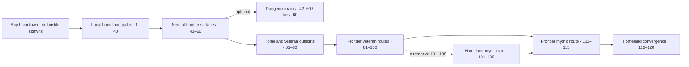

These arrows describe campaign order, not teleportation or new cross-world edges. Travel continues along the existing world road network. Higher-level route entrances need explicit danger signs and a retreat path; their levels must not spill onto village streets or beginner roads. Exact quest prerequisites and environmental requirements remain future encounter design.

## World regions, strongholds and roads

All eight homelands are parallel starts. **Dark regions are not automatically higher-level.** Stronghold and story-site access remains allegiance-based; ordinary regional progression stays in shared outdoor maps.

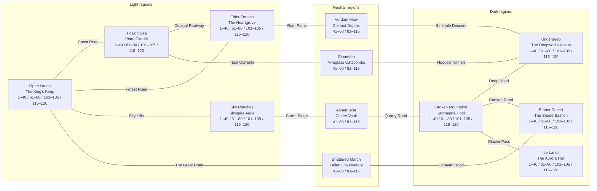

### Map budget

| Region | Current atlas maps | Proposed progression maps | Total | Stronghold access |
| --- | ---: | ---: | ---: | --- |
| Open Lands | 19 | 22 | 41 | Light |
| Tidekin Sea | 17 | 22 | 39 | Light |
| Elder Forests | 16 | 22 | 38 | Light |
| Sky Reaches | 17 | 22 | 39 | Light |
| Broken Mountains | 13 | 22 | 35 | Dark |
| Underdeep | 19 | 22 | 41 | Dark |
| Ember Desert | 16 | 22 | 38 | Dark |
| Ice Lands | 14 | 22 | 36 | Dark |
| Ashen Scar | 13 | 11 | 24 | None; shared frontier |
| Shattered March | 18 | 11 | 29 | None; shared frontier |
| Gloamfen | 13 | 11 | 24 | None; shared frontier |
| Verdant Maw | 13 | 11 | 24 | None; shared frontier |
| **Total** | **188** | **220** | **408** | |

This stays inside DESIGN-0010's 320–500-map planning range: homeland totals are 35–41 each, and frontier totals are 24–29 each. Stronghold interiors retain their existing five-to-ten-map counts; new leveling maps are outside their gates.

## Map-by-map plan

- [Open Lands](#open-lands)
- [Tidekin Sea](#tidekin-sea)
- [Elder Forests](#elder-forests)
- [Sky Reaches](#sky-reaches)
- [Broken Mountains](#broken-mountains)
- [Underdeep](#underdeep)
- [Ember Desert](#ember-desert)
- [Ice Lands](#ice-lands)
- [Ashen Scar](#ashen-scar)
- [Shattered March](#shattered-march)
- [Gloamfen](#gloamfen)
- [Verdant Maw](#verdant-maw)

Each region has two graphs: the existing atlas graph and the proposed outdoor progression graph. The tables are the exact name/level/occupant index. Shared IDs at diagram boundaries denote the same map, not duplicates. Doorway access applies in both directions. Layout in these diagrams communicates connectivity, not physical platform geometry.


### Open Lands

Village: **Wendmere Crossroads**. Stronghold: **The King's Keep** (Light). Story site: **The Princess's Tower**.

Town and story maps are social, service or traversal spaces in this pass. No hostile population is added merely to fill a level column. Threats near a keep belong in its separate outdoor encounter map, not inside the peaceful hall. Human tower access still requires the Warden key.

#### Existing atlas connections

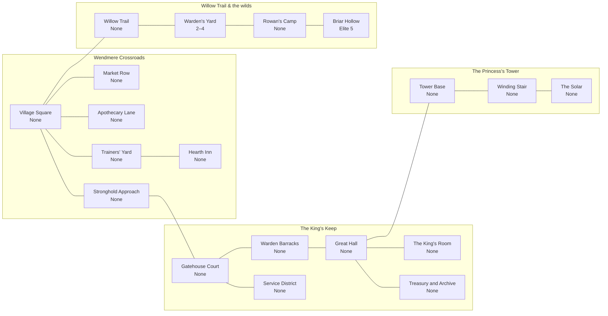

| Map ID | Map name | R | Monster / encounter levels | Occupants and purpose | Access | Status |
| --- | --- | ---: | --- | --- | --- | --- |
| `square` | Village Square | — | None | Peaceful settlement / traversal; NPCs and guardians are not farmable monsters. | Shared | Atlas |
| `market` | Market Row | — | None | Peaceful settlement / traversal; NPCs and guardians are not farmable monsters. | Shared | Atlas |
| `apothecary` | Apothecary Lane | — | None | Peaceful settlement / traversal; NPCs and guardians are not farmable monsters. | Shared | Atlas |
| `trainers` | Trainers' Yard | — | None | Peaceful settlement / traversal; NPCs and guardians are not farmable monsters. | Shared | Atlas |
| `inn` | Hearth Inn | — | None | Peaceful settlement / traversal; NPCs and guardians are not farmable monsters. | Shared | Atlas |
| `approach` | Stronghold Approach | — | None | Peaceful settlement / traversal; NPCs and guardians are not farmable monsters. | Shared | Atlas |
| `gatehouse` | Gatehouse Court | — | None | Peaceful settlement / traversal; NPCs and guardians are not farmable monsters. | Light | Atlas |
| `barracks` | Warden Barracks | — | None | Peaceful settlement / traversal; NPCs and guardians are not farmable monsters. | Light | Atlas |
| `service` | Service District | — | None | Peaceful settlement / traversal; NPCs and guardians are not farmable monsters. | Light | Atlas |
| `hall` | Great Hall | — | None | Peaceful settlement / traversal; NPCs and guardians are not farmable monsters. | Light | Atlas |
| `king` | The King's Room | — | None | Peaceful settlement / traversal; NPCs and guardians are not farmable monsters. | Light | Atlas |
| `archive` | Treasury and Archive | — | None | Peaceful settlement / traversal; NPCs and guardians are not farmable monsters. | Light | Atlas |
| `tower` | Tower Base | — | None | Peaceful settlement / traversal; NPCs and guardians are not farmable monsters. | Light | Atlas |
| `stair` | Winding Stair | — | None | Peaceful settlement / traversal; NPCs and guardians are not farmable monsters. | Light | Atlas |
| `solar` | The Solar | — | None | Peaceful settlement / traversal; NPCs and guardians are not farmable monsters. | Light | Atlas |
| `trail` | Willow Trail | — | None | Peaceful travel / supplies; no ordinary monster spawns. | Shared | Atlas |
| `yard` | Warden's Yard | 3 | 2–4 | Ordinary training foes; species unchanged / unnamed in the encounter model. | Shared | Atlas |
| `camp` | Rowan's Camp | — | None | Peaceful travel / supplies; no ordinary monster spawns. | Shared | Atlas |
| `grove` | Briar Hollow | 4 | Elite 5 | Elder Briar (existing tutorial encounter; optional to the proposed regional leveling spine). | Shared | Atlas |

#### Proposed outdoor progression

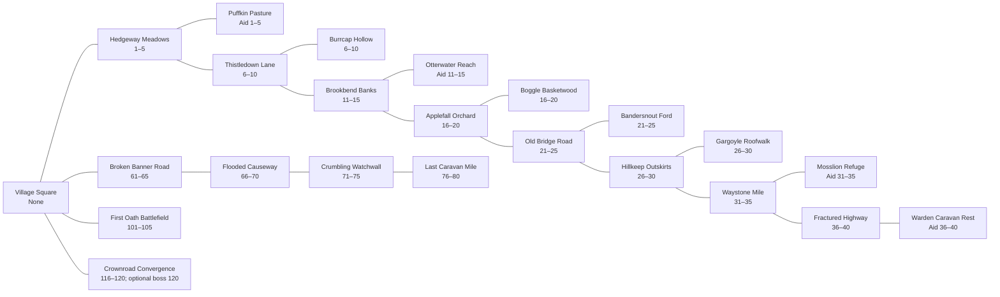

| Map ID | Map name | R | Monster / encounter levels | Occupants and purpose | Access | Status |
| --- | --- | ---: | --- | --- | --- | --- |
| `open_lands_path_001` | Hedgeway Meadows | 3 | 1–5 | Hedge Nibbler · Common; repeatable solo combat AND equivalent aid/repair objective. | Shared | Proposed |
| `open_lands_site_001` | Puffkin Pasture | 3 | None hostile; aid creature 1–5 | Meadow Puffkin · Benevolent / Common; aid / escort / protection, never a kill-farm target. | Shared | Proposed |
| `open_lands_path_006` | Thistledown Lane | 8 | 6–10 | Hedge Nibbler · Common; repeatable solo combat AND equivalent aid/repair objective. | Shared | Proposed |
| `open_lands_site_006` | Burrcap Hollow | 8 | 6–10 | Thistlecap Rascal · Hostile / Common; optional local encounter. | Shared | Proposed |
| `open_lands_path_011` | Brookbend Banks | 13 | 11–15 | Hedge Nibbler · Common; repeatable solo combat AND equivalent aid/repair objective. | Shared | Proposed |
| `open_lands_site_011` | Otterwater Reach | 13 | None hostile; aid creature 11–15 | Brookskip Otter · Benevolent / Common; aid / escort / protection, never a kill-farm target. | Shared | Proposed |
| `open_lands_path_016` | Applefall Orchard | 18 | 16–20 | Hedge Nibbler · Common; repeatable solo combat AND equivalent aid/repair objective. | Shared | Proposed |
| `open_lands_site_016` | Boggle Basketwood | 18 | 16–20 | Orchard Boggle · Hostile / Common; optional local encounter. | Shared | Proposed |
| `open_lands_path_021` | Old Bridge Road | 23 | 21–25 | Hedge Nibbler · Common; repeatable solo combat AND equivalent aid/repair objective. | Shared | Proposed |
| `open_lands_site_021` | Bandersnout Ford | 23 | 21–25 | Riverroad Bandersnout · Hostile / Common; optional local encounter. | Shared | Proposed |
| `open_lands_path_026` | Hillkeep Outskirts | 28 | 26–30 | Hedge Nibbler · Common; repeatable solo combat AND equivalent aid/repair objective. | Shared | Proposed |
| `open_lands_site_026` | Gargoyle Roofwalk | 28 | 26–30 | Hillkeep Gargoyle · Corrupted / Common; optional local encounter. | Shared | Proposed |
| `open_lands_path_031` | Waystone Mile | 33 | 31–35 | Hedge Nibbler · Common; repeatable solo combat AND equivalent aid/repair objective. | Shared | Proposed |
| `open_lands_site_031` | Mosslion Refuge | 33 | None hostile; aid creature 31–35 | Waystone Guardian · Benevolent / Elite; aid / escort / protection, never a kill-farm target. | Shared | Proposed |
| `open_lands_path_036` | Fractured Highway | 38 | 36–40 | Hedge Nibbler · Common; repeatable solo combat AND equivalent aid/repair objective. | Shared | Proposed |
| `open_lands_site_036` | Warden Caravan Rest | 38 | None hostile; aid creature 36–40 | Old Road Warden · Benevolent / Elite; aid / escort / protection, never a kill-farm target. | Shared | Proposed |
| `open_lands_return_061` | Broken Banner Road | 63 | 61–65 | Veteran local Common threats; species TBD, proposed fixed-level population. | Shared | Proposed |
| `open_lands_return_066` | Flooded Causeway | 68 | 66–70 | Veteran local Common threats; species TBD, proposed fixed-level population. | Shared | Proposed |
| `open_lands_return_071` | Crumbling Watchwall | 73 | 71–75 | Veteran local Common threats; species TBD, proposed fixed-level population. | Shared | Proposed |
| `open_lands_return_076` | Last Caravan Mile | 78 | 76–80 | Veteran local Common threats; species TBD, proposed fixed-level population. | Shared | Proposed |
| `open_lands_return_101` | First Oath Battlefield | 103 | 101–105 | Mythic local threats; species TBD, proposed fixed-level population. | Shared | Proposed |
| `open_lands_return_116` | Crownroad Convergence | 118 | 116–120; optional boss 120 | Mythic local threats; species TBD, proposed fixed-level population. | Shared | Proposed |

Every `path_` map has both ordinary combat and comparable aid/repair progression. Its `site_` branch is optional. Regional access at 40/60/80/100/115 follows the world roads above; the veteran and mythic village branches are dangerous outward routes, never a requirement to cross a restricted stronghold.

### Tidekin Sea

Detailed map layouts, creatures, tide rules and quests: [Tidekin Sea region design](0023-tidekin-sea-region.md).

Village: **Tidewharf**. Stronghold: **Pearl Citadel** (Light). Story site: **The Sunken Shrine**.

Town and story maps are social, service or traversal spaces in this pass. No hostile population is added merely to fill a level column. Threats near a keep belong in its separate outdoor encounter map, not inside the peaceful hall. Human tower access still requires the Warden key.

#### Existing atlas connections

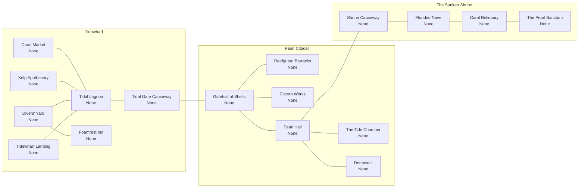

| Map ID | Map name | R | Monster / encounter levels | Occupants and purpose | Access | Status |
| --- | --- | ---: | --- | --- | --- | --- |
| `tidekin_sea_cm` | Coral Market | — | None | Peaceful settlement / traversal; NPCs and guardians are not farmable monsters. | Shared | Atlas |
| `tidekin_sea_lag` | Tidal Lagoon | — | None | Peaceful settlement / traversal; NPCs and guardians are not farmable monsters. | Shared | Atlas |
| `tidekin_sea_ka` | Kelp Apothecary | — | None | Peaceful settlement / traversal; NPCs and guardians are not farmable monsters. | Shared | Atlas |
| `tidekin_sea_dy` | Divers' Yard | — | None | Peaceful settlement / traversal; NPCs and guardians are not farmable monsters. | Shared | Atlas |
| `tidekin_sea_inn` | Foamrest Inn | — | None | Peaceful settlement / traversal; NPCs and guardians are not farmable monsters. | Shared | Atlas |
| `tidekin_sea_land` | Tidewharf Landing | — | None | Peaceful settlement / traversal; NPCs and guardians are not farmable monsters. | Shared | Atlas |
| `tidekin_sea_caus` | Tidal Gate Causeway | — | None | Peaceful settlement / traversal; NPCs and guardians are not farmable monsters. | Shared | Atlas |
| `tidekin_sea_gs` | Gatehall of Shells | — | None | Peaceful settlement / traversal; NPCs and guardians are not farmable monsters. | Light | Atlas |
| `tidekin_sea_rb` | Reefguard Barracks | — | None | Peaceful settlement / traversal; NPCs and guardians are not farmable monsters. | Light | Atlas |
| `tidekin_sea_cw` | Cistern Works | — | None | Peaceful settlement / traversal; NPCs and guardians are not farmable monsters. | Light | Atlas |
| `tidekin_sea_ph` | Pearl Hall | — | None | Peaceful settlement / traversal; NPCs and guardians are not farmable monsters. | Light | Atlas |
| `tidekin_sea_tc` | The Tide Chamber | — | None | Peaceful settlement / traversal; NPCs and guardians are not farmable monsters. | Light | Atlas |
| `tidekin_sea_dv` | Deepvault | — | None | Peaceful settlement / traversal; NPCs and guardians are not farmable monsters. | Light | Atlas |
| `tidekin_sea_sc` | Shrine Causeway | — | None | Peaceful settlement / traversal; NPCs and guardians are not farmable monsters. | Light | Atlas |
| `tidekin_sea_fn` | Flooded Nave | — | None | Peaceful settlement / traversal; NPCs and guardians are not farmable monsters. | Light | Atlas |
| `tidekin_sea_cr` | Coral Reliquary | — | None | Peaceful settlement / traversal; NPCs and guardians are not farmable monsters. | Light | Atlas |
| `tidekin_sea_ps` | The Pearl Sanctum | — | None | Peaceful settlement / traversal; NPCs and guardians are not farmable monsters. | Light | Atlas |

#### Proposed outdoor progression

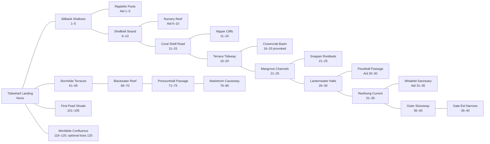

| Map ID | Map name | R | Monster / encounter levels | Occupants and purpose | Access | Status |
| --- | --- | ---: | --- | --- | --- | --- |
| `tidekin_sea_path_001` | Siltbank Shallows | 3 | 1–5 | Silt Skitter · Common; repeatable solo combat AND equivalent aid/repair objective. | Shared | Proposed |
| `tidekin_sea_site_001` | Ripplefin Pools | 3 | None hostile; aid creature 1–5 | Ripplefin Sprout · Benevolent / Common; aid / escort / protection, never a kill-farm target. | Shared | Proposed |
| `tidekin_sea_path_006` | Shellbell Strand | 8 | 6–10 | Silt Skitter · Common; repeatable solo combat AND equivalent aid/repair objective. | Shared | Proposed |
| `tidekin_sea_site_006` | Nursery Reef | 8 | None hostile; aid creature 6–10 | Shellbell Nymph · Benevolent / Common; aid / escort / protection, never a kill-farm target. | Shared | Proposed |
| `tidekin_sea_path_011` | Coral Shelf Road | 13 | 11–15 | Silt Skitter · Common; repeatable solo combat AND equivalent aid/repair objective. | Shared | Proposed |
| `tidekin_sea_site_011` | Nipper Cliffs | 13 | 11–15 | Coral Nipper · Hostile / Common; optional local encounter. | Shared | Proposed |
| `tidekin_sea_path_016` | Terrace Tideway | 18 | 16–20 | Silt Skitter · Common; repeatable solo combat AND equivalent aid/repair objective. | Shared | Proposed |
| `tidekin_sea_site_016` | Crowncrab Basin | 18 | 16–20 only if provoked | Tidepool Crowncrab · Neutral / Common; avoidable encounter / observation. | Shared | Proposed |
| `tidekin_sea_path_021` | Mangrove Channels | 23 | 21–25 | Silt Skitter · Common; repeatable solo combat AND equivalent aid/repair objective. | Shared | Proposed |
| `tidekin_sea_site_021` | Snapper Rootbeds | 23 | 21–25 | Mangrove Snapper · Hostile / Common; optional local encounter. | Shared | Proposed |
| `tidekin_sea_path_026` | Lanternwater Halls | 28 | 26–30 | Silt Skitter · Common; repeatable solo combat AND equivalent aid/repair objective. | Shared | Proposed |
| `tidekin_sea_site_026` | Floodhall Passage | 28 | None hostile; aid creature 26–30 | Floodhall Lanternfish · Benevolent / Common; aid / escort / protection, never a kill-farm target. | Shared | Proposed |
| `tidekin_sea_path_031` | Reefsong Current | 33 | 31–35 | Silt Skitter · Common; repeatable solo combat AND equivalent aid/repair objective. | Shared | Proposed |
| `tidekin_sea_site_031` | Whalelet Sanctuary | 33 | None hostile; aid creature 31–35 | Reefsong Whalelet · Benevolent / Common; aid / escort / protection, never a kill-farm target. | Shared | Proposed |
| `tidekin_sea_path_036` | Outer Sluiceway | 38 | 36–40 | Silt Skitter · Common; repeatable solo combat AND equivalent aid/repair objective. | Shared | Proposed |
| `tidekin_sea_site_036` | Gate Eel Narrows | 38 | 36–40 | Tidal Gate Eel · Hostile / Common; optional local encounter. | Shared | Proposed |
| `tidekin_sea_return_061` | Stormtide Terraces | 63 | 61–65 | Stormshell Skitter · proposed in [Tidekin region design](0023-tidekin-sea-region.md). | Shared | Proposed |
| `tidekin_sea_return_066` | Blackwater Reef | 68 | 66–70 | Blackwater Pincer · proposed in [Tidekin region design](0023-tidekin-sea-region.md). | Shared | Proposed |
| `tidekin_sea_return_071` | Pressurehall Passage | 73 | 71–75 | Bellowshell Crawler · proposed in [Tidekin region design](0023-tidekin-sea-region.md). | Shared | Proposed |
| `tidekin_sea_return_076` | Maelstrom Causeway | 78 | 76–80 | Riptide Coil · proposed in [Tidekin region design](0023-tidekin-sea-region.md). | Shared | Proposed |
| `tidekin_sea_return_101` | First Pearl Shoals | 103 | 101–105 | Pearlglass Sentinel · proposed in [Tidekin region design](0023-tidekin-sea-region.md). | Shared | Proposed |
| `tidekin_sea_return_116` | Worldtide Confluence | 118 | 116–120; optional boss 120 | Confluence Eel; optional Group boss The Undertow Regent (120) · proposed in [Tidekin region design](0023-tidekin-sea-region.md). | Shared | Proposed |

Every `path_` map has both ordinary combat and comparable aid/repair progression. Its `site_` branch is optional. Regional access at 40/60/80/100/115 follows the world roads above; the veteran and mythic village branches are dangerous outward routes, never a requirement to cross a restricted stronghold.

### Elder Forests

Village: **Rootway Commons**. Stronghold: **The Heartgrove** (Light). Story site: **Elder Tree: Trial of Paths**.

Town and story maps are social, service or traversal spaces in this pass. No hostile population is added merely to fill a level column. Threats near a keep belong in its separate outdoor encounter map, not inside the peaceful hall. Human tower access still requires the Warden key.

#### Existing atlas connections

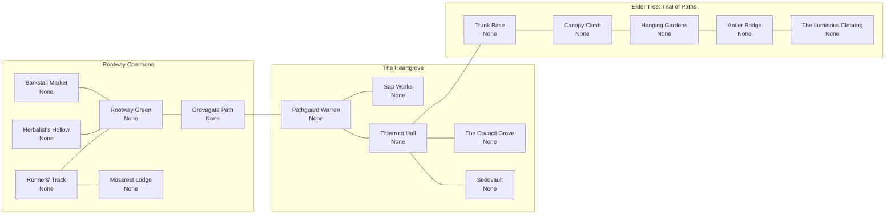

| Map ID | Map name | R | Monster / encounter levels | Occupants and purpose | Access | Status |
| --- | --- | ---: | --- | --- | --- | --- |
| `elder_forests_bm` | Barkstall Market | — | None | Peaceful settlement / traversal; NPCs and guardians are not farmable monsters. | Shared | Atlas |
| `elder_forests_grn` | Rootway Green | — | None | Peaceful settlement / traversal; NPCs and guardians are not farmable monsters. | Shared | Atlas |
| `elder_forests_hh` | Herbalist's Hollow | — | None | Peaceful settlement / traversal; NPCs and guardians are not farmable monsters. | Shared | Atlas |
| `elder_forests_rt` | Runners' Track | — | None | Peaceful settlement / traversal; NPCs and guardians are not farmable monsters. | Shared | Atlas |
| `elder_forests_ml` | Mossrest Lodge | — | None | Peaceful settlement / traversal; NPCs and guardians are not farmable monsters. | Shared | Atlas |
| `elder_forests_gp` | Grovegate Path | — | None | Peaceful settlement / traversal; NPCs and guardians are not farmable monsters. | Shared | Atlas |
| `elder_forests_pw` | Pathguard Warren | — | None | Peaceful settlement / traversal; NPCs and guardians are not farmable monsters. | Light | Atlas |
| `elder_forests_sw` | Sap Works | — | None | Peaceful settlement / traversal; NPCs and guardians are not farmable monsters. | Light | Atlas |
| `elder_forests_eh` | Elderroot Hall | — | None | Peaceful settlement / traversal; NPCs and guardians are not farmable monsters. | Light | Atlas |
| `elder_forests_cg` | The Council Grove | — | None | Peaceful settlement / traversal; NPCs and guardians are not farmable monsters. | Light | Atlas |
| `elder_forests_sv` | Seedvault | — | None | Peaceful settlement / traversal; NPCs and guardians are not farmable monsters. | Light | Atlas |
| `elder_forests_tb` | Trunk Base | — | None | Peaceful settlement / traversal; NPCs and guardians are not farmable monsters. | Light | Atlas |
| `elder_forests_cc` | Canopy Climb | — | None | Peaceful settlement / traversal; NPCs and guardians are not farmable monsters. | Light | Atlas |
| `elder_forests_hg` | Hanging Gardens | — | None | Peaceful settlement / traversal; NPCs and guardians are not farmable monsters. | Light | Atlas |
| `elder_forests_ab` | Antler Bridge | — | None | Peaceful settlement / traversal; NPCs and guardians are not farmable monsters. | Light | Atlas |
| `elder_forests_lc` | The Luminous Clearing | — | None | Peaceful settlement / traversal; NPCs and guardians are not farmable monsters. | Light | Atlas |

#### Proposed outdoor progression

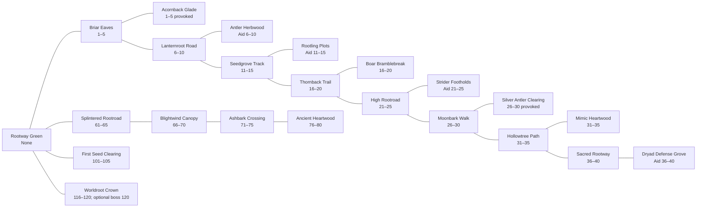

| Map ID | Map name | R | Monster / encounter levels | Occupants and purpose | Access | Status |
| --- | --- | ---: | --- | --- | --- | --- |
| `elder_forests_path_001` | Briar Eaves | 3 | 1–5 | Briar Mite · Common; repeatable solo combat AND equivalent aid/repair objective. | Shared | Proposed |
| `elder_forests_site_001` | Acornback Glade | 3 | 1–5 only if provoked | Acornback Fawn · Neutral / Common; avoidable encounter / observation. | Shared | Proposed |
| `elder_forests_path_006` | Lanternroot Road | 8 | 6–10 | Briar Mite · Common; repeatable solo combat AND equivalent aid/repair objective. | Shared | Proposed |
| `elder_forests_site_006` | Antler Herbwood | 8 | None hostile; aid creature 6–10 | Lantern Antler · Benevolent / Common; aid / escort / protection, never a kill-farm target. | Shared | Proposed |
| `elder_forests_path_011` | Seedgrove Track | 13 | 11–15 | Briar Mite · Common; repeatable solo combat AND equivalent aid/repair objective. | Shared | Proposed |
| `elder_forests_site_011` | Rootling Plots | 13 | None hostile; aid creature 11–15 | Rootling Tender · Benevolent / Common; aid / escort / protection, never a kill-farm target. | Shared | Proposed |
| `elder_forests_path_016` | Thornback Trail | 18 | 16–20 | Briar Mite · Common; repeatable solo combat AND equivalent aid/repair objective. | Shared | Proposed |
| `elder_forests_site_016` | Boar Bramblebreak | 18 | 16–20 | Briarhorn Boar · Hostile / Common; optional local encounter. | Shared | Proposed |
| `elder_forests_path_021` | High Rootroad | 23 | 21–25 | Briar Mite · Common; repeatable solo combat AND equivalent aid/repair objective. | Shared | Proposed |
| `elder_forests_site_021` | Strider Footholds | 23 | None hostile; aid creature 21–25 | Rootroad Strider · Benevolent / Common; aid / escort / protection, never a kill-farm target. | Shared | Proposed |
| `elder_forests_path_026` | Moonbark Walk | 28 | 26–30 | Briar Mite · Common; repeatable solo combat AND equivalent aid/repair objective. | Shared | Proposed |
| `elder_forests_site_026` | Silver Antler Clearing | 28 | 26–30 only if provoked | Moonbark Stag · Neutral / Common; avoidable encounter / observation. | Shared | Proposed |
| `elder_forests_path_031` | Hollowtree Path | 33 | 31–35 | Briar Mite · Common; repeatable solo combat AND equivalent aid/repair objective. | Shared | Proposed |
| `elder_forests_site_031` | Mimic Heartwood | 33 | 31–35 | Hollowroot Mimic · Hostile / Common; optional local encounter. | Shared | Proposed |
| `elder_forests_path_036` | Sacred Rootway | 38 | 36–40 | Briar Mite · Common; repeatable solo combat AND equivalent aid/repair objective. | Shared | Proposed |
| `elder_forests_site_036` | Dryad Defense Grove | 38 | None hostile; aid creature 36–40 | Elderbloom Dryad · Benevolent / Elite; aid / escort / protection, never a kill-farm target. | Shared | Proposed |
| `elder_forests_return_061` | Splintered Rootroad | 63 | 61–65 | Veteran local Common threats; species TBD, proposed fixed-level population. | Shared | Proposed |
| `elder_forests_return_066` | Blightwind Canopy | 68 | 66–70 | Veteran local Common threats; species TBD, proposed fixed-level population. | Shared | Proposed |
| `elder_forests_return_071` | Ashbark Crossing | 73 | 71–75 | Veteran local Common threats; species TBD, proposed fixed-level population. | Shared | Proposed |
| `elder_forests_return_076` | Ancient Heartwood | 78 | 76–80 | Veteran local Common threats; species TBD, proposed fixed-level population. | Shared | Proposed |
| `elder_forests_return_101` | First Seed Clearing | 103 | 101–105 | Mythic local threats; species TBD, proposed fixed-level population. | Shared | Proposed |
| `elder_forests_return_116` | Worldroot Crown | 118 | 116–120; optional boss 120 | Mythic local threats; species TBD, proposed fixed-level population. | Shared | Proposed |

Every `path_` map has both ordinary combat and comparable aid/repair progression. Its `site_` branch is optional. Regional access at 40/60/80/100/115 follows the world roads above; the veteran and mythic village branches are dangerous outward routes, never a requirement to cross a restricted stronghold.

### Sky Reaches

Village: **Lowdock**. Stronghold: **Skyspire Aerie** (Light). Story site: **Observatory of Storms**.

Town and story maps are social, service or traversal spaces in this pass. No hostile population is added merely to fill a level column. Threats near a keep belong in its separate outdoor encounter map, not inside the peaceful hall. Human tower access still requires the Warden key.

#### Existing atlas connections

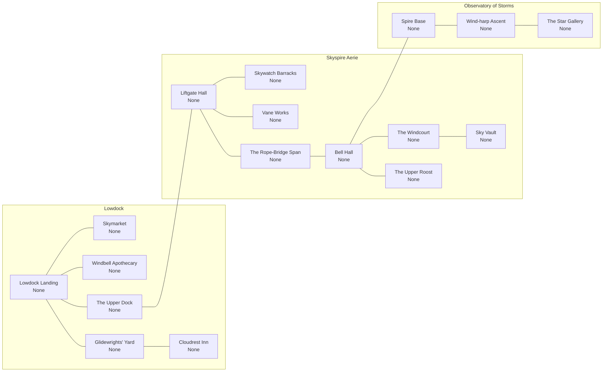

| Map ID | Map name | R | Monster / encounter levels | Occupants and purpose | Access | Status |
| --- | --- | ---: | --- | --- | --- | --- |
| `sky_reaches_ll` | Lowdock Landing | — | None | Peaceful settlement / traversal; NPCs and guardians are not farmable monsters. | Shared | Atlas |
| `sky_reaches_sm` | Skymarket | — | None | Peaceful settlement / traversal; NPCs and guardians are not farmable monsters. | Shared | Atlas |
| `sky_reaches_wa` | Windbell Apothecary | — | None | Peaceful settlement / traversal; NPCs and guardians are not farmable monsters. | Shared | Atlas |
| `sky_reaches_gy` | Glidewrights' Yard | — | None | Peaceful settlement / traversal; NPCs and guardians are not farmable monsters. | Shared | Atlas |
| `sky_reaches_ci` | Cloudrest Inn | — | None | Peaceful settlement / traversal; NPCs and guardians are not farmable monsters. | Shared | Atlas |
| `sky_reaches_ud` | The Upper Dock | — | None | Peaceful settlement / traversal; NPCs and guardians are not farmable monsters. | Shared | Atlas |
| `sky_reaches_lh` | Liftgate Hall | — | None | Peaceful settlement / traversal; NPCs and guardians are not farmable monsters. | Light | Atlas |
| `sky_reaches_sb` | Skywatch Barracks | — | None | Peaceful settlement / traversal; NPCs and guardians are not farmable monsters. | Light | Atlas |
| `sky_reaches_vw` | Vane Works | — | None | Peaceful settlement / traversal; NPCs and guardians are not farmable monsters. | Light | Atlas |
| `sky_reaches_rsp` | The Rope-Bridge Span | — | None | Peaceful settlement / traversal; NPCs and guardians are not farmable monsters. | Light | Atlas |
| `sky_reaches_bh` | Bell Hall | — | None | Peaceful settlement / traversal; NPCs and guardians are not farmable monsters. | Light | Atlas |
| `sky_reaches_wc` | The Windcourt | — | None | Peaceful settlement / traversal; NPCs and guardians are not farmable monsters. | Light | Atlas |
| `sky_reaches_ur` | The Upper Roost | — | None | Peaceful settlement / traversal; NPCs and guardians are not farmable monsters. | Light | Atlas |
| `sky_reaches_skv` | Sky Vault | — | None | Peaceful settlement / traversal; NPCs and guardians are not farmable monsters. | Light | Atlas |
| `sky_reaches_sp` | Spire Base | — | None | Peaceful settlement / traversal; NPCs and guardians are not farmable monsters. | Light | Atlas |
| `sky_reaches_wh` | Wind-harp Ascent | — | None | Peaceful settlement / traversal; NPCs and guardians are not farmable monsters. | Light | Atlas |
| `sky_reaches_sg` | The Star Gallery | — | None | Peaceful settlement / traversal; NPCs and guardians are not farmable monsters. | Light | Atlas |

#### Proposed outdoor progression

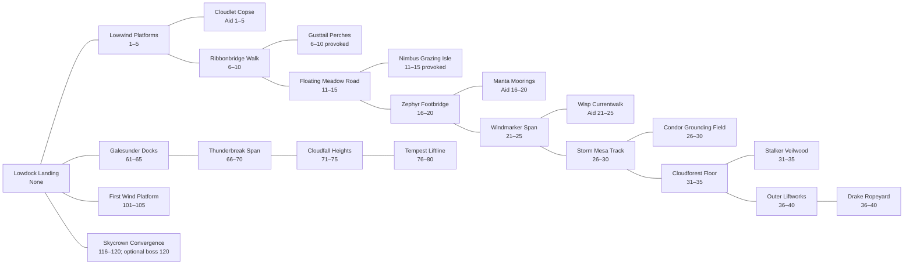

| Map ID | Map name | R | Monster / encounter levels | Occupants and purpose | Access | Status |
| --- | --- | ---: | --- | --- | --- | --- |
| `sky_reaches_path_001` | Lowwind Platforms | 3 | 1–5 | Draft Midge · Common; repeatable solo combat AND equivalent aid/repair objective. | Shared | Proposed |
| `sky_reaches_site_001` | Cloudlet Copse | 3 | None hostile; aid creature 1–5 | Cloudlet Finch · Benevolent / Common; aid / escort / protection, never a kill-farm target. | Shared | Proposed |
| `sky_reaches_path_006` | Ribbonbridge Walk | 8 | 6–10 | Draft Midge · Common; repeatable solo combat AND equivalent aid/repair objective. | Shared | Proposed |
| `sky_reaches_site_006` | Gusttail Perches | 8 | 6–10 only if provoked | Gusttail Kite · Neutral / Common; avoidable encounter / observation. | Shared | Proposed |
| `sky_reaches_path_011` | Floating Meadow Road | 13 | 11–15 | Draft Midge · Common; repeatable solo combat AND equivalent aid/repair objective. | Shared | Proposed |
| `sky_reaches_site_011` | Nimbus Grazing Isle | 13 | 11–15 only if provoked | Nimbus Ram · Neutral / Common; avoidable encounter / observation. | Shared | Proposed |
| `sky_reaches_path_016` | Zephyr Footbridge | 18 | 16–20 | Draft Midge · Common; repeatable solo combat AND equivalent aid/repair objective. | Shared | Proposed |
| `sky_reaches_site_016` | Manta Moorings | 18 | None hostile; aid creature 16–20 | Zephyr Manta · Benevolent / Common; aid / escort / protection, never a kill-farm target. | Shared | Proposed |
| `sky_reaches_path_021` | Windmarker Span | 23 | 21–25 | Draft Midge · Common; repeatable solo combat AND equivalent aid/repair objective. | Shared | Proposed |
| `sky_reaches_site_021` | Wisp Currentwalk | 23 | None hostile; aid creature 21–25 | Windbridge Wisp · Benevolent / Common; aid / escort / protection, never a kill-farm target. | Shared | Proposed |
| `sky_reaches_path_026` | Storm Mesa Track | 28 | 26–30 | Draft Midge · Common; repeatable solo combat AND equivalent aid/repair objective. | Shared | Proposed |
| `sky_reaches_site_026` | Condor Grounding Field | 28 | 26–30 | Thunderplume Condor · Hostile / Common; optional local encounter. | Shared | Proposed |
| `sky_reaches_path_031` | Cloudforest Floor | 33 | 31–35 | Draft Midge · Common; repeatable solo combat AND equivalent aid/repair objective. | Shared | Proposed |
| `sky_reaches_site_031` | Stalker Veilwood | 33 | 31–35 | Cloudforest Stalker · Hostile / Common; optional local encounter. | Shared | Proposed |
| `sky_reaches_path_036` | Outer Liftworks | 38 | 36–40 | Draft Midge · Common; repeatable solo combat AND equivalent aid/repair objective. | Shared | Proposed |
| `sky_reaches_site_036` | Drake Ropeyard | 38 | 36–40 | Liftline Drake · Hostile / Common; optional local encounter. | Shared | Proposed |
| `sky_reaches_return_061` | Galesunder Docks | 63 | 61–65 | Veteran local Common threats; species TBD, proposed fixed-level population. | Shared | Proposed |
| `sky_reaches_return_066` | Thunderbreak Span | 68 | 66–70 | Veteran local Common threats; species TBD, proposed fixed-level population. | Shared | Proposed |
| `sky_reaches_return_071` | Cloudfall Heights | 73 | 71–75 | Veteran local Common threats; species TBD, proposed fixed-level population. | Shared | Proposed |
| `sky_reaches_return_076` | Tempest Liftline | 78 | 76–80 | Veteran local Common threats; species TBD, proposed fixed-level population. | Shared | Proposed |
| `sky_reaches_return_101` | First Wind Platform | 103 | 101–105 | Mythic local threats; species TBD, proposed fixed-level population. | Shared | Proposed |
| `sky_reaches_return_116` | Skycrown Convergence | 118 | 116–120; optional boss 120 | Mythic local threats; species TBD, proposed fixed-level population. | Shared | Proposed |

Every `path_` map has both ordinary combat and comparable aid/repair progression. Its `site_` branch is optional. Regional access at 40/60/80/100/115 follows the world roads above; the veteran and mythic village branches are dangerous outward routes, never a requirement to cross a restricted stronghold.

### Broken Mountains

Village: **Hoistyard**. Stronghold: **Stormgate Hold** (Dark). Story site: **The Storm Forge**.

Town and story maps are social, service or traversal spaces in this pass. No hostile population is added merely to fill a level column. Threats near a keep belong in its separate outdoor encounter map, not inside the peaceful hall. Human tower access still requires the Warden key.

#### Existing atlas connections

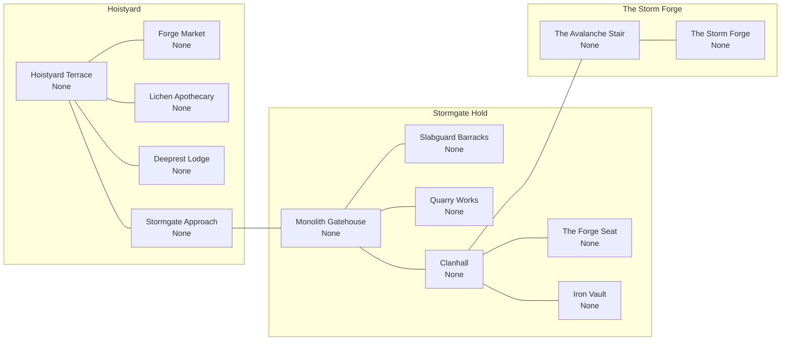

| Map ID | Map name | R | Monster / encounter levels | Occupants and purpose | Access | Status |
| --- | --- | ---: | --- | --- | --- | --- |
| `broken_mountains_ht` | Hoistyard Terrace | — | None | Peaceful settlement / traversal; NPCs and guardians are not farmable monsters. | Shared | Atlas |
| `broken_mountains_fm` | Forge Market | — | None | Peaceful settlement / traversal; NPCs and guardians are not farmable monsters. | Shared | Atlas |
| `broken_mountains_la` | Lichen Apothecary | — | None | Peaceful settlement / traversal; NPCs and guardians are not farmable monsters. | Shared | Atlas |
| `broken_mountains_dl` | Deeprest Lodge | — | None | Peaceful settlement / traversal; NPCs and guardians are not farmable monsters. | Shared | Atlas |
| `broken_mountains_sa` | Stormgate Approach | — | None | Peaceful settlement / traversal; NPCs and guardians are not farmable monsters. | Shared | Atlas |
| `broken_mountains_mg` | Monolith Gatehouse | — | None | Peaceful settlement / traversal; NPCs and guardians are not farmable monsters. | Dark | Atlas |
| `broken_mountains_slb` | Slabguard Barracks | — | None | Peaceful settlement / traversal; NPCs and guardians are not farmable monsters. | Dark | Atlas |
| `broken_mountains_qw` | Quarry Works | — | None | Peaceful settlement / traversal; NPCs and guardians are not farmable monsters. | Dark | Atlas |
| `broken_mountains_ch` | Clanhall | — | None | Peaceful settlement / traversal; NPCs and guardians are not farmable monsters. | Dark | Atlas |
| `broken_mountains_fs` | The Forge Seat | — | None | Peaceful settlement / traversal; NPCs and guardians are not farmable monsters. | Dark | Atlas |
| `broken_mountains_iv` | Iron Vault | — | None | Peaceful settlement / traversal; NPCs and guardians are not farmable monsters. | Dark | Atlas |
| `broken_mountains_avs` | The Avalanche Stair | — | None | Peaceful settlement / traversal; NPCs and guardians are not farmable monsters. | Dark | Atlas |
| `broken_mountains_sf` | The Storm Forge | — | None | Peaceful settlement / traversal; NPCs and guardians are not farmable monsters. | Dark | Atlas |

#### Proposed outdoor progression

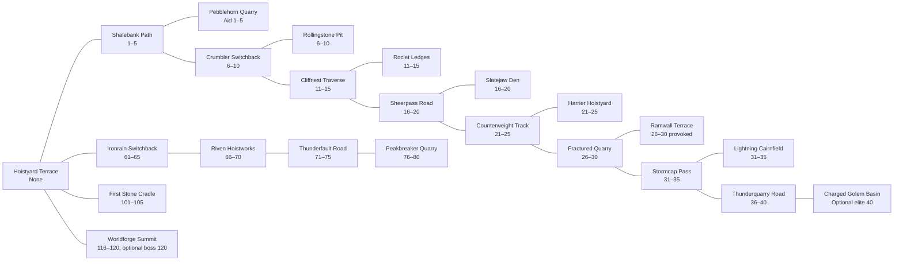

| Map ID | Map name | R | Monster / encounter levels | Occupants and purpose | Access | Status |
| --- | --- | ---: | --- | --- | --- | --- |
| `broken_mountains_path_001` | Shalebank Path | 3 | 1–5 | Shale Crawler · Common; repeatable solo combat AND equivalent aid/repair objective. | Shared | Proposed |
| `broken_mountains_site_001` | Pebblehorn Quarry | 3 | None hostile; aid creature 1–5 | Pebblehorn Kid · Benevolent / Common; aid / escort / protection, never a kill-farm target. | Shared | Proposed |
| `broken_mountains_path_006` | Crumbler Switchback | 8 | 6–10 | Shale Crawler · Common; repeatable solo combat AND equivalent aid/repair objective. | Shared | Proposed |
| `broken_mountains_site_006` | Rollingstone Pit | 8 | 6–10 | Quarry Crumbler · Hostile / Common; optional local encounter. | Shared | Proposed |
| `broken_mountains_path_011` | Cliffnest Traverse | 13 | 11–15 | Shale Crawler · Common; repeatable solo combat AND equivalent aid/repair objective. | Shared | Proposed |
| `broken_mountains_site_011` | Roclet Ledges | 13 | 11–15 | Stormfeather Roclet · Hostile / Common; optional local encounter. | Shared | Proposed |
| `broken_mountains_path_016` | Sheerpass Road | 18 | 16–20 | Shale Crawler · Common; repeatable solo combat AND equivalent aid/repair objective. | Shared | Proposed |
| `broken_mountains_site_016` | Slatejaw Den | 18 | 16–20 | Slatejaw Hound · Hostile / Common; optional local encounter. | Shared | Proposed |
| `broken_mountains_path_021` | Counterweight Track | 23 | 21–25 | Shale Crawler · Common; repeatable solo combat AND equivalent aid/repair objective. | Shared | Proposed |
| `broken_mountains_site_021` | Harrier Hoistyard | 23 | 21–25 | Hoistclaw Harrier · Hostile / Common; optional local encounter. | Shared | Proposed |
| `broken_mountains_path_026` | Fractured Quarry | 28 | 26–30 | Shale Crawler · Common; repeatable solo combat AND equivalent aid/repair objective. | Shared | Proposed |
| `broken_mountains_site_026` | Ramwall Terrace | 28 | 26–30 only if provoked | Quarryback Ram · Neutral / Common; avoidable encounter / observation. | Shared | Proposed |
| `broken_mountains_path_031` | Stormcap Pass | 33 | 31–35 | Shale Crawler · Common; repeatable solo combat AND equivalent aid/repair objective. | Shared | Proposed |
| `broken_mountains_site_031` | Lightning Cairnfield | 33 | 31–35 | Stormcap Golem · Hostile / Common; optional local encounter. | Shared | Proposed |
| `broken_mountains_path_036` | Thunderquarry Road | 38 | 36–40 | Shale Crawler · Common; repeatable solo combat AND equivalent aid/repair objective. | Shared | Proposed |
| `broken_mountains_site_036` | Charged Golem Basin | 38 | Optional elite 40 | Thunderquarry Golem · Hostile / Elite; separate signposted pocket, not required to advance. | Shared | Proposed |
| `broken_mountains_return_061` | Ironrain Switchback | 63 | 61–65 | Veteran local Common threats; species TBD, proposed fixed-level population. | Shared | Proposed |
| `broken_mountains_return_066` | Riven Hoistworks | 68 | 66–70 | Veteran local Common threats; species TBD, proposed fixed-level population. | Shared | Proposed |
| `broken_mountains_return_071` | Thunderfault Road | 73 | 71–75 | Veteran local Common threats; species TBD, proposed fixed-level population. | Shared | Proposed |
| `broken_mountains_return_076` | Peakbreaker Quarry | 78 | 76–80 | Veteran local Common threats; species TBD, proposed fixed-level population. | Shared | Proposed |
| `broken_mountains_return_101` | First Stone Cradle | 103 | 101–105 | Mythic local threats; species TBD, proposed fixed-level population. | Shared | Proposed |
| `broken_mountains_return_116` | Worldforge Summit | 118 | 116–120; optional boss 120 | Mythic local threats; species TBD, proposed fixed-level population. | Shared | Proposed |

Every `path_` map has both ordinary combat and comparable aid/repair progression. Its `site_` branch is optional. Regional access at 40/60/80/100/115 follows the world roads above; the veteran and mythic village branches are dangerous outward routes, never a requirement to cross a restricted stronghold.

### Underdeep

Village: **Lampcap Junction**. Stronghold: **The Deepworks Nexus** (Dark). Story site: **Crystal Seam / Runaway Rail**.

Town and story maps are social, service or traversal spaces in this pass. No hostile population is added merely to fill a level column. Threats near a keep belong in its separate outdoor encounter map, not inside the peaceful hall. Human tower access still requires the Warden key.

#### Existing atlas connections

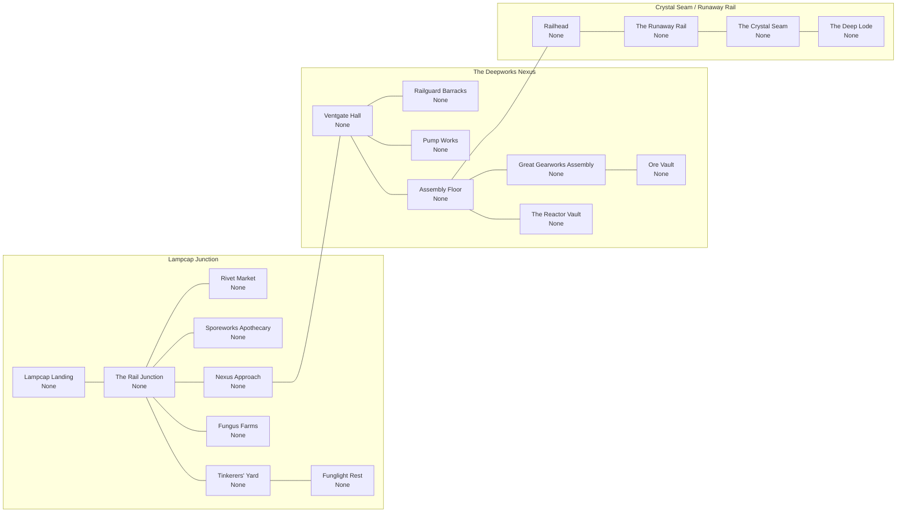

| Map ID | Map name | R | Monster / encounter levels | Occupants and purpose | Access | Status |
| --- | --- | ---: | --- | --- | --- | --- |
| `underdeep_lld` | Lampcap Landing | — | None | Peaceful settlement / traversal; NPCs and guardians are not farmable monsters. | Shared | Atlas |
| `underdeep_rj` | The Rail Junction | — | None | Peaceful settlement / traversal; NPCs and guardians are not farmable monsters. | Shared | Atlas |
| `underdeep_rm` | Rivet Market | — | None | Peaceful settlement / traversal; NPCs and guardians are not farmable monsters. | Shared | Atlas |
| `underdeep_sa2` | Sporeworks Apothecary | — | None | Peaceful settlement / traversal; NPCs and guardians are not farmable monsters. | Shared | Atlas |
| `underdeep_ty2` | Tinkerers' Yard | — | None | Peaceful settlement / traversal; NPCs and guardians are not farmable monsters. | Shared | Atlas |
| `underdeep_fr` | Funglight Rest | — | None | Peaceful settlement / traversal; NPCs and guardians are not farmable monsters. | Shared | Atlas |
| `underdeep_ff` | Fungus Farms | — | None | Peaceful settlement / traversal; NPCs and guardians are not farmable monsters. | Shared | Atlas |
| `underdeep_na` | Nexus Approach | — | None | Peaceful settlement / traversal; NPCs and guardians are not farmable monsters. | Shared | Atlas |
| `underdeep_vh` | Ventgate Hall | — | None | Peaceful settlement / traversal; NPCs and guardians are not farmable monsters. | Dark | Atlas |
| `underdeep_rgb` | Railguard Barracks | — | None | Peaceful settlement / traversal; NPCs and guardians are not farmable monsters. | Dark | Atlas |
| `underdeep_pwk` | Pump Works | — | None | Peaceful settlement / traversal; NPCs and guardians are not farmable monsters. | Dark | Atlas |
| `underdeep_af` | Assembly Floor | — | None | Peaceful settlement / traversal; NPCs and guardians are not farmable monsters. | Dark | Atlas |
| `underdeep_ga` | Great Gearworks Assembly | — | None | Peaceful settlement / traversal; NPCs and guardians are not farmable monsters. | Dark | Atlas |
| `underdeep_rv` | The Reactor Vault | — | None | Peaceful settlement / traversal; NPCs and guardians are not farmable monsters. | Dark | Atlas |
| `underdeep_ov` | Ore Vault | — | None | Peaceful settlement / traversal; NPCs and guardians are not farmable monsters. | Dark | Atlas |
| `underdeep_rh` | Railhead | — | None | Peaceful settlement / traversal; NPCs and guardians are not farmable monsters. | Dark | Atlas |
| `underdeep_rr` | The Runaway Rail | — | None | Peaceful settlement / traversal; NPCs and guardians are not farmable monsters. | Dark | Atlas |
| `underdeep_cs` | The Crystal Seam | — | None | Peaceful settlement / traversal; NPCs and guardians are not farmable monsters. | Dark | Atlas |
| `underdeep_dld` | The Deep Lode | — | None | Peaceful settlement / traversal; NPCs and guardians are not farmable monsters. | Dark | Atlas |

#### Proposed outdoor progression

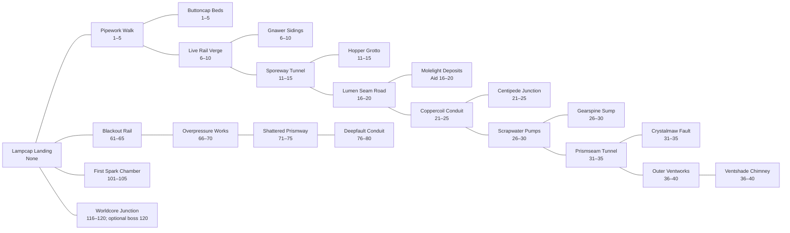

| Map ID | Map name | R | Monster / encounter levels | Occupants and purpose | Access | Status |
| --- | --- | ---: | --- | --- | --- | --- |
| `underdeep_path_001` | Pipework Walk | 3 | 1–5 | Pipe Nibbler · Common; repeatable solo combat AND equivalent aid/repair objective. | Shared | Proposed |
| `underdeep_site_001` | Buttoncap Beds | 3 | 1–5 | Buttoncap Biter · Hostile / Common; optional local encounter. | Shared | Proposed |
| `underdeep_path_006` | Live Rail Verge | 8 | 6–10 | Pipe Nibbler · Common; repeatable solo combat AND equivalent aid/repair objective. | Shared | Proposed |
| `underdeep_site_006` | Gnawer Sidings | 8 | 6–10 | Rail Gnawer · Hostile / Common; optional local encounter. | Shared | Proposed |
| `underdeep_path_011` | Sporeway Tunnel | 13 | 11–15 | Pipe Nibbler · Common; repeatable solo combat AND equivalent aid/repair objective. | Shared | Proposed |
| `underdeep_site_011` | Hopper Grotto | 13 | 11–15 | Sporebelly Hopper · Hostile / Common; optional local encounter. | Shared | Proposed |
| `underdeep_path_016` | Lumen Seam Road | 18 | 16–20 | Pipe Nibbler · Common; repeatable solo combat AND equivalent aid/repair objective. | Shared | Proposed |
| `underdeep_site_016` | Molelight Deposits | 18 | None hostile; aid creature 16–20 | Lumen Mole · Benevolent / Common; aid / escort / protection, never a kill-farm target. | Shared | Proposed |
| `underdeep_path_021` | Coppercoil Conduit | 23 | 21–25 | Pipe Nibbler · Common; repeatable solo combat AND equivalent aid/repair objective. | Shared | Proposed |
| `underdeep_site_021` | Centipede Junction | 23 | 21–25 | Coppercoil Centipede · Hostile / Common; optional local encounter. | Shared | Proposed |
| `underdeep_path_026` | Scrapwater Pumps | 28 | 26–30 | Pipe Nibbler · Common; repeatable solo combat AND equivalent aid/repair objective. | Shared | Proposed |
| `underdeep_site_026` | Gearspine Sump | 28 | 26–30 | Gearspine Rat · Hostile / Common; optional local encounter. | Shared | Proposed |
| `underdeep_path_031` | Prismseam Tunnel | 33 | 31–35 | Pipe Nibbler · Common; repeatable solo combat AND equivalent aid/repair objective. | Shared | Proposed |
| `underdeep_site_031` | Crystalmaw Fault | 33 | 31–35 | Crystalmaw Worm · Hostile / Common; optional local encounter. | Shared | Proposed |
| `underdeep_path_036` | Outer Ventworks | 38 | 36–40 | Pipe Nibbler · Common; repeatable solo combat AND equivalent aid/repair objective. | Shared | Proposed |
| `underdeep_site_036` | Ventshade Chimney | 38 | 36–40 | Ventshade · Corrupted / Common; optional local encounter. | Shared | Proposed |
| `underdeep_return_061` | Blackout Rail | 63 | 61–65 | Veteran local Common threats; species TBD, proposed fixed-level population. | Shared | Proposed |
| `underdeep_return_066` | Overpressure Works | 68 | 66–70 | Veteran local Common threats; species TBD, proposed fixed-level population. | Shared | Proposed |
| `underdeep_return_071` | Shattered Prismway | 73 | 71–75 | Veteran local Common threats; species TBD, proposed fixed-level population. | Shared | Proposed |
| `underdeep_return_076` | Deepfault Conduit | 78 | 76–80 | Veteran local Common threats; species TBD, proposed fixed-level population. | Shared | Proposed |
| `underdeep_return_101` | First Spark Chamber | 103 | 101–105 | Mythic local threats; species TBD, proposed fixed-level population. | Shared | Proposed |
| `underdeep_return_116` | Worldcore Junction | 118 | 116–120; optional boss 120 | Mythic local threats; species TBD, proposed fixed-level population. | Shared | Proposed |

Every `path_` map has both ordinary combat and comparable aid/repair progression. Its `site_` branch is optional. Regional access at 40/60/80/100/115 follows the world roads above; the veteran and mythic village branches are dangerous outward routes, never a requirement to cross a restricted stronghold.

### Ember Desert

Village: **The Caravanserai**. Stronghold: **The Shade Bastion** (Dark). Story site: **Solar Furnace / Mirage Aqueduct**.

Town and story maps are social, service or traversal spaces in this pass. No hostile population is added merely to fill a level column. Threats near a keep belong in its separate outdoor encounter map, not inside the peaceful hall. Human tower access still requires the Warden key.

#### Existing atlas connections

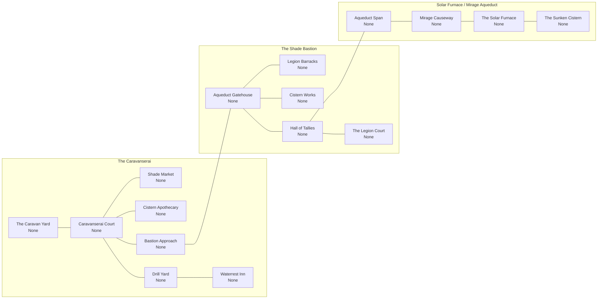

| Map ID | Map name | R | Monster / encounter levels | Occupants and purpose | Access | Status |
| --- | --- | ---: | --- | --- | --- | --- |
| `ember_desert_cy` | The Caravan Yard | — | None | Peaceful settlement / traversal; NPCs and guardians are not farmable monsters. | Shared | Atlas |
| `ember_desert_cc` | Caravanserai Court | — | None | Peaceful settlement / traversal; NPCs and guardians are not farmable monsters. | Shared | Atlas |
| `ember_desert_sm2` | Shade Market | — | None | Peaceful settlement / traversal; NPCs and guardians are not farmable monsters. | Shared | Atlas |
| `ember_desert_ca` | Cistern Apothecary | — | None | Peaceful settlement / traversal; NPCs and guardians are not farmable monsters. | Shared | Atlas |
| `ember_desert_dyd` | Drill Yard | — | None | Peaceful settlement / traversal; NPCs and guardians are not farmable monsters. | Shared | Atlas |
| `ember_desert_wi` | Waterrest Inn | — | None | Peaceful settlement / traversal; NPCs and guardians are not farmable monsters. | Shared | Atlas |
| `ember_desert_ba` | Bastion Approach | — | None | Peaceful settlement / traversal; NPCs and guardians are not farmable monsters. | Shared | Atlas |
| `ember_desert_ag` | Aqueduct Gatehouse | — | None | Peaceful settlement / traversal; NPCs and guardians are not farmable monsters. | Dark | Atlas |
| `ember_desert_lb` | Legion Barracks | — | None | Peaceful settlement / traversal; NPCs and guardians are not farmable monsters. | Dark | Atlas |
| `ember_desert_cwk` | Cistern Works | — | None | Peaceful settlement / traversal; NPCs and guardians are not farmable monsters. | Dark | Atlas |
| `ember_desert_htal` | Hall of Tallies | — | None | Peaceful settlement / traversal; NPCs and guardians are not farmable monsters. | Dark | Atlas |
| `ember_desert_lct` | The Legion Court | — | None | Peaceful settlement / traversal; NPCs and guardians are not farmable monsters. | Dark | Atlas |
| `ember_desert_asp` | Aqueduct Span | — | None | Peaceful settlement / traversal; NPCs and guardians are not farmable monsters. | Dark | Atlas |
| `ember_desert_mc` | Mirage Causeway | — | None | Peaceful settlement / traversal; NPCs and guardians are not farmable monsters. | Dark | Atlas |
| `ember_desert_sfn` | The Solar Furnace | — | None | Peaceful settlement / traversal; NPCs and guardians are not farmable monsters. | Dark | Atlas |
| `ember_desert_sci` | The Sunken Cistern | — | None | Peaceful settlement / traversal; NPCs and guardians are not farmable monsters. | Dark | Atlas |

#### Proposed outdoor progression

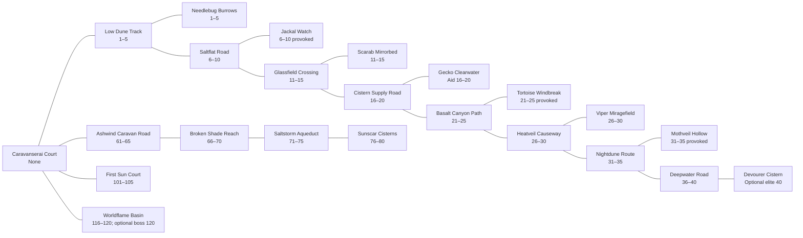

| Map ID | Map name | R | Monster / encounter levels | Occupants and purpose | Access | Status |
| --- | --- | ---: | --- | --- | --- | --- |
| `ember_desert_path_001` | Low Dune Track | 3 | 1–5 | Sand Scrabbler · Common; repeatable solo combat AND equivalent aid/repair objective. | Shared | Proposed |
| `ember_desert_site_001` | Needlebug Burrows | 3 | 1–5 | Dune Needlebug · Hostile / Common; optional local encounter. | Shared | Proposed |
| `ember_desert_path_006` | Saltflat Road | 8 | 6–10 | Sand Scrabbler · Common; repeatable solo combat AND equivalent aid/repair objective. | Shared | Proposed |
| `ember_desert_site_006` | Jackal Watch | 8 | 6–10 only if provoked | Saltback Jackal · Neutral / Common; avoidable encounter / observation. | Shared | Proposed |
| `ember_desert_path_011` | Glassfield Crossing | 13 | 11–15 | Sand Scrabbler · Common; repeatable solo combat AND equivalent aid/repair objective. | Shared | Proposed |
| `ember_desert_site_011` | Scarab Mirrorbed | 13 | 11–15 | Glasswing Scarab · Hostile / Common; optional local encounter. | Shared | Proposed |
| `ember_desert_path_016` | Cistern Supply Road | 18 | 16–20 | Sand Scrabbler · Common; repeatable solo combat AND equivalent aid/repair objective. | Shared | Proposed |
| `ember_desert_site_016` | Gecko Clearwater | 18 | None hostile; aid creature 16–20 | Cistern Gecko · Benevolent / Common; aid / escort / protection, never a kill-farm target. | Shared | Proposed |
| `ember_desert_path_021` | Basalt Canyon Path | 23 | 21–25 | Sand Scrabbler · Common; repeatable solo combat AND equivalent aid/repair objective. | Shared | Proposed |
| `ember_desert_site_021` | Tortoise Windbreak | 23 | 21–25 only if provoked | Basaltback Tortoise · Neutral / Common; avoidable encounter / observation. | Shared | Proposed |
| `ember_desert_path_026` | Heatveil Causeway | 28 | 26–30 | Sand Scrabbler · Common; repeatable solo combat AND equivalent aid/repair objective. | Shared | Proposed |
| `ember_desert_site_026` | Viper Miragefield | 28 | 26–30 | Mirage Viper · Hostile / Common; optional local encounter. | Shared | Proposed |
| `ember_desert_path_031` | Nightdune Route | 33 | 31–35 | Sand Scrabbler · Common; repeatable solo combat AND equivalent aid/repair objective. | Shared | Proposed |
| `ember_desert_site_031` | Mothveil Hollow | 33 | 31–35 only if provoked | Sandveil Moth · Neutral / Common; avoidable encounter / observation. | Shared | Proposed |
| `ember_desert_path_036` | Deepwater Road | 38 | 36–40 | Sand Scrabbler · Common; repeatable solo combat AND equivalent aid/repair objective. | Shared | Proposed |
| `ember_desert_site_036` | Devourer Cistern | 38 | Optional elite 40 | Cistern Devourer · Hostile / Elite; separate signposted pocket, not required to advance. | Shared | Proposed |
| `ember_desert_return_061` | Ashwind Caravan Road | 63 | 61–65 | Veteran local Common threats; species TBD, proposed fixed-level population. | Shared | Proposed |
| `ember_desert_return_066` | Broken Shade Reach | 68 | 66–70 | Veteran local Common threats; species TBD, proposed fixed-level population. | Shared | Proposed |
| `ember_desert_return_071` | Saltstorm Aqueduct | 73 | 71–75 | Veteran local Common threats; species TBD, proposed fixed-level population. | Shared | Proposed |
| `ember_desert_return_076` | Sunscar Cisterns | 78 | 76–80 | Veteran local Common threats; species TBD, proposed fixed-level population. | Shared | Proposed |
| `ember_desert_return_101` | First Sun Court | 103 | 101–105 | Mythic local threats; species TBD, proposed fixed-level population. | Shared | Proposed |
| `ember_desert_return_116` | Worldflame Basin | 118 | 116–120; optional boss 120 | Mythic local threats; species TBD, proposed fixed-level population. | Shared | Proposed |

Every `path_` map has both ordinary combat and comparable aid/repair progression. Its `site_` branch is optional. Regional access at 40/60/80/100/115 follows the world roads above; the veteran and mythic village branches are dangerous outward routes, never a requirement to cross a restricted stronghold.

### Ice Lands

Village: **Thawcamp**. Stronghold: **The Aurora Hall** (Dark). Story site: **Snow-buried Ruin / Aurora Vault**.

Town and story maps are social, service or traversal spaces in this pass. No hostile population is added merely to fill a level column. Threats near a keep belong in its separate outdoor encounter map, not inside the peaceful hall. Human tower access still requires the Warden key.

#### Existing atlas connections

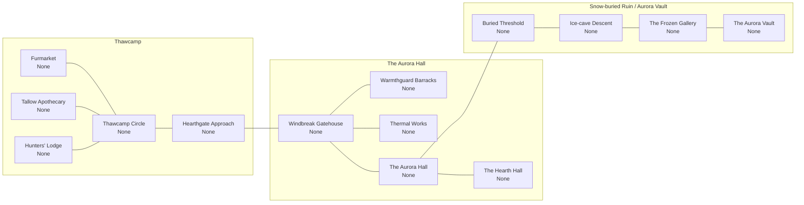

| Map ID | Map name | R | Monster / encounter levels | Occupants and purpose | Access | Status |
| --- | --- | ---: | --- | --- | --- | --- |
| `ice_lands_fmk` | Furmarket | — | None | Peaceful settlement / traversal; NPCs and guardians are not farmable monsters. | Shared | Atlas |
| `ice_lands_tci` | Thawcamp Circle | — | None | Peaceful settlement / traversal; NPCs and guardians are not farmable monsters. | Shared | Atlas |
| `ice_lands_ta` | Tallow Apothecary | — | None | Peaceful settlement / traversal; NPCs and guardians are not farmable monsters. | Shared | Atlas |
| `ice_lands_hlg` | Hunters' Lodge | — | None | Peaceful settlement / traversal; NPCs and guardians are not farmable monsters. | Shared | Atlas |
| `ice_lands_hga` | Hearthgate Approach | — | None | Peaceful settlement / traversal; NPCs and guardians are not farmable monsters. | Shared | Atlas |
| `ice_lands_wg` | Windbreak Gatehouse | — | None | Peaceful settlement / traversal; NPCs and guardians are not farmable monsters. | Dark | Atlas |
| `ice_lands_wb` | Warmthguard Barracks | — | None | Peaceful settlement / traversal; NPCs and guardians are not farmable monsters. | Dark | Atlas |
| `ice_lands_tw` | Thermal Works | — | None | Peaceful settlement / traversal; NPCs and guardians are not farmable monsters. | Dark | Atlas |
| `ice_lands_ah` | The Aurora Hall | — | None | Peaceful settlement / traversal; NPCs and guardians are not farmable monsters. | Dark | Atlas |
| `ice_lands_hh` | The Hearth Hall | — | None | Peaceful settlement / traversal; NPCs and guardians are not farmable monsters. | Dark | Atlas |
| `ice_lands_bt` | Buried Threshold | — | None | Peaceful settlement / traversal; NPCs and guardians are not farmable monsters. | Dark | Atlas |
| `ice_lands_id` | Ice-cave Descent | — | None | Peaceful settlement / traversal; NPCs and guardians are not farmable monsters. | Dark | Atlas |
| `ice_lands_fg` | The Frozen Gallery | — | None | Peaceful settlement / traversal; NPCs and guardians are not farmable monsters. | Dark | Atlas |
| `ice_lands_av` | The Aurora Vault | — | None | Peaceful settlement / traversal; NPCs and guardians are not farmable monsters. | Dark | Atlas |

#### Proposed outdoor progression

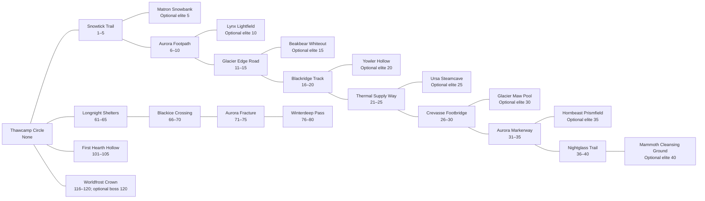

| Map ID | Map name | R | Monster / encounter levels | Occupants and purpose | Access | Status |
| --- | --- | ---: | --- | --- | --- | --- |
| `ice_lands_path_001` | Snowtick Trail | 3 | 1–5 | Snowtick · Common; repeatable solo combat AND equivalent aid/repair objective. | Shared | Proposed |
| `ice_lands_site_001` | Matron Snowbank | 3 | Optional elite 5 | Frostburrow Matron · Hostile / Elite; separate signposted pocket, not required to advance. | Shared | Proposed |
| `ice_lands_path_006` | Aurora Footpath | 8 | 6–10 | Snowtick · Common; repeatable solo combat AND equivalent aid/repair objective. | Shared | Proposed |
| `ice_lands_site_006` | Lynx Lightfield | 8 | Optional elite 10 | Aurora Lynx · Hostile / Elite; separate signposted pocket, not required to advance. | Shared | Proposed |
| `ice_lands_path_011` | Glacier Edge Road | 13 | 11–15 | Snowtick · Common; repeatable solo combat AND equivalent aid/repair objective. | Shared | Proposed |
| `ice_lands_site_011` | Beakbear Whiteout | 13 | Optional elite 15 | Whiteout Beakbear · Hostile / Elite; separate signposted pocket, not required to advance. | Shared | Proposed |
| `ice_lands_path_016` | Blackridge Track | 18 | 16–20 | Snowtick · Common; repeatable solo combat AND equivalent aid/repair objective. | Shared | Proposed |
| `ice_lands_site_016` | Yowler Hollow | 18 | Optional elite 20 | Blackridge Yowler · Hostile / Elite; separate signposted pocket, not required to advance. | Shared | Proposed |
| `ice_lands_path_021` | Thermal Supply Way | 23 | 21–25 | Snowtick · Common; repeatable solo combat AND equivalent aid/repair objective. | Shared | Proposed |
| `ice_lands_site_021` | Ursa Steamcave | 23 | Optional elite 25 | Steamhide Ursa · Hostile / Elite; separate signposted pocket, not required to advance. | Shared | Proposed |
| `ice_lands_path_026` | Crevasse Footbridge | 28 | 26–30 | Snowtick · Common; repeatable solo combat AND equivalent aid/repair objective. | Shared | Proposed |
| `ice_lands_site_026` | Glacier Maw Pool | 28 | Optional elite 30 | Glacier Maw · Hostile / Elite; separate signposted pocket, not required to advance. | Shared | Proposed |
| `ice_lands_path_031` | Aurora Markerway | 33 | 31–35 | Snowtick · Common; repeatable solo combat AND equivalent aid/repair objective. | Shared | Proposed |
| `ice_lands_site_031` | Hornbeast Prismfield | 33 | Optional elite 35 | Aurora Hornbeast · Hostile / Elite; separate signposted pocket, not required to advance. | Shared | Proposed |
| `ice_lands_path_036` | Nightglass Trail | 38 | 36–40 | Snowtick · Common; repeatable solo combat AND equivalent aid/repair objective. | Shared | Proposed |
| `ice_lands_site_036` | Mammoth Cleansing Ground | 38 | Optional elite 40 | Nightglass Mammoth · Corrupted / Elite; separate signposted pocket, not required to advance. | Shared | Proposed |
| `ice_lands_return_061` | Longnight Shelters | 63 | 61–65 | Veteran local Common threats; species TBD, proposed fixed-level population. | Shared | Proposed |
| `ice_lands_return_066` | Blackice Crossing | 68 | 66–70 | Veteran local Common threats; species TBD, proposed fixed-level population. | Shared | Proposed |
| `ice_lands_return_071` | Aurora Fracture | 73 | 71–75 | Veteran local Common threats; species TBD, proposed fixed-level population. | Shared | Proposed |
| `ice_lands_return_076` | Winterdeep Pass | 78 | 76–80 | Veteran local Common threats; species TBD, proposed fixed-level population. | Shared | Proposed |
| `ice_lands_return_101` | First Hearth Hollow | 103 | 101–105 | Mythic local threats; species TBD, proposed fixed-level population. | Shared | Proposed |
| `ice_lands_return_116` | Worldfrost Crown | 118 | 116–120; optional boss 120 | Mythic local threats; species TBD, proposed fixed-level population. | Shared | Proposed |

Every `path_` map has both ordinary combat and comparable aid/repair progression. Its `site_` branch is optional. Regional access at 40/60/80/100/115 follows the world roads above; the veteran and mythic village branches are dangerous outward routes, never a requirement to cross a restricted stronghold.

### Ashen Scar

Shared frontier. Dungeon: **Cinder Vault**; **Elite** difficulty. Surface routes remain available without completing the dungeon.

#### Existing atlas connections

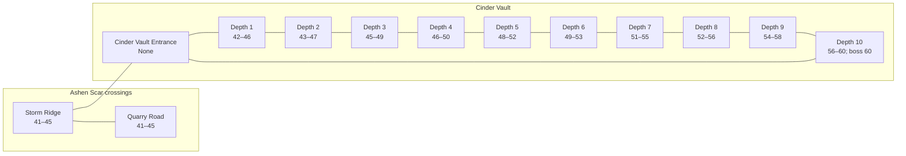

| Map ID | Map name | R | Monster / encounter levels | Occupants and purpose | Access | Status |
| --- | --- | ---: | --- | --- | --- | --- |
| `ashen_scar_road_0` | Storm Ridge | 43 | 41–45 | Frontier Common threats, species TBD; both allegiances may enter. | Shared | Atlas |
| `ashen_scar_road_1` | Quarry Road | 43 | 41–45 | Frontier Common threats, species TBD; both allegiances may enter. | Shared | Atlas |
| `ashen_scar_threshold` | Cinder Vault Entrance | — | None | Proposed entrance staging map; no ambient hostile spawns. No remote respawn binding. | Shared | Atlas |
| `ashen_scar_depth_1` | Depth 1 | 44 | 42–46 | Elite dungeon threats; species TBD (41–60 roster not curated). | Shared | Atlas |
| `ashen_scar_depth_2` | Depth 2 | 45 | 43–47 | Elite dungeon threats; species TBD (41–60 roster not curated). | Shared | Atlas |
| `ashen_scar_depth_3` | Depth 3 | 47 | 45–49 | Elite dungeon threats; species TBD (41–60 roster not curated). | Shared | Atlas |
| `ashen_scar_depth_4` | Depth 4 | 48 | 46–50 | Elite dungeon threats; species TBD (41–60 roster not curated). | Shared | Atlas |
| `ashen_scar_depth_5` | Depth 5 | 50 | 48–52 | Elite dungeon threats; species TBD (41–60 roster not curated). | Shared | Atlas |
| `ashen_scar_depth_6` | Depth 6 | 51 | 49–53 | Elite dungeon threats; species TBD (41–60 roster not curated). | Shared | Atlas |
| `ashen_scar_depth_7` | Depth 7 | 53 | 51–55 | Elite dungeon threats; species TBD (41–60 roster not curated). | Shared | Atlas |
| `ashen_scar_depth_8` | Depth 8 | 54 | 52–56 | Elite dungeon threats; species TBD (41–60 roster not curated). | Shared | Atlas |
| `ashen_scar_depth_9` | Depth 9 | 56 | 54–58 | Elite dungeon threats; species TBD (41–60 roster not curated). | Shared | Atlas |
| `ashen_scar_depth_10` | Depth 10 | 58 | 56–60; boss 60 | Elite dungeon threats; species TBD (41–60 roster not curated). Optional dungeon finale. | Shared | Atlas |

#### Proposed outdoor progression

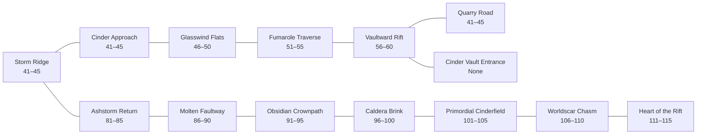

| Map ID | Map name | R | Monster / encounter levels | Occupants and purpose | Access | Status |
| --- | --- | ---: | --- | --- | --- | --- |
| `ashen_scar_surface_041` | Cinder Approach | 43 | 41–45 | Common frontier threats; species TBD. Solo route + aid objective; dungeon completion not required. | Shared | Proposed |
| `ashen_scar_surface_046` | Glasswind Flats | 48 | 46–50 | Common frontier threats; species TBD. Solo route + aid objective; dungeon completion not required. | Shared | Proposed |
| `ashen_scar_surface_051` | Fumarole Traverse | 53 | 51–55 | Common frontier threats; species TBD. Solo route + aid objective; dungeon completion not required. | Shared | Proposed |
| `ashen_scar_surface_056` | Vaultward Rift | 58 | 56–60 | Common frontier threats; species TBD. Solo route + aid objective; dungeon completion not required. | Shared | Proposed |
| `ashen_scar_surface_081` | Ashstorm Return | 83 | 81–85 | Common frontier threats; species TBD. Solo route + aid objective; dungeon completion not required. | Shared | Proposed |
| `ashen_scar_surface_086` | Molten Faultway | 88 | 86–90 | Common frontier threats; species TBD. Solo route + aid objective; dungeon completion not required. | Shared | Proposed |
| `ashen_scar_surface_091` | Obsidian Crownpath | 93 | 91–95 | Common frontier threats; species TBD. Solo route + aid objective; dungeon completion not required. | Shared | Proposed |
| `ashen_scar_surface_096` | Caldera Brink | 98 | 96–100 | Common frontier threats; species TBD. Solo route + aid objective; dungeon completion not required. | Shared | Proposed |
| `ashen_scar_surface_101` | Primordial Cinderfield | 103 | 101–105 | Mythic frontier threats; species TBD. Solo route + aid objective; dungeon completion not required. | Shared | Proposed |
| `ashen_scar_surface_106` | Worldscar Chasm | 108 | 106–110 | Mythic frontier threats; species TBD. Solo route + aid objective; dungeon completion not required. | Shared | Proposed |
| `ashen_scar_surface_111` | Heart of the Rift | 113 | 111–115 | Mythic frontier threats; species TBD. Solo route + aid objective; dungeon completion not required. | Shared | Proposed |

The road-mouth maps connect this regional graph to the two neighboring world regions. The surface 41–60 spine reaches both the opposite road mouth and the dungeon threshold. Veteran and mythic maps are a separate fixed-level branch. Every depth connection is reciprocal, with the additional final-depth-to-threshold return already present in the atlas.

### Shattered March

Shared frontier. Dungeon: **Fallen Observatory**; **Group** difficulty. Surface routes remain available without completing the dungeon.

#### Existing atlas connections

```mermaid
flowchart LR
    subgraph frontier["Abandoned City of Babylon"]
        shattered_march_road_0["The Great Road<br/>41–45"]
        shattered_march_road_1["Caravan Road<br/>41–45"]
        shattered_march_gate["Ruined City Gate<br/>41–45"]
        shattered_march_plaza["The Broken Concourse<br/>None"]
        shattered_march_bazaar["Hanging Bazaar Ruins<br/>43–47"]
        shattered_march_shrine["Shrine of the Old Accord<br/>None"]
        shattered_march_base["Base of the Tower of Babylon<br/>45–49"]
    end
    subgraph dungeon["Tower of Babylon · Fallen Observatory"]
        shattered_march_threshold["Tower Threshold<br/>None"]
        shattered_march_depth_1["1 · Flooded Vaults<br/>42–46"]
        shattered_march_depth_2["2 · The Shifted Stairs<br/>43–47"]
        shattered_march_depth_3["3 · Hall of Tongues<br/>45–49"]
        shattered_march_depth_4["4 · The Sundered Library<br/>46–50"]
        shattered_march_depth_5["5 · Gearfall Shafts<br/>48–52"]
        shattered_march_depth_6["6 · Cistern of Echoes<br/>49–53"]
        shattered_march_depth_7["7 · The Whispering Ascent<br/>51–55"]
        shattered_march_depth_8["8 · Skybroken Ramparts<br/>52–56"]
        shattered_march_depth_9["9 · The Broken Orrery<br/>54–58"]
        shattered_march_depth_10["10 · The Fallen Observatory<br/>56–60; boss 60"]
    end
    shattered_march_gate --- shattered_march_plaza
    shattered_march_plaza --- shattered_march_bazaar
    shattered_march_plaza --- shattered_march_shrine
    shattered_march_plaza --- shattered_march_base
    shattered_march_road_0 --- shattered_march_plaza
    shattered_march_road_1 --- shattered_march_plaza
    shattered_march_base --- shattered_march_threshold
    shattered_march_threshold --- shattered_march_depth_1
    shattered_march_depth_1 --- shattered_march_depth_2
    shattered_march_depth_2 --- shattered_march_depth_3
    shattered_march_depth_3 --- shattered_march_depth_4
    shattered_march_depth_4 --- shattered_march_depth_5
    shattered_march_depth_5 --- shattered_march_depth_6
    shattered_march_depth_6 --- shattered_march_depth_7
    shattered_march_depth_7 --- shattered_march_depth_8
    shattered_march_depth_8 --- shattered_march_depth_9
    shattered_march_depth_9 --- shattered_march_depth_10
    shattered_march_depth_10 --- shattered_march_threshold
```

| Map ID | Map name | R | Monster / encounter levels | Occupants and purpose | Access | Status |
| --- | --- | ---: | --- | --- | --- | --- |
| `shattered_march_road_0` | The Great Road | 43 | 41–45 | Frontier Common threats, species TBD; both allegiances may enter. | Shared | Atlas |
| `shattered_march_road_1` | Caravan Road | 43 | 41–45 | Frontier Common threats, species TBD; both allegiances may enter. | Shared | Atlas |
| `shattered_march_gate` | Ruined City Gate | 43 | 41–45 | Frontier Common threats, species TBD; both allegiances may enter. | Shared | Atlas |
| `shattered_march_plaza` | The Broken Concourse | — | None | Proposed guarded trade pocket; no ambient hostile spawns. Babylon safety policy remains a design decision. | Shared | Atlas |
| `shattered_march_bazaar` | Hanging Bazaar Ruins | 45 | 43–47 | Frontier Common threats, species TBD; both allegiances may enter. | Shared | Atlas |
| `shattered_march_shrine` | Shrine of the Old Accord | — | None | Lore / aid map; no ambient hostile spawns proposed. Not a blanket safe-zone promise. | Shared | Atlas |
| `shattered_march_base` | Base of the Tower of Babylon | 47 | 45–49 | Frontier Common threats, species TBD; both allegiances may enter. | Shared | Atlas |
| `shattered_march_threshold` | Tower Threshold | — | None | Proposed entrance staging map; no ambient hostile spawns. No remote respawn binding. | Shared | Atlas |
| `shattered_march_depth_1` | 1 · Flooded Vaults | 44 | 42–46 | Group dungeon threats; species TBD (41–60 roster not curated). | Shared | Atlas |
| `shattered_march_depth_2` | 2 · The Shifted Stairs | 45 | 43–47 | Group dungeon threats; species TBD (41–60 roster not curated). | Shared | Atlas |
| `shattered_march_depth_3` | 3 · Hall of Tongues | 47 | 45–49 | Group dungeon threats; species TBD (41–60 roster not curated). | Shared | Atlas |
| `shattered_march_depth_4` | 4 · The Sundered Library | 48 | 46–50 | Group dungeon threats; species TBD (41–60 roster not curated). | Shared | Atlas |
| `shattered_march_depth_5` | 5 · Gearfall Shafts | 50 | 48–52 | Group dungeon threats; species TBD (41–60 roster not curated). | Shared | Atlas |
| `shattered_march_depth_6` | 6 · Cistern of Echoes | 51 | 49–53 | Group dungeon threats; species TBD (41–60 roster not curated). | Shared | Atlas |
| `shattered_march_depth_7` | 7 · The Whispering Ascent | 53 | 51–55 | Group dungeon threats; species TBD (41–60 roster not curated). | Shared | Atlas |
| `shattered_march_depth_8` | 8 · Skybroken Ramparts | 54 | 52–56 | Group dungeon threats; species TBD (41–60 roster not curated). | Shared | Atlas |
| `shattered_march_depth_9` | 9 · The Broken Orrery | 56 | 54–58 | Group dungeon threats; species TBD (41–60 roster not curated). | Shared | Atlas |
| `shattered_march_depth_10` | 10 · The Fallen Observatory | 58 | 56–60; boss 60 | Group dungeon threats; species TBD (41–60 roster not curated). Optional dungeon finale. | Shared | Atlas |

#### Proposed outdoor progression

```mermaid
flowchart LR
    shattered_march_road_0["The Great Road<br/>41–45"]
    shattered_march_road_1["Caravan Road<br/>41–45"]
    shattered_march_threshold["Tower Threshold<br/>None"]
    shattered_march_surface_041["Rubbleway Approach<br/>41–45"]
    shattered_march_surface_046["Dry Canal Road<br/>46–50"]
    shattered_march_surface_051["Fallen Accord Avenue<br/>51–55"]
    shattered_march_surface_056["Towerward Causeway<br/>56–60"]
    shattered_march_surface_081["Broken Banner March<br/>81–85"]
    shattered_march_surface_086["Shifting Ziggurats<br/>86–90"]
    shattered_march_surface_091["Orrery Shadowlands<br/>91–95"]
    shattered_march_surface_096["Siege of the Concourse<br/>96–100"]
    shattered_march_surface_101["First Accord Ruins<br/>101–105"]
    shattered_march_surface_106["Starfall Processional<br/>106–110"]
    shattered_march_surface_111["Firmament Breach<br/>111–115"]
    shattered_march_road_0 --- shattered_march_surface_041
    shattered_march_surface_041 --- shattered_march_surface_046
    shattered_march_surface_046 --- shattered_march_surface_051
    shattered_march_surface_051 --- shattered_march_surface_056
    shattered_march_road_0 --- shattered_march_surface_081
    shattered_march_surface_081 --- shattered_march_surface_086
    shattered_march_surface_086 --- shattered_march_surface_091
    shattered_march_surface_091 --- shattered_march_surface_096
    shattered_march_surface_096 --- shattered_march_surface_101
    shattered_march_surface_101 --- shattered_march_surface_106
    shattered_march_surface_106 --- shattered_march_surface_111
    shattered_march_surface_056 --- shattered_march_road_1
    shattered_march_surface_056 --- shattered_march_threshold
```

| Map ID | Map name | R | Monster / encounter levels | Occupants and purpose | Access | Status |
| --- | --- | ---: | --- | --- | --- | --- |
| `shattered_march_surface_041` | Rubbleway Approach | 43 | 41–45 | Common frontier threats; species TBD. Solo route + aid objective; dungeon completion not required. | Shared | Proposed |
| `shattered_march_surface_046` | Dry Canal Road | 48 | 46–50 | Common frontier threats; species TBD. Solo route + aid objective; dungeon completion not required. | Shared | Proposed |
| `shattered_march_surface_051` | Fallen Accord Avenue | 53 | 51–55 | Common frontier threats; species TBD. Solo route + aid objective; dungeon completion not required. | Shared | Proposed |
| `shattered_march_surface_056` | Towerward Causeway | 58 | 56–60 | Common frontier threats; species TBD. Solo route + aid objective; dungeon completion not required. | Shared | Proposed |
| `shattered_march_surface_081` | Broken Banner March | 83 | 81–85 | Common frontier threats; species TBD. Solo route + aid objective; dungeon completion not required. | Shared | Proposed |
| `shattered_march_surface_086` | Shifting Ziggurats | 88 | 86–90 | Common frontier threats; species TBD. Solo route + aid objective; dungeon completion not required. | Shared | Proposed |
| `shattered_march_surface_091` | Orrery Shadowlands | 93 | 91–95 | Common frontier threats; species TBD. Solo route + aid objective; dungeon completion not required. | Shared | Proposed |
| `shattered_march_surface_096` | Siege of the Concourse | 98 | 96–100 | Common frontier threats; species TBD. Solo route + aid objective; dungeon completion not required. | Shared | Proposed |
| `shattered_march_surface_101` | First Accord Ruins | 103 | 101–105 | Mythic frontier threats; species TBD. Solo route + aid objective; dungeon completion not required. | Shared | Proposed |
| `shattered_march_surface_106` | Starfall Processional | 108 | 106–110 | Mythic frontier threats; species TBD. Solo route + aid objective; dungeon completion not required. | Shared | Proposed |
| `shattered_march_surface_111` | Firmament Breach | 113 | 111–115 | Mythic frontier threats; species TBD. Solo route + aid objective; dungeon completion not required. | Shared | Proposed |

The road-mouth maps connect this regional graph to the two neighboring world regions. The surface 41–60 spine reaches both the opposite road mouth and the dungeon threshold. Veteran and mythic maps are a separate fixed-level branch. Every depth connection is reciprocal, with the additional final-depth-to-threshold return already present in the atlas.

### Gloamfen

Shared frontier. Dungeon: **Mireglass Catacombs**; **Veteran** difficulty. Surface routes remain available without completing the dungeon.

#### Existing atlas connections

```mermaid
flowchart LR
    subgraph frontier["Gloamfen crossings"]
        gloamfen_road_0["Tidal Currents<br/>41–45"]
        gloamfen_road_1["Flooded Tunnels<br/>41–45"]
    end
    subgraph dungeon["Mireglass Catacombs"]
        gloamfen_threshold["Mireglass Catacombs Entrance<br/>None"]
        gloamfen_depth_1["Depth 1<br/>42–46"]
        gloamfen_depth_2["Depth 2<br/>43–47"]
        gloamfen_depth_3["Depth 3<br/>45–49"]
        gloamfen_depth_4["Depth 4<br/>46–50"]
        gloamfen_depth_5["Depth 5<br/>48–52"]
        gloamfen_depth_6["Depth 6<br/>49–53"]
        gloamfen_depth_7["Depth 7<br/>51–55"]
        gloamfen_depth_8["Depth 8<br/>52–56"]
        gloamfen_depth_9["Depth 9<br/>54–58"]
        gloamfen_depth_10["Depth 10<br/>56–60; boss 60"]
    end
    gloamfen_road_0 --- gloamfen_road_1
    gloamfen_road_0 --- gloamfen_threshold
    gloamfen_threshold --- gloamfen_depth_1
    gloamfen_depth_1 --- gloamfen_depth_2
    gloamfen_depth_2 --- gloamfen_depth_3
    gloamfen_depth_3 --- gloamfen_depth_4
    gloamfen_depth_4 --- gloamfen_depth_5
    gloamfen_depth_5 --- gloamfen_depth_6
    gloamfen_depth_6 --- gloamfen_depth_7
    gloamfen_depth_7 --- gloamfen_depth_8
    gloamfen_depth_8 --- gloamfen_depth_9
    gloamfen_depth_9 --- gloamfen_depth_10
    gloamfen_depth_10 --- gloamfen_threshold
```

| Map ID | Map name | R | Monster / encounter levels | Occupants and purpose | Access | Status |
| --- | --- | ---: | --- | --- | --- | --- |
| `gloamfen_road_0` | Tidal Currents | 43 | 41–45 | Frontier Common threats, species TBD; both allegiances may enter. | Shared | Atlas |
| `gloamfen_road_1` | Flooded Tunnels | 43 | 41–45 | Frontier Common threats, species TBD; both allegiances may enter. | Shared | Atlas |
| `gloamfen_threshold` | Mireglass Catacombs Entrance | — | None | Proposed entrance staging map; no ambient hostile spawns. No remote respawn binding. | Shared | Atlas |
| `gloamfen_depth_1` | Depth 1 | 44 | 42–46 | Veteran dungeon threats; species TBD (41–60 roster not curated). | Shared | Atlas |
| `gloamfen_depth_2` | Depth 2 | 45 | 43–47 | Veteran dungeon threats; species TBD (41–60 roster not curated). | Shared | Atlas |
| `gloamfen_depth_3` | Depth 3 | 47 | 45–49 | Veteran dungeon threats; species TBD (41–60 roster not curated). | Shared | Atlas |
| `gloamfen_depth_4` | Depth 4 | 48 | 46–50 | Veteran dungeon threats; species TBD (41–60 roster not curated). | Shared | Atlas |
| `gloamfen_depth_5` | Depth 5 | 50 | 48–52 | Veteran dungeon threats; species TBD (41–60 roster not curated). | Shared | Atlas |
| `gloamfen_depth_6` | Depth 6 | 51 | 49–53 | Veteran dungeon threats; species TBD (41–60 roster not curated). | Shared | Atlas |
| `gloamfen_depth_7` | Depth 7 | 53 | 51–55 | Veteran dungeon threats; species TBD (41–60 roster not curated). | Shared | Atlas |
| `gloamfen_depth_8` | Depth 8 | 54 | 52–56 | Veteran dungeon threats; species TBD (41–60 roster not curated). | Shared | Atlas |
| `gloamfen_depth_9` | Depth 9 | 56 | 54–58 | Veteran dungeon threats; species TBD (41–60 roster not curated). | Shared | Atlas |
| `gloamfen_depth_10` | Depth 10 | 58 | 56–60; boss 60 | Veteran dungeon threats; species TBD (41–60 roster not curated). Optional dungeon finale. | Shared | Atlas |

#### Proposed outdoor progression

```mermaid
flowchart LR
    gloamfen_road_0["Tidal Currents<br/>41–45"]
    gloamfen_road_1["Flooded Tunnels<br/>41–45"]
    gloamfen_threshold["Mireglass Catacombs Entrance<br/>None"]
    gloamfen_surface_041["Reedmist Track<br/>41–45"]
    gloamfen_surface_046["Drowned Milestones<br/>46–50"]
    gloamfen_surface_051["Lanternbog Crossing<br/>51–55"]
    gloamfen_surface_056["Catacomb Causeway<br/>56–60"]
    gloamfen_surface_081["Blackreed Return<br/>81–85"]
    gloamfen_surface_086["Sinking Bell Road<br/>86–90"]
    gloamfen_surface_091["Pale Water Reach<br/>91–95"]
    gloamfen_surface_096["Drowned Crown Marsh<br/>96–100"]
    gloamfen_surface_101["First Water Basin<br/>101–105"]
    gloamfen_surface_106["Memoryfen Crossing<br/>106–110"]
    gloamfen_surface_111["Mireglass Abyss<br/>111–115"]
    gloamfen_road_0 --- gloamfen_surface_041
    gloamfen_surface_041 --- gloamfen_surface_046
    gloamfen_surface_046 --- gloamfen_surface_051
    gloamfen_surface_051 --- gloamfen_surface_056
    gloamfen_road_0 --- gloamfen_surface_081
    gloamfen_surface_081 --- gloamfen_surface_086
    gloamfen_surface_086 --- gloamfen_surface_091
    gloamfen_surface_091 --- gloamfen_surface_096
    gloamfen_surface_096 --- gloamfen_surface_101
    gloamfen_surface_101 --- gloamfen_surface_106
    gloamfen_surface_106 --- gloamfen_surface_111
    gloamfen_surface_056 --- gloamfen_road_1
    gloamfen_surface_056 --- gloamfen_threshold
```

| Map ID | Map name | R | Monster / encounter levels | Occupants and purpose | Access | Status |
| --- | --- | ---: | --- | --- | --- | --- |
| `gloamfen_surface_041` | Reedmist Track | 43 | 41–45 | Common frontier threats; species TBD. Solo route + aid objective; dungeon completion not required. | Shared | Proposed |
| `gloamfen_surface_046` | Drowned Milestones | 48 | 46–50 | Common frontier threats; species TBD. Solo route + aid objective; dungeon completion not required. | Shared | Proposed |
| `gloamfen_surface_051` | Lanternbog Crossing | 53 | 51–55 | Common frontier threats; species TBD. Solo route + aid objective; dungeon completion not required. | Shared | Proposed |
| `gloamfen_surface_056` | Catacomb Causeway | 58 | 56–60 | Common frontier threats; species TBD. Solo route + aid objective; dungeon completion not required. | Shared | Proposed |
| `gloamfen_surface_081` | Blackreed Return | 83 | 81–85 | Common frontier threats; species TBD. Solo route + aid objective; dungeon completion not required. | Shared | Proposed |
| `gloamfen_surface_086` | Sinking Bell Road | 88 | 86–90 | Common frontier threats; species TBD. Solo route + aid objective; dungeon completion not required. | Shared | Proposed |
| `gloamfen_surface_091` | Pale Water Reach | 93 | 91–95 | Common frontier threats; species TBD. Solo route + aid objective; dungeon completion not required. | Shared | Proposed |
| `gloamfen_surface_096` | Drowned Crown Marsh | 98 | 96–100 | Common frontier threats; species TBD. Solo route + aid objective; dungeon completion not required. | Shared | Proposed |
| `gloamfen_surface_101` | First Water Basin | 103 | 101–105 | Mythic frontier threats; species TBD. Solo route + aid objective; dungeon completion not required. | Shared | Proposed |
| `gloamfen_surface_106` | Memoryfen Crossing | 108 | 106–110 | Mythic frontier threats; species TBD. Solo route + aid objective; dungeon completion not required. | Shared | Proposed |
| `gloamfen_surface_111` | Mireglass Abyss | 113 | 111–115 | Mythic frontier threats; species TBD. Solo route + aid objective; dungeon completion not required. | Shared | Proposed |

The road-mouth maps connect this regional graph to the two neighboring world regions. The surface 41–60 spine reaches both the opposite road mouth and the dungeon threshold. Veteran and mythic maps are a separate fixed-level branch. Every depth connection is reciprocal, with the additional final-depth-to-threshold return already present in the atlas.

### Verdant Maw

Shared frontier. Dungeon: **Coilroot Depths**; **Group** difficulty. Surface routes remain available without completing the dungeon.

#### Existing atlas connections

```mermaid
flowchart LR
    subgraph frontier["Verdant Maw crossings"]
        verdant_maw_road_0["Root Paths<br/>41–45"]
        verdant_maw_road_1["Sinkhole Descent<br/>41–45"]
    end
    subgraph dungeon["Coilroot Depths"]
        verdant_maw_threshold["Coilroot Depths Entrance<br/>None"]
        verdant_maw_depth_1["Depth 1<br/>42–46"]
        verdant_maw_depth_2["Depth 2<br/>43–47"]
        verdant_maw_depth_3["Depth 3<br/>45–49"]
        verdant_maw_depth_4["Depth 4<br/>46–50"]
        verdant_maw_depth_5["Depth 5<br/>48–52"]
        verdant_maw_depth_6["Depth 6<br/>49–53"]
        verdant_maw_depth_7["Depth 7<br/>51–55"]
        verdant_maw_depth_8["Depth 8<br/>52–56"]
        verdant_maw_depth_9["Depth 9<br/>54–58"]
        verdant_maw_depth_10["Depth 10<br/>56–60; boss 60"]
    end
    verdant_maw_road_0 --- verdant_maw_road_1
    verdant_maw_road_0 --- verdant_maw_threshold
    verdant_maw_threshold --- verdant_maw_depth_1
    verdant_maw_depth_1 --- verdant_maw_depth_2
    verdant_maw_depth_2 --- verdant_maw_depth_3
    verdant_maw_depth_3 --- verdant_maw_depth_4
    verdant_maw_depth_4 --- verdant_maw_depth_5
    verdant_maw_depth_5 --- verdant_maw_depth_6
    verdant_maw_depth_6 --- verdant_maw_depth_7
    verdant_maw_depth_7 --- verdant_maw_depth_8
    verdant_maw_depth_8 --- verdant_maw_depth_9
    verdant_maw_depth_9 --- verdant_maw_depth_10
    verdant_maw_depth_10 --- verdant_maw_threshold
```

| Map ID | Map name | R | Monster / encounter levels | Occupants and purpose | Access | Status |
| --- | --- | ---: | --- | --- | --- | --- |
| `verdant_maw_road_0` | Root Paths | 43 | 41–45 | Frontier Common threats, species TBD; both allegiances may enter. | Shared | Atlas |
| `verdant_maw_road_1` | Sinkhole Descent | 43 | 41–45 | Frontier Common threats, species TBD; both allegiances may enter. | Shared | Atlas |
| `verdant_maw_threshold` | Coilroot Depths Entrance | — | None | Proposed entrance staging map; no ambient hostile spawns. No remote respawn binding. | Shared | Atlas |
| `verdant_maw_depth_1` | Depth 1 | 44 | 42–46 | Group dungeon threats; species TBD (41–60 roster not curated). | Shared | Atlas |
| `verdant_maw_depth_2` | Depth 2 | 45 | 43–47 | Group dungeon threats; species TBD (41–60 roster not curated). | Shared | Atlas |
| `verdant_maw_depth_3` | Depth 3 | 47 | 45–49 | Group dungeon threats; species TBD (41–60 roster not curated). | Shared | Atlas |
| `verdant_maw_depth_4` | Depth 4 | 48 | 46–50 | Group dungeon threats; species TBD (41–60 roster not curated). | Shared | Atlas |
| `verdant_maw_depth_5` | Depth 5 | 50 | 48–52 | Group dungeon threats; species TBD (41–60 roster not curated). | Shared | Atlas |
| `verdant_maw_depth_6` | Depth 6 | 51 | 49–53 | Group dungeon threats; species TBD (41–60 roster not curated). | Shared | Atlas |
| `verdant_maw_depth_7` | Depth 7 | 53 | 51–55 | Group dungeon threats; species TBD (41–60 roster not curated). | Shared | Atlas |
| `verdant_maw_depth_8` | Depth 8 | 54 | 52–56 | Group dungeon threats; species TBD (41–60 roster not curated). | Shared | Atlas |
| `verdant_maw_depth_9` | Depth 9 | 56 | 54–58 | Group dungeon threats; species TBD (41–60 roster not curated). | Shared | Atlas |
| `verdant_maw_depth_10` | Depth 10 | 58 | 56–60; boss 60 | Group dungeon threats; species TBD (41–60 roster not curated). Optional dungeon finale. | Shared | Atlas |

#### Proposed outdoor progression

```mermaid
flowchart LR
    verdant_maw_road_0["Root Paths<br/>41–45"]
    verdant_maw_road_1["Sinkhole Descent<br/>41–45"]
    verdant_maw_threshold["Coilroot Depths Entrance<br/>None"]
    verdant_maw_surface_041["Rootbound Approach<br/>41–45"]
    verdant_maw_surface_046["Canopy Sinktrail<br/>46–50"]
    verdant_maw_surface_051["Lost Temple Road<br/>51–55"]
    verdant_maw_surface_056["Coilroot Descent<br/>56–60"]
    verdant_maw_surface_081["Thornwake Return<br/>81–85"]
    verdant_maw_surface_086["Devouring Canopy<br/>86–90"]
    verdant_maw_surface_091["Sunken Idolway<br/>91–95"]
    verdant_maw_surface_096["Overgrowth Crown<br/>96–100"]
    verdant_maw_surface_101["First Vine Hollow<br/>101–105"]
    verdant_maw_surface_106["Worldseed Scar<br/>106–110"]
    verdant_maw_surface_111["Heartroot Abyss<br/>111–115"]
    verdant_maw_road_0 --- verdant_maw_surface_041
    verdant_maw_surface_041 --- verdant_maw_surface_046
    verdant_maw_surface_046 --- verdant_maw_surface_051
    verdant_maw_surface_051 --- verdant_maw_surface_056
    verdant_maw_road_0 --- verdant_maw_surface_081
    verdant_maw_surface_081 --- verdant_maw_surface_086
    verdant_maw_surface_086 --- verdant_maw_surface_091
    verdant_maw_surface_091 --- verdant_maw_surface_096
    verdant_maw_surface_096 --- verdant_maw_surface_101
    verdant_maw_surface_101 --- verdant_maw_surface_106
    verdant_maw_surface_106 --- verdant_maw_surface_111
    verdant_maw_surface_056 --- verdant_maw_road_1
    verdant_maw_surface_056 --- verdant_maw_threshold
```

| Map ID | Map name | R | Monster / encounter levels | Occupants and purpose | Access | Status |
| --- | --- | ---: | --- | --- | --- | --- |
| `verdant_maw_surface_041` | Rootbound Approach | 43 | 41–45 | Common frontier threats; species TBD. Solo route + aid objective; dungeon completion not required. | Shared | Proposed |
| `verdant_maw_surface_046` | Canopy Sinktrail | 48 | 46–50 | Common frontier threats; species TBD. Solo route + aid objective; dungeon completion not required. | Shared | Proposed |
| `verdant_maw_surface_051` | Lost Temple Road | 53 | 51–55 | Common frontier threats; species TBD. Solo route + aid objective; dungeon completion not required. | Shared | Proposed |
| `verdant_maw_surface_056` | Coilroot Descent | 58 | 56–60 | Common frontier threats; species TBD. Solo route + aid objective; dungeon completion not required. | Shared | Proposed |
| `verdant_maw_surface_081` | Thornwake Return | 83 | 81–85 | Common frontier threats; species TBD. Solo route + aid objective; dungeon completion not required. | Shared | Proposed |
| `verdant_maw_surface_086` | Devouring Canopy | 88 | 86–90 | Common frontier threats; species TBD. Solo route + aid objective; dungeon completion not required. | Shared | Proposed |
| `verdant_maw_surface_091` | Sunken Idolway | 93 | 91–95 | Common frontier threats; species TBD. Solo route + aid objective; dungeon completion not required. | Shared | Proposed |
| `verdant_maw_surface_096` | Overgrowth Crown | 98 | 96–100 | Common frontier threats; species TBD. Solo route + aid objective; dungeon completion not required. | Shared | Proposed |
| `verdant_maw_surface_101` | First Vine Hollow | 103 | 101–105 | Mythic frontier threats; species TBD. Solo route + aid objective; dungeon completion not required. | Shared | Proposed |
| `verdant_maw_surface_106` | Worldseed Scar | 108 | 106–110 | Mythic frontier threats; species TBD. Solo route + aid objective; dungeon completion not required. | Shared | Proposed |
| `verdant_maw_surface_111` | Heartroot Abyss | 113 | 111–115 | Mythic frontier threats; species TBD. Solo route + aid objective; dungeon completion not required. | Shared | Proposed |

The road-mouth maps connect this regional graph to the two neighboring world regions. The surface 41–60 spine reaches both the opposite road mouth and the dungeon threshold. Veteran and mythic maps are a separate fixed-level branch. Every depth connection is reciprocal, with the additional final-depth-to-threshold return already present in the atlas.

## Encounter and implementation boundaries

1. **Do not auto-level peaceful maps.** Traders, trainers, residents, sentries and Stronghold Guardians receive no farmable monster level here. The roster's wild Waystone Guardian / Old Road Warden encounters are distinct from the gatekeeping NPC roles.
2. **Keep the solo floor equal.** Every 1–5 through 36–40 homeland cohort has a Common route map using its approved local starter archetype. Optional marquee sites never gate the next cohort. Rimeborn's many elites remain optional side pockets; benevolent creatures use aid rewards rather than kill rewards.
3. **Keep physical progression reversible.** New maps need outbound/return portals and a safe local Recovery Anchor. Death/relogin stays in the current map. All six combat classes and all body topologies must be able to traverse the ordinary route without mandatory flight, an elite kill or an opposing-allegiance stronghold.
4. **Level budget is not spawn implementation.** Numeric ranges do not specify density, spawn coordinates, XP, money, drops, respawn timers, encounter stats or final boss mechanics. The current training enemy model also needs explicit level/stat integration before these proposed numbers can appear as real monster levels.
5. **Higher-level species remain pending.** DESIGN-0011 intentionally stops its named roster at level 40. Most veteran, frontier and mythic rows therefore use `species TBD`. Tidekin's six later maps now link to proposed creature designs in [DESIGN-0023](0023-tidekin-sea-region.md); those names remain proposals for review, not an approved expansion of the global roster. No new item drops are approved here.
6. **Dungeon difficulty and level are separate.** Mireglass is Veteran, Cinder Vault Elite, and Coilroot / Fallen Observatory Group. Those dungeon branches are optional; their monster ranges are not a promise that every class can solo them. Existing ten-depth chains stay 41–60 content; veteran/mythic surface maps are separate. Future deeper dungeon extensions would need their own reviewed map additions.
7. **Shared does not mean safe.** Frontiers allow both allegiances and retain the open-conflict policy. The no-ambient-hostiles treatment of entrance maps and Babylon's proposed trade pocket does not silently settle PvP immunity or guardian rules. The Broken Concourse's guarded-market status remains a specific review decision.
8. **No migration yet.** Review this Markdown first. After approval, a separate implementation pass can add accepted IDs, names and level metadata to `atlas.json`, then expose levels in the map UI. Playable scene creation and enemy placement remain later work.

## Review decisions

- Approve or adjust the **408-map scope** and the new outdoor map names.
- Approve the fixed 1–120 regional progression schedule and the per-map recommended/monster ranges.
- Decide whether the **Broken Concourse** is a guarded neutral market or ordinary open-conflict space with no ambient monster spawns.
- Curate the 41–120 creature roster before assigning named species, boss identities, loot or combat balance to TBD rows.

## Sources and completeness

- [Current atlas catalog](../../src/world/atlas.json): every one of its 188 IDs/names and all internal/world edges is retained here.
- [DESIGN-0010 — map hierarchy and map budgets](0010-interactive-world-map.md): region/zone hierarchy, 320–500 target, stronghold counts and dungeon-depth rules.
- [DESIGN-0011 — creature roster](0011-creature-roster.md): homeland Common archetypes, all 64 drafted marquee species and dispositions, solo parity, encounter ranges and regional 1–120 progression.
- [DESIGN-0014 — hometown graphs](0014-hometown-maps.md): settlements, story routes, guardian gates and recovery rules.
- [DESIGN-0015 — world layout](0015-world-map-layout.md): all fifteen roads, frontier/dungeon relationships and Babylon.
- [Current domain glossary](../../CONTEXT.md): player-facing Overall Level terminology.

The proposal contains twelve existing-map diagrams and twelve proposed-map diagrams, plus world and campaign overview diagrams. Every one of the 408 map entries has a stable ID, name, recommended-level field, explicit monster/encounter-level field, occupant description, access label and status. `None` is deliberate for peaceful maps. All 220 proposed IDs are new, and all maps participate in reciprocal graph connections. This is design coverage, not a claim of implemented or balanced content.
