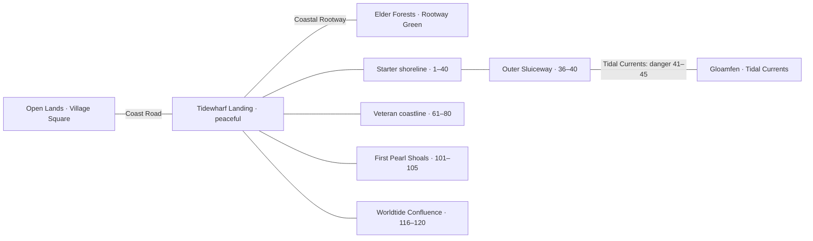
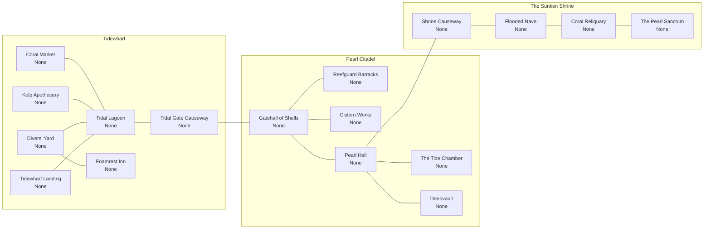
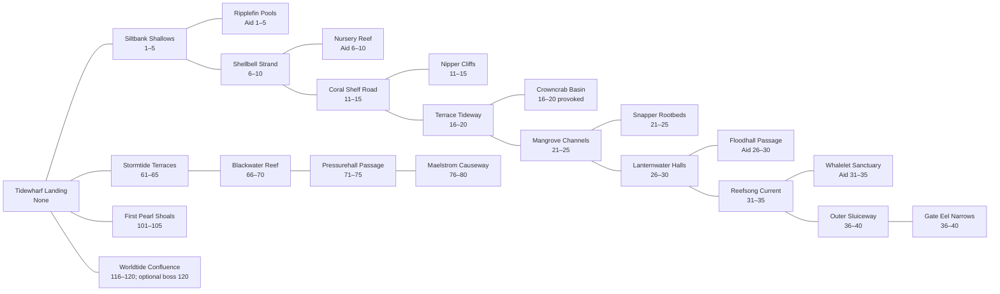
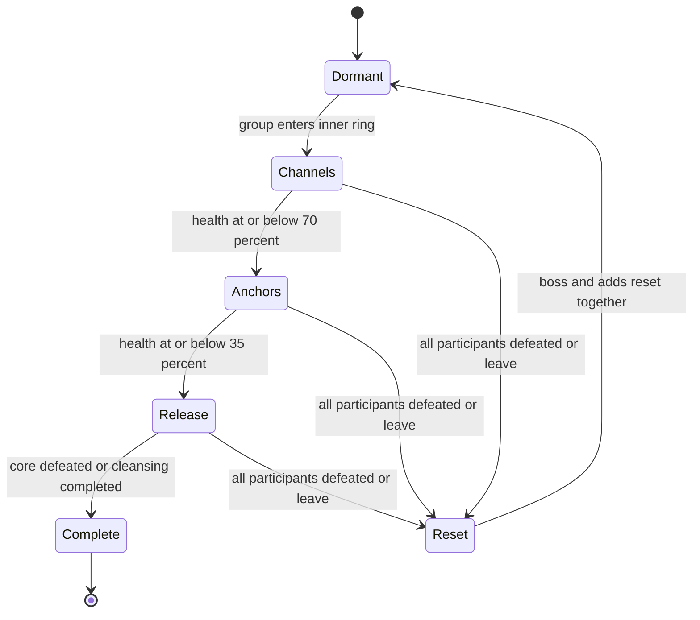

# Tidekin Sea — the next region

This develops **Tidekin Sea**, the next region after Open Lands in DESIGN-0022, as a detailed **design specification**. It retains all **39 map IDs and names**: seven village maps, six Pearl Citadel maps, four Sunken Shrine maps, sixteen starter wilderness maps and six veteran/mythic maps. Nothing here claims that these levels, artwork, enemies or NPC systems are already implemented.

The core journey is **a working coastal town struggling to keep freshwater separate from the sea**. Tides reveal routes and habits, but the ordinary path always has dry, class-independent footing. The Pearl Citadel governs water; the Sunken Shrine holds its failing regulator. Hostile wildlife belongs in the outer channels rather than in peaceful town interiors.

## Contents

- [Region identity and access](#region-identity-and-access)
- [Geography and connections](#geography-and-connections)
- [Shared level rules](#shared-level-rules)
- [The 39 maps](#the-39-maps)
- [Monster and wildlife roster](#monster-and-wildlife-roster)
- [Aid and reward parity](#aid-and-reward-parity)
- [Tidewharf story: The Salt in the Wells](#tidewharf-story-the-salt-in-the-wells)
- [Optional finale: The Undertow Regent](#optional-finale-the-undertow-regent)
- [Presentation and map UI](#presentation-and-map-ui)
- [Content-production package](#content-production-package)
- [Acceptance checks before calling the region playable](#acceptance-checks-before-calling-the-region-playable)
- [Sources and decisions](#sources-and-decisions)

## Region identity and access

| Element | Design |
| --- | --- |
| Homeland / allegiance | Tidekin Sea / Light; outdoor maps and Tidewharf welcome both allegiances |
| Village | Tidewharf, built around the Tidal Lagoon; first Tidekin creation at Tidewharf Landing |
| Stronghold | Pearl Citadel; six maps behind a permanent Light-allegiance gate |
| Story site | The Sunken Shrine; four peaceful traversal maps, Light access plus the local investigation |
| Starter progression | Eight Common-threat and equivalent aid cohorts, 1–5 through 36–40 |
| Later visits | Separate 61–80, 101–105 and 116–120 maps; starter maps never scale up automatically |
| Visual language | Deep teal, sea green, foam cream, indigo and coral-orange; shell, polished coral, kelp rope, sea glass, verdigris bronze |
| Reference | Existing [Tidekin moodboard](../../designs/moodboards/tidekin.png) |
| Public routes | Coast Road ↔ Open Lands; Coastal Rootway ↔ Elder Forests; Tidal Currents ↔ Gloamfen |

The Tidekin body is not a traversal requirement. Humans, centaurs and every other playable body must have a grounded route, adequate platform width and access to all ordinary combat objectives. No swimming, water breathing, flight, particular weapon or party is needed for the solo path. Stronghold denial never prevents outdoor leveling.

## Geography and connections

The following diagrams retain every connection in the Tidekin section of DESIGN-0022. Connections are reciprocal walk-through portals. The three border links below are **new proposed exact endpoint mappings** for the already established world roads; they are not present-day gameplay transfers.

| Road | Proposed Tidekin endpoint | Proposed other endpoint | Border rule |
| --- | --- | --- | --- |
| Coast Road | `tidekin_sea_land` | `square` | Public dock-to-road connection; no stronghold gate |
| Coastal Rootway | `tidekin_sea_land` | `elder_forests_grn` | Public coast/root-road connection; no stronghold gate |
| Tidal Currents | `tidekin_sea_path_036` | `gloamfen_road_0` | Shared frontier; warning before entry, dry fallback landing and a return portal |

The Tidewharf signpost names all three roads, but the dangerous current crossing is physically at the outer sluice, not a level-1 trap on the arrival dock. Veteran and mythic branch entrances have full danger labels before the trigger. Their return portals never deposit monsters or hazards inside the village.

### Town, citadel and shrine

### Outdoor routes

## Shared level rules

These values are implementation starting points, not measured balance.

- **Ordinary map footprint:** roughly 1,600–2,400 horizontal game units and one to three traversable tiers, using the current 1,152×648 camera as reference. A permanent route uses jumps no harder than the existing training route; every raised mandatory tier also has an accessible ramp or climb route.
- **Portal safety:** reserve a dry arrival area at least 240 units across. Enemy spawn/aggro volumes and tide damage do not intersect it. Arrivals stand outside the receiving trigger so they cannot bounce immediately back.
- **Recovery:** each row names its own local Recovery Anchor. Death and relogin keep the same map. An obstructed position falls back to that map's anchor; it never transports the hero to the inn, village or shrine entrance.
- **Tide cycle:** proposed 60 seconds: 22 low, 8 rising, 22 high, 8 falling. Sound, moving waterlines and carved gauges communicate the phase. Tide timing changes optional lower paths only; the upper route and all outbound portals remain reachable. A submerged shortcut closes only after an evacuation cue, with an adjacent dry refuge. Early tide water does not cause drowning deaths.
- **Ordinary encounters:** at most two simultaneously engaged Common enemies through level 40. Later solo maps cap at three, with a two-attacker pressure limit; other enemies reposition. Spawns do not appear inside the camera or on the hero, and a resetting enemy is not a new reward encounter.
- **Aggro / leash:** initial Common acquisition around 240 units with line of sight; leash around 420 units from home. No aggro through solid floors. Return-to-home clears an unfinished attack, restores the encounter state and retains its spent reward budget until a legitimate respawn.
- **No hazard stacking:** a rising tide cannot remove the only safe tile during a committed attack. Eel electricity always leaves dry, reachable footing. Hazard labels use shape and animation as well as color.
- **Ordinary respawn proposal:** 75 seconds after defeat, delayed while a hero occupies the spawn pocket. Aid props reset as a complete authored job after 90 seconds, not by toggling one object. Timers and eligibility are authoritative per encounter/job in a future server implementation.
- **Save state:** current map/position, explored IDs, shrine stage, individual objective bits, unique lens possession/consumption and encounter reward credit must survive reload. Save a portal transfer atomically. Tide state is authoritative; a loaded character gets a safe same-map position if the lower route changed.

## The 39 maps

Monster levels below are fixed Overall Levels. “None” means no hostile ambient population. Benevolent creature levels are encounter tiers, not kill targets. All population, layout, NPC names and objective details introduced here are proposals. Shared maps do not gain blanket PvP immunity from this document.

### Coral Market

`tidekin_sea_cm` · Shared access · Recommended: — · Encounters: **None**

- **Route / silhouette:** A crescent of shell-awning stalls around a dry loading court.
- **Population:** None. Town NPCs and the gate guardian are non-farmable characters.
- **Activity:** Neri sells basic arms; Brineweft sells armor; Ossa keeps provisions. Broker Pel offers exchange information until the economy exists.
- **Recovery Anchor:** Market bell platform; a dry refuge on this same map.

### Tidal Lagoon

`tidekin_sea_lag` · Shared access · Recommended: — · Encounters: **None**

- **Route / silhouette:** A broad central basin ringed by a permanent upper boardwalk and three tide stairs.
- **Population:** None. Town NPCs and the gate guardian are non-farmable characters.
- **Activity:** Tidemender Sera introduces the blocked freshwater intake. Water changes lower scenery and optional shortcuts; every exit stays reachable.
- **Recovery Anchor:** Central tide gauge; a dry refuge on this same map.

### Kelp Apothecary

`tidekin_sea_ka` · Shared access · Recommended: — · Encounters: **None**

- **Route / silhouette:** Kelp racks on three low terraces with a sheltered mixing room at the top.
- **Population:** None. Town NPCs and the gate guardian are non-farmable characters.
- **Activity:** Apothecary Vela teaches water sampling and sells the same baseline restorative supplies as other hometowns.
- **Recovery Anchor:** Mortar-and-shell porch; a dry refuge on this same map.

### Divers' Yard

`tidekin_sea_dy` · Shared access · Recommended: — · Encounters: **None**

- **Route / silhouette:** A dry sparring deck beside nonlethal floating-platform drills.
- **Population:** None. Town NPCs and the gate guardian are non-farmable characters.
- **Activity:** Six class trainers offer the shared skill overview. Divers do not impose a class, swimming or lineage prerequisite.
- **Recovery Anchor:** Training gong; a dry refuge on this same map.

### Foamrest Inn

`tidekin_sea_inn` · Shared access · Recommended: — · Encounters: **None**

- **Route / silhouette:** A low shell lodge with a raised dry common room and return ramp.
- **Population:** None. Town NPCs and the gate guardian are non-farmable characters.
- **Activity:** Innkeeper Pell records local rumors and recovery guidance. Rest does not bind remote respawns or refill resources through travel.
- **Recovery Anchor:** Hearth deck; a dry refuge on this same map.

### Tidewharf Landing

`tidekin_sea_land` · Shared access · Recommended: — · Encounters: **None**

- **Route / silhouette:** Two ferry berths, a customs shelter and a three-way public signpost.
- **Population:** None. Town NPCs and the gate guardian are non-farmable characters.
- **Activity:** First Tidekin creation arrives here. Ferrymaster Tavi names the Coast Road, the Coastal Rootway and the dangerous Tidal Currents.
- **Recovery Anchor:** Ferry bell; a dry refuge on this same map.

### Tidal Gate Causeway

`tidekin_sea_caus` · Shared access · Recommended: — · Encounters: **None**

- **Route / silhouette:** A wide causeway with an always-dry central crown and a tidal gatehouse beyond.
- **Population:** None. Town NPCs and the gate guardian are non-farmable characters.
- **Activity:** Reefwarden Nacre, a bonded guardian character, checks permanent Light allegiance. Refusal leaves a safe turn-back space on this map.
- **Recovery Anchor:** Outer gate lantern; a dry refuge on this same map.

### Gatehall of Shells

`tidekin_sea_gs` · Light access · Recommended: — · Encounters: **None**

- **Route / silhouette:** A double shell arch and a visible return door above the sluice.
- **Population:** None. Town NPCs and the gate guardian are non-farmable characters.
- **Activity:** Shell Captain Iri confirms entry and points to the cistern, barracks and Pearl Hall. Guardian and sentries are not monsters.
- **Recovery Anchor:** Inner gate bench; a dry refuge on this same map.

### Reefguard Barracks

`tidekin_sea_rb` · Light access · Recommended: — · Encounters: **None**

- **Route / silhouette:** A ring of bunks and drill platforms around an open equipment court.
- **Population:** None. Town NPCs and the gate guardian are non-farmable characters.
- **Activity:** Reefguard Sen demonstrates the dry-footing rule used by eel encounters; optional practice deals no permanent damage.
- **Recovery Anchor:** Barracks standard; a dry refuge on this same map.

### Cistern Works

`tidekin_sea_cw` · Light access · Recommended: — · Encounters: **None**

- **Route / silhouette:** Parallel freshwater channels and a maintenance walkway above them.
- **Population:** None. Town NPCs and the gate guardian are non-farmable characters.
- **Activity:** Engineer Mero provides the missing intake diagram. Three valves have distinct marks and cannot be farmed by toggling.
- **Recovery Anchor:** Maintenance shelter; a dry refuge on this same map.

### Pearl Hall

`tidekin_sea_ph` · Light access · Recommended: — · Encounters: **None**

- **Route / silhouette:** A fan-shaped ceremonial hall with a central pearl-lit dais.
- **Population:** None. Town NPCs and the gate guardian are non-farmable characters.
- **Activity:** Steward Amaya authorizes the shrine investigation; door signs distinguish Tide Chamber, Deepvault and shrine descent.
- **Recovery Anchor:** Hall entry dais; a dry refuge on this same map.

### The Tide Chamber

`tidekin_sea_tc` · Light access · Recommended: — · Encounters: **None**

- **Route / silhouette:** An enclosed listening chamber above a broad tidal window.
- **Population:** None. Town NPCs and the gate guardian are non-farmable characters.
- **Activity:** The Tide Speaker explains the civic cost of the broken regulator. Dialogue concludes here; there is no throne-room boss.
- **Recovery Anchor:** Listening bench; a dry refuge on this same map.

### Deepvault

`tidekin_sea_dv` · Light access · Recommended: — · Encounters: **None**

- **Route / silhouette:** A compact archive with dry raised shelves and a shallow observation channel.
- **Population:** None. Town NPCs and the gate guardian are non-farmable characters.
- **Activity:** Archivist Coru supplies a rubbing of the original gate sequence. Records grant one authored quest completion, not repeat scan XP.
- **Recovery Anchor:** Archive stair; a dry refuge on this same map.

### Shrine Causeway

`tidekin_sea_sc` · Light access · Recommended: — · Encounters: **None**

- **Route / silhouette:** A causeway descending beside the sea wall with a permanent handrail route.
- **Population:** None. Town NPCs and the gate guardian are non-farmable characters.
- **Activity:** An authorized shrine route opens after Amaya records the engineer's findings. Wrong timing only closes optional stepping-stone shortcuts.
- **Recovery Anchor:** Shrine gate alcove; a dry refuge on this same map.

### Flooded Nave

`tidekin_sea_fn` · Light access · Recommended: — · Encounters: **None**

- **Route / silhouette:** A nave with a high gallery, lower tide platforms and three symbol-marked sluices.
- **Population:** None. Town NPCs and the gate guardian are non-farmable characters.
- **Activity:** Route water through three separate repairs, each with a distinct persisted completion bit. A dry gallery always reaches the return portal.
- **Recovery Anchor:** Upper gallery lantern; a dry refuge on this same map.

### Coral Reliquary

`tidekin_sea_cr` · Light access · Recommended: — · Encounters: **None**

- **Route / silhouette:** A chamber of branching coral conduits and a sheltered observation balcony.
- **Population:** None. Town NPCs and the gate guardian are non-farmable characters.
- **Activity:** Match the archive rubbing to physical conduit symbols. Success releases one pearl lens; resetting a lever cannot mint another lens.
- **Recovery Anchor:** Reliquary balcony; a dry refuge on this same map.

### The Pearl Sanctum

`tidekin_sea_ps` · Light access · Recommended: — · Encounters: **None**

- **Route / silhouette:** A quiet circular sanctuary beneath a dome of water-lit glass.
- **Population:** None. Town NPCs and the gate guardian are non-farmable characters.
- **Activity:** Install the lens and restore the freshwater regulator. This is a peaceful traversal/story culmination, with an explicit return connection.
- **Recovery Anchor:** Sanctum antechamber; a dry refuge on this same map.

### Siltbank Shallows

`tidekin_sea_path_001` · Shared access · Recommended: 3 · Encounters: **1–5**

- **Route / silhouette:** Three dry sandbars joined by shallow ramps; one clear sightline per fight.
- **Population:** Silt Skitter, 1–5. Skitter pair on alternate bars; keep the next pack out of aggro range.
- **Activity:** Clear three distinct blocked runnels, then guide a marked water sample home.
- **Recovery Anchor:** Siltbank warning post; a dry refuge on this same map.

### Ripplefin Pools

`tidekin_sea_site_001` · Shared access · Recommended: 3 · Encounters: **None hostile; aid creature 1–5**

- **Route / silhouette:** A sheltered nursery pool with a low bank and an overhead walkway.
- **Population:** Ripplefin Sprouts only; no hostile ambient spawns.
- **Activity:** Guide three individually marked stranded sprouts through reopened runnels.
- **Recovery Anchor:** Nursery keeper's mat; a dry refuge on this same map.

### Shellbell Strand

`tidekin_sea_path_006` · Shared access · Recommended: 8 · Encounters: **6–10**

- **Route / silhouette:** A shell beach with two beachside loops and a high public walkway.
- **Population:** Silt Skitter, 6–10. Skitter lane patrols separated by broken shell walls.
- **Activity:** Repair three different shell-bell tide markers along the full route.
- **Recovery Anchor:** Shellbell shelter; a dry refuge on this same map.

### Nursery Reef

`tidekin_sea_site_006` · Shared access · Recommended: 8 · Encounters: **None hostile; aid creature 6–10**

- **Route / silhouette:** A shell nursery under a stone canopy; short paths return to one central bell.
- **Population:** Shellbell Nymphs only; temporary aid shields are not permanent equipment.
- **Activity:** Replace two cracked bell supports and escort a nymph to the quiet alcove.
- **Recovery Anchor:** Bell keeper's awning; a dry refuge on this same map.

### Coral Shelf Road

`tidekin_sea_path_011` · Shared access · Recommended: 13 · Encounters: **11–15**

- **Route / silhouette:** A broad shelf beneath coral overhangs with two climbable ramps.
- **Population:** Silt Skitter, 11–15. Skitter singletons at bends; no projectile attack from an unreachable ledge.
- **Activity:** Collect three loose survey tags without removing living coral.
- **Recovery Anchor:** Surveyor's canopy; a dry refuge on this same map.

### Nipper Cliffs

`tidekin_sea_site_011` · Shared access · Recommended: 13 · Encounters: **11–15**

- **Route / silhouette:** Three wide cliff terraces, with no enemy able to pin the recovery ledge.
- **Population:** Coral Nippers in single patrol pockets, at most two engaged together.
- **Activity:** Map the two-claw warning and clear two occupied survey perches.
- **Recovery Anchor:** Clifftop survey tent; a dry refuge on this same map.

### Terrace Tideway

`tidekin_sea_path_016` · Shared access · Recommended: 18 · Encounters: **16–20**

- **Route / silhouette:** Stepped tidal terraces with a permanent upper path and optional lower pools.
- **Population:** Silt Skitter, 16–20. Skitter pairs in separate terrace basins.
- **Activity:** Reopen three freshwater bypasses using different intake fixtures.
- **Recovery Anchor:** Terrace watchhouse; a dry refuge on this same map.

### Crowncrab Basin

`tidekin_sea_site_016` · Shared access · Recommended: 18 · Encounters: **16–20 only if provoked**

- **Route / silhouette:** A basin with an obvious wide bypass outside the nesting circle.
- **Population:** Neutral Tidepool Crowncrabs warn and retreat; combat starts only after deliberate provocation.
- **Activity:** Count three nests from safe marked observation points. No crab kills required.
- **Recovery Anchor:** Basin observation hide; a dry refuge on this same map.

### Mangrove Channels

`tidekin_sea_path_021` · Shared access · Recommended: 23 · Encounters: **21–25**

- **Route / silhouette:** Woven root bridges over shallow channels; silhouettes visible through the roots.
- **Population:** Silt Skitter, 21–25. Skitter encounters on open root clearings, never hidden beneath the character.
- **Activity:** Remove three marked debris bundles and plant replacement root bindings.
- **Recovery Anchor:** Rootbridge shelter; a dry refuge on this same map.

### Snapper Rootbeds

`tidekin_sea_site_021` · Shared access · Recommended: 23 · Encounters: **21–25**

- **Route / silhouette:** Root-knotted side pools with ample landing room beside each vertical snap lane.
- **Population:** Mangrove Snappers; rustling leaves and a raised root-knot expose every ambush.
- **Activity:** Recover two dropped rigging spools after avoiding or defeating the local snappers.
- **Recovery Anchor:** Rootbed rescue platform; a dry refuge on this same map.

### Lanternwater Halls

`tidekin_sea_path_026` · Shared access · Recommended: 28 · Encounters: **26–30**

- **Route / silhouette:** Roofless coastal halls with dry balconies and flooded side aisles.
- **Population:** Silt Skitter, 26–30. Skitter scavengers occupy dry rooms; no enemies on the return balcony.
- **Activity:** Restore three signal lanterns with separate authored fuel parcels.
- **Recovery Anchor:** Lantern keeper's porch; a dry refuge on this same map.

### Floodhall Passage

`tidekin_sea_site_026` · Shared access · Recommended: 28 · Encounters: **None hostile; aid creature 26–30**

- **Route / silhouette:** A flooded hall seen from a dry gallery, with door marks below the waterline.
- **Population:** Floodhall Lanternfish only; following light patterns is a navigation activity.
- **Activity:** Copy three illuminated door signs during distinct light passes.
- **Recovery Anchor:** Gallery survey bench; a dry refuge on this same map.

### Reefsong Current

`tidekin_sea_path_031` · Shared access · Recommended: 33 · Encounters: **31–35**

- **Route / silhouette:** Reef platforms surrounding an audible current; a fixed bridge parallels the moving route.
- **Population:** Silt Skitter, 31–35. Skitter packs separated by sound-marker posts.
- **Activity:** Retune three current beacons in the order shown by their wave patterns.
- **Recovery Anchor:** Reefwatch ledge; a dry refuge on this same map.

### Whalelet Sanctuary

`tidekin_sea_site_031` · Shared access · Recommended: 33 · Encounters: **None hostile; aid creature 31–35**

- **Route / silhouette:** A broad open-reef loop with dry platforms within every current crossing.
- **Population:** Reefsong Whalelets only; no hunting objective or monster drops.
- **Activity:** Place three resonance stakes, then record one complete song.
- **Recovery Anchor:** Whalewatch shelter; a dry refuge on this same map.

### Outer Sluiceway

`tidekin_sea_path_036` · Shared access · Recommended: 38 · Encounters: **36–40**

- **Route / silhouette:** A long industrial sluice with raised causeways and marked wet channels.
- **Population:** Silt Skitter, 36–40. Skitter packs guard dry maintenance bays; eel hazards stay on the optional side map.
- **Activity:** Service three distinct grounding straps and sign off at the outer gauge.
- **Recovery Anchor:** Sluice inspection booth; a dry refuge on this same map.

### Gate Eel Narrows

`tidekin_sea_site_036` · Shared access · Recommended: 38 · Encounters: **36–40**

- **Route / silhouette:** Parallel wet channels and raised dry stepping ledges around one gate.
- **Population:** Tidal Gate Eels; electrified lanes are segmented and always leave a reachable dry route.
- **Activity:** Close two damaged contacts after surviving clearly signalled pulses.
- **Recovery Anchor:** Dry gate-inspection deck; a dry refuge on this same map.

### Stormtide Terraces

`tidekin_sea_return_061` · Shared access · Recommended: 63 · Encounters: **61–65**

- **Route / silhouette:** A storm-battered outer terrace with two parallel retreat paths.
- **Population:** Stormshell Skitter; 61–65. See the monster specifications below.
- **Activity:** Rebuild three storm screens and remove loose conductive shell fragments.
- **Recovery Anchor:** Stormwatch shelter; a dry refuge on this same map.

### Blackwater Reef

`tidekin_sea_return_066` · Shared access · Recommended: 68 · Encounters: **66–70**

- **Route / silhouette:** A dark reef corridor with broken sightlines and dry refuge islands.
- **Population:** Blackwater Pincer; 66–70. See the monster specifications below.
- **Activity:** Recover three pressure gauges; fights are avoidable on the repair route.
- **Recovery Anchor:** Reef rescue beacon; a dry refuge on this same map.

### Pressurehall Passage

`tidekin_sea_return_071` · Shared access · Recommended: 73 · Encounters: **71–75**

- **Route / silhouette:** A pressure-control complex with redundant dry relief galleries.
- **Population:** Bellowshell Crawler; 71–75. See the monster specifications below.
- **Activity:** Vent three separate chambers without entering the discharge lanes.
- **Recovery Anchor:** Relief-gallery cabin; a dry refuge on this same map.

### Maelstrom Causeway

`tidekin_sea_return_076` · Shared access · Recommended: 78 · Encounters: **76–80**

- **Route / silhouette:** A causeway circling an offshore vortex, with an anchored inner service route.
- **Population:** Riptide Coil; 76–80. See the monster specifications below.
- **Activity:** Reset three mooring winches while keeping out of marked pull lanes.
- **Recovery Anchor:** Mooring house; a dry refuge on this same map.

### First Pearl Shoals

`tidekin_sea_return_101` · Shared access · Recommended: 103 · Encounters: **101–105**

- **Route / silhouette:** A luminous shoal of fossil pearl plates and broad stone platforms.
- **Population:** Pearlglass Sentinel; 101–105. See the monster specifications below.
- **Activity:** Realign three prism plates; reflective phases are visible from safe cover.
- **Recovery Anchor:** Pearlwatch refuge; a dry refuge on this same map.

### Worldtide Confluence

`tidekin_sea_return_116` · Shared access · Recommended: 118 · Encounters: **116–120; optional boss 120**

- **Route / silhouette:** A convergence of three sea channels around a dry ring of ancient gates.
- **Population:** Confluence Eel; optional boss The Undertow Regent; 116–120; optional boss 120. See the monster specifications below.
- **Activity:** Stabilize three channel anchors for solo completion; the boss occupies an optional inner ring.
- **Recovery Anchor:** Confluence service refuge; a dry refuge on this same map.

## Monster and wildlife roster

The nine established Tidekin creatures below retain DESIGN-0011's dispositions and level cohorts. The six late-region species and the boss are **new proposals**, replacing this region's TBD slots only; they do not silently approve the rest of the paused 41–120 roster. Higher-level skins are not permission to replace benevolent creatures with hostile recolors.

### Shared combat budget

Use a matched-level baseline **H** (Common enemy health) and **D** (ordinary light-hit damage), tuned against the same reference loadout used for other homelands. The table provides explicit relative budgets before absolute weapon/armor curves are implemented. Baseline target: a Common survives 4–6 ordinary reference hits, with its light hit taking roughly 8–12% of the matched hero's maximum health before active defense. These are test targets, not current runtime statistics.

Telegraph, active and recovery durations are in seconds. Every damaging state has a clear start/end and a usable counter. Shieldless dodging and movement are valid counters; no ordinary encounter requires parry mastery. Contact while idling is not automatic unavoidable damage.

| Species | Maps / fixed levels | Disposition / rank | H / D budget | Attack and counter |
| --- | --- | --- | --- | --- |
| Silt Skitter | All eight `path_` maps, respective 1–5 … 36–40 cohort | Hostile / Common | 1.0H / 1.0D | Raise claw 0.75 → sideways lunge 0.20 → exposed recovery 0.95. Step behind, jump the short lane or defend; no target tracking after commit. |
| Ripplefin Sprout | Ripplefin Pools, 1–5 | Benevolent / Common wildlife | No combat health/reward budget | Three-note chirp indicates the next clear channel. Reopen water, then guide it; no damaging attacks. |
| Shellbell Nymph | Nursery Reef, 6–10 | Benevolent / Common wildlife | No combat health/reward budget | Bell ring 1.0 → temporary small bubble shield after successful aid; shield expires and cannot be stacked by repeat interaction. |
| Coral Nipper | Nipper Cliffs, 11–15 | Hostile / Common | 1.1H / 1.0D | Lateral shuffle 0.45 → two-claw rise 0.8 → narrow pinch 0.25 → recovery 1.0. Punish the sides; the shuffle never crosses a ledge or pins the arrival anchor. |
| Tidepool Crowncrab | Crowncrab Basin, 16–20 | Neutral / Common | 1.3H / 0.9D | Initial 1.2-second warning and retreat. Only deliberate provocation starts crown-shield 1.0 → shove 0.25 → recovery 1.2. Walk around; observation objective requires no damage. |
| Mangrove Snapper | Snapper Rootbeds, 21–25 | Hostile / Common | 0.9H / 1.2D | Leaves rustle 0.8 and root knot rises → narrow vertical snap 0.25 → exposed root 1.1. Leave the marked column; no silent off-screen strike. |
| Floodhall Lanternfish | Floodhall Passage, 26–30 | Benevolent / Common wildlife | No combat health/reward budget | Illuminate one door glyph for 3.0, then move with a 1.0 cue. Observe from dry gallery; no breath meter required. |
| Reefsong Whalelet | Whalelet Sanctuary, 31–35 | Benevolent / Common wildlife | No combat health/reward budget | Three audible/visible pulses expose a current rhythm. Aid records a song; this wildlife is not the gatekeeping NPC. |
| Tidal Gate Eel | Gate Eel Narrows, 36–40 | Hostile / Common | 1.0H / 1.1D | Wet-lane outline 1.0 → electric pulse 0.35 → grounded recovery 1.4. Dry ledges are safe; a pulse never electrifies every exit at once. |
| Stormshell Skitter | Stormtide Terraces, 61–65 | Hostile / Common — new | 1.1H / 1.0D | Shell opens 0.85 → angled shell chip 0.25 → recovery 1.1. Visible projectile follows a committed lane; cover or sidestep. No homing fragments. |
| Blackwater Pincer | Blackwater Reef, 66–70 | Hostile / Common — new | 1.2H / 1.1D | Two luminous claw marks 0.9 → converging pinch 0.30 → recovery 1.2. The center and outside lanes are distinct; walk behind the committed claws. |
| Bellowshell Crawler | Pressurehall Passage, 71–75 | Hostile / Common — new | 1.25H / 1.0D | Bellows inflate and relief arrows show direction 1.0 → steam cone 0.5 → vent recovery 1.4. Cross behind or use the dry relief gallery; steam does not fill the room. |
| Riptide Coil | Maelstrom Causeway, 76–80 | Hostile / Common — new | 1.0H / 1.15D | Spiral floor mark 1.0 → shallow pull 0.6 → recovery 1.2. Exit laterally; pull ends at a dry stop and cannot drag a hero off the map. |
| Pearlglass Sentinel | First Pearl Shoals, 101–105 | Corrupted / Common — new | 1.35H / 1.0D | Prism face lights 1.1 → straight beam 0.45 → dim recovery 1.5. Rotate to the rear or use a fossil plate. Frontal reflection is telegraphed and capped, never instant attacker death. |
| Confluence Eel | Worldtide Confluence outer ring, 116–120 | Hostile / Common — new | 1.2H / 1.1D | One of three channel glyphs brightens 1.15 → pulse 0.4 → recovery 1.5. Two other channels remain safe; separate eel commits cannot remove all safe channels. |
| The Undertow Regent | Worldtide Confluence inner ring, 120 | Corrupted / optional Group boss — new | 12H total / 1.2D light, 1.8D heavy | Three-phase sluice-and-current encounter below. Not a gate on the solo activity or exit. |

### Silt Skitter: eight variants, one readable core

| Cohort | Presentation | Allowed variation | Aid objective on the same ordinary map |
| --- | --- | --- | --- |
| 1–5 | Pale sand shell, small claw | Single lunge only; one engaged enemy for the first authored lesson | Clear runnels and deliver the water sample |
| 6–10 | Shell fragments tied to its back | Pauses at broken shell cover before the same lunge | Repair separated shell-bell markers |
| 11–15 | Flat coral-colored shell | Repositions once, always outside its committed attack | Recover survey tags |
| 16–20 | Tide-striped legs | Patrol follows the terrace contour; no extra water hazard | Open freshwater bypasses |
| 21–25 | Root fibers caught on the shell | Approaches from a visible side path, never invisible ambush | Clear debris and bind roots |
| 26–30 | Lantern-bright shell flecks | Alternating single attackers, never a simultaneous untelegraphed rush | Restore signal lanterns |
| 31–35 | Reef-polished shell | Longer retreat before the same readable lunge | Retune current beacons |
| 36–40 | Bronze-stained shell | Uses maintenance-bay cover; no electricity added to its attack | Repair grounding straps |

All variants use the same 0.75-second minimum claw tell. Cohort increases primarily change matched-level statistics and authored arrangement, not progressively invisible tells. Each map spawns within its listed five-level range; entering at level 80 does not upgrade its Skitters.

```mermaid
stateDiagram-v2
    [*] --> Patrol
    Patrol --> Notice: line of sight within home range
    Notice --> Telegraph: target on legal footing
    Notice --> ReturnHome: target leaves leash
    Telegraph --> Lunge: 0.75 seconds; commit lane
    Telegraph --> ReturnHome: invalid target or safe-zone boundary
    Lunge --> Recovery: 0.20 seconds or collision
    Recovery --> Notice: 0.95 seconds
    ReturnHome --> Patrol: encounter reset without new reward budget
    Patrol --> Defeated: health reaches zero
    Notice --> Defeated: health reaches zero
    Telegraph --> Defeated: health reaches zero
    Lunge --> Defeated: health reaches zero
    Recovery --> Defeated: health reaches zero
    ReturnHome --> Defeated: health reaches zero
    Defeated --> RespawnPending: completed encounter credited once
    RespawnPending --> Patrol: eligible timer and empty spawn pocket
```

Every actor supports stun/interrupt policy consistently with the shared combat rules; an interrupted tell cannot still apply its old hit. Multi-hit damage, wards and projectiles reuse the current common damage path rather than bespoke creature-only health deductions.

## Aid and reward parity

Initial matched-level activity budgets follow DESIGN-0018: **2 Overall XP per authored productive second**, not per second spent waiting. A 30-second ordinary encounter budgets 60 XP; a 90-second three-fixture repair budgets 180 XP. Required kills and the parent objective share one budget rather than double-paying. Travel, repeated lever toggles, overhealing and harmless attacks do not accrue free encounter XP.

Currency follows the same completion-time budget across combat and aid. At the current six-coin basic potion reference, a 90-second starter job targets at least one potion's purchase power before tuning; this is a proposed economy floor, not a new live shop price. Loot quality stays in the local equipment band. No unique lens, boss token or aid creature is tradable until the item/economy design explicitly permits it.

| Activity | Eligible completion | Reset / credit |
| --- | --- | --- |
| Ordinary fight | A legitimate encounter defeated; effective support shares credit | Once per encounter identity, not per leash/reset |
| Repair job | Three different authored fixtures + final inspection | One completion per job identity; all bits persist |
| Wildlife aid | Named individual successfully reaches its destination / completes the song | Aid reward only, no kill drop or repeat dialogue credit |
| Shrine investigation | Persisted stage transition after required evidence | Once per character, with an idempotent reward record |
| Regent encounter | Boss defeated/cleansed in one eligible instance | Instance completion credit; no generic per-part reward multiplication |

## Tidewharf story: The Salt in the Wells

This quest is a service-and-traversal arc, not a mandatory combat-class or leveling gate. Shared outdoor activities remain available to Dark-allegiance visitors. The restricted shrine stages remain Light-only, matching the permanent citadel policy.

| Stage | Contact / map | Required action | Persisted result |
| --- | --- | --- | --- |
| 0 · First bad water | Sera / Tidal Lagoon | Accept three marked sample bottles | `salt_in_wells = samples_started`; grant each bottle only once |
| 1 · Follow the runnels | Public Siltbank Shallows | Clear three distinct runnels and return a valid sample | Three fixture bits and inspected sample; equivalent solo aid progression |
| 2 · Read the works | Mero / Cistern Works, Light entry only | Compare the sample with the damaged intake diagram | `intake_diagram_read` |
| 3 · Remember the sequence | Coru / Deepvault | Obtain a rubbing of the three conduit symbols | `conduit_rubbing`; no repeat archive XP |
| 4 · Open the descent | Amaya / Pearl Hall | Present diagram and rubbing | Shrine route authorization; separate from allegiance |
| 5 · Clear the nave | Flooded Nave | Repair three independent sluices using the safe gallery | `nave_sluices[3]`; each completed repair survives reload |
| 6 · Recover the lens | Coral Reliquary | Match the conduit sequence and take the released lens | Exactly one unique lens or a recorded already-collected state |
| 7 · Restore the regulator | Pearl Sanctum | Install the lens; visit Tide Chamber or return directly through shrine portals | Consume lens and set `regulator_restored` atomically |
| 8 · Clean water again | Sera / Tidal Lagoon | Report restoration | Quest completion and one reward; cosmetic clear-water change only |

Dark visitors can complete the public sample/repair job without receiving a false promise of shrine access; Sera offers a repeatable public water-care contract instead. An incorrect conduit sequence resets the local puzzle and gives a visual/audio explanation, without consuming the lens or closing the return path. Disconnects after collection, installation or reward delivery must not duplicate the lens or payout.

## Optional finale: The Undertow Regent

**Level 120; Group; recommended player level 118–120.** A corrupted regulator-beast occupies the inner ring of Worldtide Confluence. Solo players can repair the outer anchors and leave without engaging it. A visible approach, confirmation through physical entry, and retreat portal separate the boss ring from the public objective.

- **Phase 1, 100–70% health — Read the channels.** One channel flashes for 1.2 seconds, then surges for 0.5. Two remain dry. A 1.5-second recovery exposes the central shell. Heavy surge damage uses 1.8D; ordinary tail sweep uses 1.2D with its own 1.0-second tell.
- **Phase 2, 70–35% — Break the undertow.** Three anchors activate in a fixed readable cycle. The group stabilizes one while the other two show distinct warning marks. Pulls stop at the dry inner rail; nobody is dragged across the exit trigger. At most two Confluence Eel adds are active, and their pulse scheduler reserves one safe channel globally.
- **Phase 3, 35–0% — Release the pressure.** Two sequential surges occur with separate 1.2-second warnings; no simultaneous full-ring hit. Successful anchor stabilization opens a 2.0-second shell window. The group may end by defeating the core or completing a proposed cleansing interaction during that window; reward budget and quest outcome are the same eligible completion.
- **Reset / recovery.** Wipe recovery stays at the Worldtide Confluence refuge, not Tidewharf. Boss health and active adds reset together; spent partial-encounter credit is not paid out repeatedly. No strict DPS enrage is proposed before class/gear balance exists.

## Presentation and map UI

- World scale shows **Tidekin Sea / Pearl Citadel**, the three roads and broad regional bands. It does not scatter 39 map labels over the world painting.
- Region scale shows village, citadel, shrine and the fixed-level outdoor clusters. A selected map displays its name, exact level range, Common/neutral/aid/Group role, actual discovery state and access restriction.
- A peaceful map says **Peaceful · no hostile spawns**, rather than `Lv 0`. Wildlife aid sites say **Aid · Lv 1–5**, etc. The optional Regent ring says **Group boss · Lv 120** before entry.
- Traders use the existing coin-pouch hint; the current quest contact uses the bright quest symbol. Other dialogue uses the conversation marker. Keep the game’s navy/brass frames.
- Physical transfers use the existing **soft golden ground glow**. Restricted entrances use subdued amber and a specific reason; no new neon doorway art.
- Tide signals combine a physical waterline, a gauge position, patterned ground marks and audio. Essential safety must remain legible with reduced effects or color-vision differences.

## Content-production package

| Asset / system | Required coverage |
| --- | --- |
| Town kit | Tidewharf shell docks, permanent boardwalk, market, kelp racks, inn and training deck |
| Citadel kit | Shell gate, reef barracks, freshwater works, Pearl Hall, chamber and archive |
| Shrine kit | Causeway, safe gallery, three distinguishable sluices, coral conduits and pearl regulator |
| Wilderness kits | Sandbar/strand; coral shelf/terrace; mangrove; flooded gallery; open reef; outer sluice |
| Return-region kits | Storm terraces; black reef; pressure works; vortex causeway; pearlglass shoals; confluence ring |
| Established creatures | One Silt Skitter body with eight cohort treatments; eight distinct existing marquee creatures |
| New proposed creatures | Six late-region bodies and The Undertow Regent; silhouette review before art production |
| NPC roles | Ferry guide, three working shop roles, broker information, apothecary, six trainers, innkeeper, Sera, guardian, captain, reefguard, engineer, steward, archivist and Tide Speaker |
| Shared systems | Reciprocal portals, per-map recovery, tide-safe routes, map discovery, quest persistence, idempotent rewards and shared damage/telegraph presentation |

This document does not generate images or create placeholder playable scenes. Asset reuse is by material kit and role; each map still needs its own verified traversal layout and recognizable landmark.

## Acceptance checks before calling the region playable

1. All 39 listed IDs load the intended map, show the documented name and fixed levels, and have a legal outbound/return portal and same-map Recovery Anchor.
2. All existing internal connections are retained. Proposed border endpoints are reviewed and then tested both ways, including a safe arrival on the other side.
3. Every lineage can complete each ordinary 1–40 map using every class family’s basic movement/combat, without flight, swimming, a shield, a party or an elite kill. Neutral and benevolent sites remain optional.
4. Every ordinary cohort offers comparable productive-time XP/currency through combat and aid. Leashing, respawning in view, toggling fixtures, copying save data and repeating dialogue cannot generate duplicate budget payouts.
5. Tide tests cover low/rising/high/falling phases on every exit and recovery anchor. No valid low-route save restores a hero inside solid water machinery or outside the map.
6. Light heroes can enter the citadel and authorized shrine; Dark heroes are refused safely and retain every outdoor path. Quest authorization never overrides allegiance.
7. Each monster’s tell, commitment, damage window, interruption and recovery are tested separately. Idle contact, off-screen attacks and competing eel pulses cannot create unavoidable damage.
8. Wildlife accepts only its intended aid/observation interactions; neutral crab aggression is deliberate, and the guardian cannot be treated as a monster farm.
9. Saves round-trip all quest stages, three-fixture objectives, lens collection/consumption, map discovery and current location. Death at the shrine or boss remains on that same map.
10. The Regent remains an optional Group branch. Its phase transitions, global safe-channel reservation, wipe reset, adds and single eligible completion work without blocking solo anchor repairs.
11. Screenshots cover all 39 maps, all tide phases in affected layouts, marker readability, map-level labels and each monster tell. Performance and reduced-effects checks use the existing game’s targets.

These are future implementation gates. The validation for this design document is map/name/range/graph coverage and roster consistency, not runtime or balance testing.

## Sources and decisions

- [DESIGN-0022](0022-world-map-level-plan.md#tidekin-sea): all 39 IDs, names, ranges and existing internal routes.
- [DESIGN-0014](0014-hometown-maps.md#2-tidekin--the-sea-light): Tidewharf, Pearl Citadel, shrine, guardian role and materials.
- [DESIGN-0011](0011-creature-roster.md): nine established creature designs, dispositions and Common starter parity.
- [DESIGN-0018](0018-xp-and-weapon-proficiency-balance.md): Overall Level terminology and authored productive-time reward budgets.
- [World layout](0015-world-map-layout.md): Coast Road, Coastal Rootway and Gloamfen adjacency (the first two labels are descriptive atlas route names).

New proposals needing later balance/art review: named local NPCs, precise border endpoints, tide cadence, map layouts, objective steps, spawn pressure/timers, attack timings and budget multipliers, the seven higher-level creature designs, the shrine quest and the optional Group finale. The settled scope here is a fully described next-region design; gameplay implementation is a separate step unless requested.
